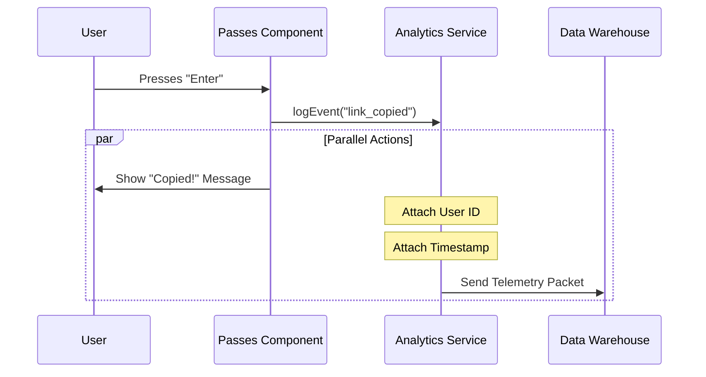

# Chapter 5: Analytics Service

Welcome to the final chapter of our **Passes** tutorial!

In the previous chapter, [Keybinding Management](04_keybinding_management.md), we brought our application to life. We allowed users to press `Enter` to copy a referral link and `Esc` to close the window.

## The Problem: Flying Blind

Right now, your application works perfectly on your computer. But once you release it to thousands of users, you are "flying blind."

*   Are people actually copying the links?
*   Are they opening the menu and immediately closing it (pressing `Esc`)?
*   Did the app crash?

Without a system to record these actions, you have no way of knowing if your feature is a success or a failure.

## The Solution: The Flight Recorder

The **Analytics Service** acts like the "Black Box" flight recorder on an airplane.

It runs quietly in the background. Whenever a significant action happens (like a user copying a link), we send a signal to this service. The service records:
1.  **What** happened (The Event Name).
2.  **When** it happened (The Timestamp).
3.  **Context** (Any extra details, like which campaign ID was used).

## How to Use the Service

We are going to modify our `Passes.tsx` file one last time. We want to record exactly when a user copies a guest pass link.

### Step 1: Importing the Logger
First, we import the helper function.

```typescript
// Importing the analytics logger
import { logEvent } from '../../services/analytics/index.js';
```

### Step 2: Logging the Action
In Chapter 4, we set up a `useInput` hook to listen for the `Enter` key. We will add one line of code inside that logic.

```typescript
useInput((_input, key) => {
  // When the user presses Enter AND a link exists
  if (key.return && referralLink) {
    
    // 1. Copy to clipboard (System Action)
    void setClipboard(referralLink).then(() => {
      
      // 2. Record the event (Analytics Action)
      logEvent('tengu_guest_passes_link_copied', {});
      
      // 3. Close the UI (User Feedback)
      onDone(`Referral link copied to clipboard!`);
    });
  }
});
```

**Breakdown:**
*   `logEvent`: This is the function we call to record data.
*   `'tengu_guest_passes_link_copied'`: This is the specific **Event Name**. We use long, descriptive names so data scientists know exactly what this means later.
*   `{}`: The second argument is for **Properties**. Here, we don't need extra details, so we pass an empty object.

### Why place it here?
We place the log event *inside* the success block of `setClipboard`. This ensures we only count the action if the link was actually successfully prepared for copying.

---

## Under the Hood: Internal Implementation

You might wonder: "Does logging an event slow down the app?"

The answer is **no**. The Analytics Service is "fire and forget." The UI tells the service to log something, and the UI immediately moves on without waiting for the log to finish uploading to the internet.

### The Data Flow



### A Look Inside `logEvent`
While the real file handles buffering and network retries, here is a simplified version of what `logEvent` does conceptually:

```typescript
// Simplified concept of the Analytics Service
export function logEvent(eventName: string, properties: object) {
  // 1. Create the data packet
  const payload = {
    event: eventName,
    props: properties,
    timestamp: Date.now(),
    userId: getCurrentUserId(), // Fetched from config
  };

  // 2. Send it to the background worker
  // We don't await this; we let it happen in the background
  sendToBackend(payload);
}
```

**Key Concepts:**
1.  **Metadata Injection:** You only sent the name (`link_copied`). The service automatically added the `timestamp` and `userId`. This keeps your UI code clean.
2.  **Asynchronous:** The function returns immediately so the user doesn't feel a "lag" while the app talks to the server.

## Putting It All Together

Congratulations! You have completed the **Passes** project tutorial. Let's recap what we built:

1.  **[Referral API Service](01_referral_api_service.md)**: We fetched raw data and cached it.
2.  **[Design System (Pane)](02_design_system__pane_.md)**: We created a consistent visual frame.
3.  **[CLI UI Components](03_cli_ui_components.md)**: We laid out tickets, text, and links.
4.  **[Keybinding Management](04_keybinding_management.md)**: We made the app interactive via the keyboard.
5.  **Analytics Service**: We ensured we can track the success of our feature.

You have built a fully functional, professional-grade CLI feature that is beautiful, interactive, and data-driven.

**Tutorial Complete.**

---

Generated by [Code IQ](https://github.com/adityasoni99/Code-IQ)