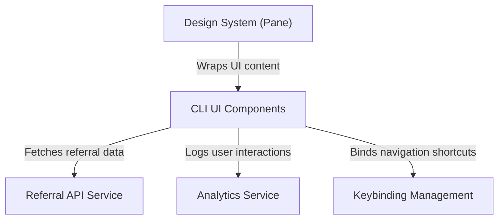

# Tutorial: Passes

This project implements a **CLI-based user interface** for managing guest passes and referrals. It features a reactive terminal dashboard that displays **eligibility status** and redemption statistics using ASCII visualizations. The system orchestrates **keyboard shortcuts** for navigation and clipboard actions, while tracking user engagement through a dedicated **analytics service**.

## Chapters

1. [Referral API Service](01_referral_api_service.md)
2. [Design System (Pane)](02_design_system__pane_.md)
3. [CLI UI Components](03_cli_ui_components.md)
4. [Keybinding Management](04_keybinding_management.md)
5. [Analytics Service](05_analytics_service.md)

---

Generated by [Code IQ](https://github.com/adityasoni99/Code-IQ)