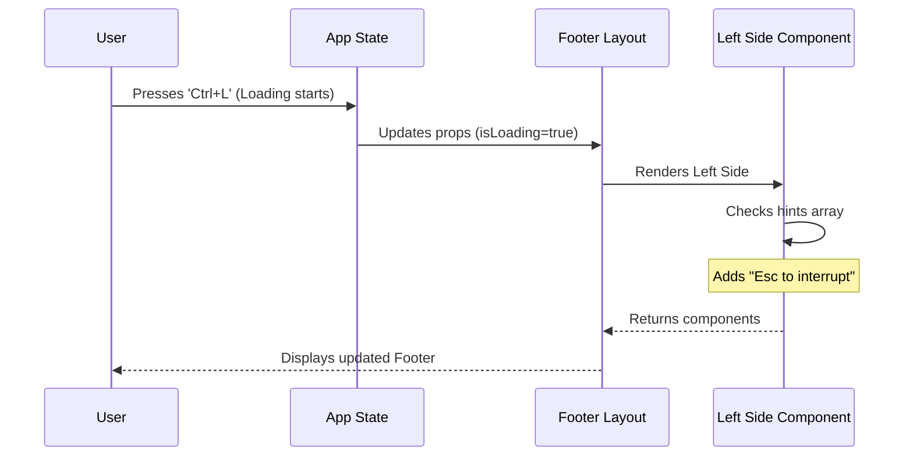

# Chapter 1: Footer Status Dashboard

Welcome to the first chapter of the **PromptInput** project tutorial! 

Before we dive into how the system processes what you type, we need to understand how the system communicates back to you while you are typing.

### The Cockpit Metaphor

Imagine driving a car. You spend most of your time looking through the windshield (the **Input Area**), but you frequently glance down at the dashboard to check your speed, fuel, and warning lights.

The **Footer Status Dashboard** is that dashboard for your terminal.

## Why do we need this?

In a standard Command Line Interface (CLI), you usually just get a blinking cursor. You might wonder:
* "Is the application frozen or just thinking?"
* "Am I in Vim mode or standard editing mode?"
* "What keyboard shortcut opens the help menu?"

The Footer Status Dashboard solves this by orchestrating a reactive strip of information immediately below your cursor. It dynamically changes based on **Context**.

## Key Concepts

To build this dashboard, we break it down into three distinct concepts:

1.  **The Container:** A responsive flexbox that holds everything together and adapts to the terminal width.
2.  **The Status Indicators:** Visual cues for modes (like `INSERT` vs `COMMAND`), permissions, and background tasks.
3.  **Contextual Hints:** Helpful text that appears only when relevant (e.g., showing "Press Esc to cancel" only when a task is loading).

---

## How to Use It

At a high level, the Footer is a React component that takes the current state of your application as "props" and decides what to show.

Here is a simplified example of how you might implement the Footer in your main application loop:

```tsx
// Example usage in a parent component
<PromptInputFooter 
  mode="prompt"
  vimMode="INSERT"
  isLoading={true}
  exitMessage={{ show: false }}
  toolPermissionContext={currentPermissions}
/>
```

**What happens here?**
1.  **`mode`**: Tells the footer we are in standard prompt mode.
2.  **`vimMode`**: Triggers the visual "INSERT" indicator.
3.  **`isLoading`**: Switches the hints to show cancellation options instead of navigation options.

---

## Internal Implementation

Let's look under the hood. The Footer isn't just one static line of text; it is a decision engine.

### The Decision Flow

When the application state changes (e.g., you press a key or a background task starts), the Footer recalculates its layout.



### 1. The Container (`PromptInputFooter.tsx`)

The main entry point is `PromptInputFooter`. It checks how wide your terminal is to decide if it should squish everything into one column or spread it out.

```tsx
function PromptInputFooter(props: Props) {
  const { columns } = useTerminalSize();
  const isNarrow = columns < 80;

  // If showing autocomplete suggestions, prioritize that view
  if (props.suggestions.length) {
     return <PromptInputFooterSuggestions {...props} />;
  }
  
  // Otherwise render the dashboard
  return (
    <Box flexDirection={isNarrow ? 'column' : 'row'}>
      {/* Content goes here */}
    </Box>
  );
}
```
*Explanation:* We use a hook to get the terminal size. If `isNarrow` is true, we stack items vertically. If there are autocomplete suggestions (covered in [Autocomplete Suggestion Overlay](04_autocomplete_suggestion_overlay.md)), they take over the footer entirely.

### 2. The Logic Engine (`PromptInputFooterLeftSide.tsx`)

This is where the magic happens. This component decides *exactly* which indicators to show. For example, if you are in Vim mode, it takes priority over standard hints.

```tsx
// Inside PromptInputFooterLeftSide
const showVim = isVimModeEnabled() && 
                vimMode === "INSERT" && 
                !isSearching;

if (showVim) {
  // If in Vim Insert mode, show the indicator explicitly
  return <Text dimColor>-- INSERT --</Text>;
}
```
*Explanation:* The code checks a specific combination of flags. You must be in Vim mode, specifically inside "INSERT", and *not* currently searching history.

### 3. Dynamic Hints

Hints are not static strings. They are built as an array depending on what the user is doing.

```tsx
// Building the hint parts array
const parts = [];

if (isLoading) {
  // If the AI is thinking, show how to stop it
  parts.push(<KeyboardShortcutHint shortcut="Esc" action="interrupt" />);
} else if (hasBackgroundTasks) {
  // If agents are running, show how to manage them
  parts.push(<KeyboardShortcutHint shortcut="Ctrl+T" action="show tasks" />);
}
```
*Explanation:* This approach ensures the UI is never cluttered. You only see the "interrupt" hint when there is actually something to interrupt.

### 4. Special Notifications

Sometimes, critical system information needs to bypass standard hints. For example, if the application is running in a Sandbox environment or has stashed changes.

From `PromptInputStashNotice.tsx`:
```tsx
export function PromptInputStashNotice({ hasStash }: Props) {
  if (!hasStash) return null;

  return (
    <Box paddingLeft={2}>
      <Text dimColor>
        {figures.pointerSmall} Stashed (auto-restores after submit)
      </Text>
    </Box>
  );
}
```
*Explanation:* This component follows the "Return Null" pattern. If there is no stash, it renders nothing (`null`), taking up zero space in the DOM.

## Conclusion

The **Footer Status Dashboard** acts as the grounded source of truth for the user. By combining responsive design with conditional rendering logic, it ensures that users always know the state of the system without being overwhelmed by information.

Now that we have a place to display information, we need to handle the user's actual keystrokes.

[Next Chapter: Smart Input Processing](02_smart_input_processing.md)

---

Generated by [Code IQ](https://github.com/adityasoni99/Code-IQ)