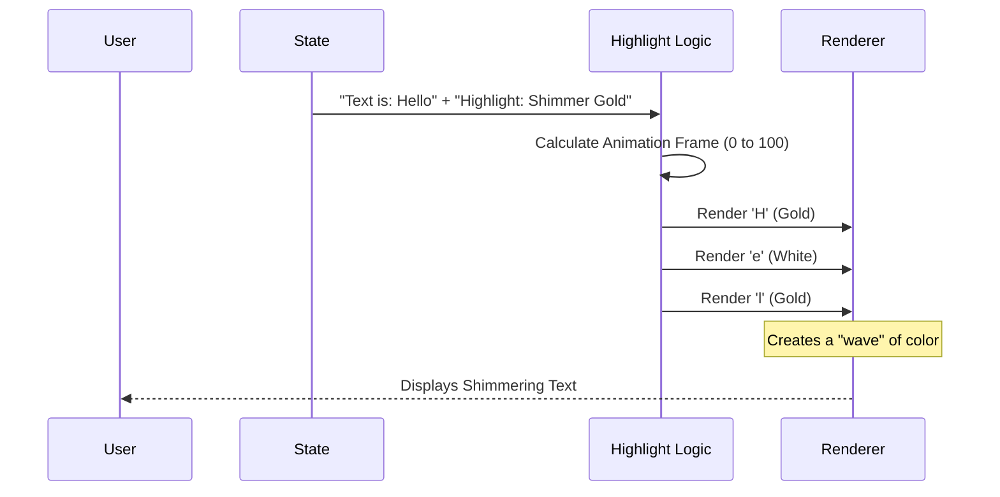

# Chapter 2: Smart Input Processing

In the previous chapter, [Footer Status Dashboard](01_footer_status_dashboard.md), we built the dashboard that tells the user *what* the system is doing. Now, we will focus on the most interactive part of the CLI: the place where the user types.

## The Problem: It's Not Just a Textbox

In a standard web form or basic terminal script, `input` is just a string. You type "hello", the variable holds "hello".

But in a complex AI agent terminal, the input field needs to be smarter. Consider these scenarios:
1.  **The "Paste Bomb":** You paste a 50,000-line error log to ask the AI to fix it. If we try to render all 50,000 lines in the terminal UI at once, the application will freeze.
2.  **Mode Switching:** You usually chat with the AI, but sometimes you want to run a system command (like `ls` or `git status`) without leaving the app.
3.  **Visual Feedback:** When the AI is "thinking" or generating code, simply freezing the input looks broken. We need sophisticated visual cues (shimmers/animations).

**Smart Input Processing** is the logic layer that sits between the user's keyboard and the screen to handle these complexities.

---

## Key Concepts

To manage this, we divide the input logic into three specific jobs:

1.  **Mode Detection:** checking the first character to see if the user is Chatting or Commanding.
2.  **Input Sanitization:** Intercepting large pastes to prevent UI lag.
3.  **Decorated Rendering:** Drawing the text with colors, highlights, and animations instead of plain white text.

---

## 1. Mode Detection: "Bash" vs "Chat"

The system needs to know *intent* before you even hit enter. We use a simple convention: if you start your sentence with `!`, you are speaking to the operating system, not the AI.

This logic is handled in `inputModes.ts`.

### How it works
We peek at the first character of the input string.

```typescript
// From inputModes.ts
export function getModeFromInput(input: string): HistoryMode {
  if (input.startsWith('!')) {
    return 'bash'; // User wants to run a command
  }
  return 'prompt'; // User is chatting with the AI
}
```

**Why is this separate?**
By extracting this logic, other components (like the Footer from Chapter 1) can ask "What mode are we in?" to change their color from Blue (Chat) to Red (Command) instantly.

---

## 2. The Safety Valve: Handling Massive Pastes

This is arguably the most critical feature for performance. 

**The Use Case:** You copy a massive JSON file and paste it into the prompt.
**The Reaction:** Instead of freezing, the input field automatically "folds" the text.

The system keeps the full text in memory (so the AI can read it) but only renders a preview to the User Interface. This logic lives in `useMaybeTruncateInput.ts`.

### The Truncation Hook

This React hook watches the `input` variable. If it gets too long, it swaps the display text.

```typescript
// From useMaybeTruncateInput.ts
useEffect(() => {
  // 1. Check if input exceeds safe threshold (e.g., 10,000 chars)
  if (input.length <= 10_000) return;

  // 2. Truncate the visual input, but keep the data
  const { newInput, newPastedContents } = maybeTruncateInput(
    input,
    pastedContents,
  );

  // 3. Update the state
  onInputChange(newInput);
  setPastedContents(newPastedContents);
}, [input]); // Re-run whenever input changes
```

### What the User Sees
The `maybeTruncateInput` helper function (in `inputPaste.ts`) replaces the middle of your text with a tag.

**Input:** 20,000 characters of text.
**Output:** 
```text
start of file... [...Truncated text #1 +500 lines...] ...end of file
```

This ensures the rendering engine only has to draw ~1,000 characters, keeping the UI buttery smooth.

---

## 3. Visual Polish: Shimmering Text

When the AI is processing or applying changes, we don't want a static screen. We want the text to look "alive." We achieve this with a **Shimmer Effect**.

This isn't a standard CSS animation (since this is a terminal). We have to manually calculate colors frame-by-frame.

### The Rendering Flow



### Implementation (`ShimmeredInput.tsx`)

This component breaks the text into tiny parts (`LineParts`). If a part is marked for shimmering, it loops through the characters and calculates their color based on the current time.

```tsx
// Inside HighlightedInput component
// 1. Update animation timer 20 times per second
const [ref, time] = useAnimationFrame(hasShimmer ? 50 : null);

// 2. Calculate where the "shine" is currently located
const glimmerIndex = sweepStart + Math.floor(time / 50) % cycleLength;

// 3. Render characters
return parts.map((char, index) => (
  <ShimmerChar 
    char={char} 
    index={index} 
    glimmerIndex={glimmerIndex} 
    shimmerColor="gold" 
  />
));
```

This creates a high-quality "Apple-like" polish in a standard terminal window.

---

## 4. History Search Mode

Finally, the input processing changes entirely when you press `Ctrl+R` (History Search). The standard chat input is hidden, and `HistorySearchInput.tsx` takes over.

This component is simpler but changes the context label to alert the user they are searching, not chatting.

```tsx
// From HistorySearchInput.tsx
function HistorySearchInput({ historyFailedMatch, value }) {
  // Change label based on success/fail
  const label = historyFailedMatch ? "no matching prompt:" : "search prompts:";

  return (
    <Box gap={1}>
      <Text dimColor>{label}</Text>
      <TextInput value={value} />
    </Box>
  );
}
```

---

## Putting It All Together

Smart Input Processing turns a dumb string buffer into a reactive editor line.

1.  **User Types:** `!ls` 
    *   *Result:* Mode detector switches UI to "Command Mode" (Red).
2.  **User Pastes:** 5MB of text.
    *   *Result:* Truncator folds it into a reference tag to save the CPU.
3.  **AI Acts:** The user's prompt is accepted.
    *   *Result:* Shimmer renderer paints a gold wave across the text to show activity.

Now that we can effectively capture and sanitize user input, we need to understand *who* the user is talking to. Is it the main AI? A sub-agent? A specific tool?

[Next Chapter: Swarm Identity Context](03_swarm_identity_context.md)

---

Generated by [Code IQ](https://github.com/adityasoni99/Code-IQ)