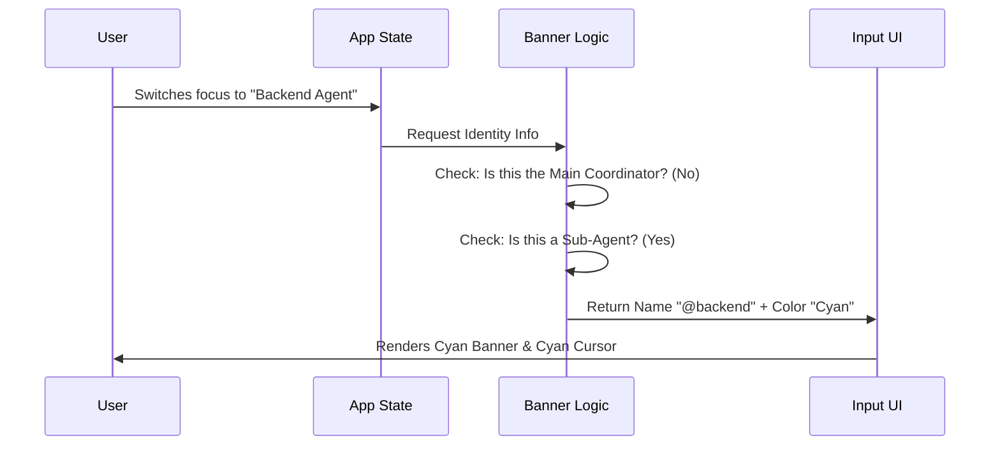

# Chapter 3: Swarm Identity Context

In the previous chapter, [Smart Input Processing](02_smart_input_processing.md), we learned how to handle the text the user types. But in a multi-agent system, **context is everything**.

Typing "Delete the database" to a **Coordinator Agent** might trigger a safety check. Typing it to a **Database Cleanup Sub-Agent** might execute it immediately.

We need a way to tell the user *exactly* who they are talking to before they hit Enter.

## The Problem: "Who am I talking to?"

Imagine you are in a crowded room working on a project. You turn to your left and ask, "Can you fix this CSS bug?"

If you turned to the **Backend Engineer**, they will look confused. If you turned to the **Frontend Designer**, they will get to work.

In a terminal interface, you don't have faces. You usually just have a blinking cursor. We need to create a **Digital Uniform**—visual cues that instantly tell you which agent is currently active.

## Key Concepts

To solve this, **Swarm Identity Context** uses three visual strategies:

1.  **The Banner:** A prominent label (like a name tag) shown when you are "possessing" or viewing a specific agent.
2.  **The Theme Color:** Every agent type (Manager, Coder, Reviewer) has a specific color assigned to it.
3.  **The Prompt Indicator:** The small symbol (❯) next to your cursor changes color or shape based on the context.

---

## The Workflow: Identifying the Agent

Before we render anything, the system runs a check to determine the current "Identity Context."

### Visualizing the Logic

Here is how the system decides what to show you:



---

## Internal Implementation

Let's look at how we build these visual cues using the React components provided in the project.

### 1. The Banner (`useSwarmBanner.ts`)

This is a **Hook**. It doesn't draw pixels itself; it calculates *what* should be drawn. It looks at the global application state to find the active agent.

The logic follows a hierarchy. Specific agents override the general swarm.

```typescript
// Simplified logic from useSwarmBanner.ts

// 1. Are we logged in as a specific teammate?
if (isTeammate()) {
  return {
    text: `@${getAgentName()}`,
    bgColor: getTeammateColor() // e.g., 'magenta'
  };
}
```

If we aren't a teammate, the code checks if we are merely *viewing* one (like a manager watching a worker).

```typescript
// 2. Are we just watching a sub-agent task?
if (viewingAgentTaskId) {
  return {
    text: `@${viewedAgentName}`,
    bgColor: viewedAgentColor // e.g., 'cyan'
  };
}

// 3. Default: No banner (Main Coordinator)
return null;
```

**Explanation:**
If this hook returns `null`, the UI stays clean (default look). If it returns an object, the UI renders a colored bar with the agent's name.

### 2. The Prompt Indicator (`PromptInputModeIndicator.tsx`)

This component draws the actual character next to your cursor. It usually looks like `❯`.

It takes the color determined by the logic above and applies it to the character. It also handles the "Bash Mode" we discussed in Chapter 2 (where `!` changes the symbol).

#### Step A: determining the Color
First, we resolve the color. If the user is viewing a specific agent, we use that agent's color.

```tsx
// Inside PromptInputModeIndicator

// If we are explicitly viewing an agent, use their color
const viewedColor = viewingAgentColor 
  ? AGENT_COLOR_TO_THEME_COLOR[viewingAgentColor] 
  : undefined;
```

#### Step B: Drawing the Symbol
Now we decide what symbol to draw.

```tsx
// If in Bash Mode (starts with !), show a red Exclamation
if (mode === "bash") {
  return <Text color="bashBorder" dimColor={isLoading}>! </Text>;
}

// Otherwise, show the Prompt Character (❯) with the agent's color
return (
  <PromptChar 
    isLoading={isLoading} 
    themeColor={viewedColor} 
  />
);
```

**Explanation:**
*   **Bash Mode:** If you type `!ls`, the prompt turns red and shows `!`. This warns you that you are running a system command, not chatting.
*   **Agent Mode:** If you are chatting with the "Reviewer" agent (who is Green), `viewedColor` becomes green, and the `❯` turns green.

### 3. The Prompt Character Component

The `PromptChar` is a tiny sub-component that actually renders the arrow. It handles the "Thinking" state too.

```tsx
function PromptChar({ isLoading, themeColor }) {
  // If no specific agent color, default to 'subtle' gray
  const color = themeColor ?? "subtle";

  return (
    <Text color={color} dimColor={isLoading}>
      {figures.pointer} {/* Renders as ❯ */}
    </Text>
  );
}
```

**Explanation:**
We use `figures.pointer` to get the `❯` symbol safely across different operating systems. The `dimColor` prop fades the arrow out if the AI is currently thinking (loading), giving subtle feedback that the input is locked.

---

## Bringing it Together

Let's see how these components change the user experience in real-time.

| User Context | Banner Output | Indicator Output | Meaning |
| :--- | :--- | :--- | :--- |
| **Default** | `null` (Hidden) | `❯` (Blue/White) | Talking to Main Coordinator |
| **View Agent** | `@planner` (Cyan Box) | `❯` (Cyan) | Giving instructions to Planner |
| **System Cmd** | `null` (Hidden) | `!` (Red) | Running a shell command (`!git`) |
| **Thinking** | `@planner` (Cyan Box) | `❯` (Dimmed) | Agent is working; please wait |

By combining the **Banner** (Top context) and the **Indicator** (Immediate context), the user never feels lost in the swarm.

## Conclusion

**Swarm Identity Context** ensures that complex multi-agent interactions feel organized. By using visual metaphors like "Uniforms" (Colors) and "Name Tags" (Banners), we prevent user errors and make the terminal feel alive.

Now that we know *who* we are talking to, we need to help the user figure out *what* to say.

[Next Chapter: Autocomplete Suggestion Overlay](04_autocomplete_suggestion_overlay.md)

---

Generated by [Code IQ](https://github.com/adityasoni99/Code-IQ)