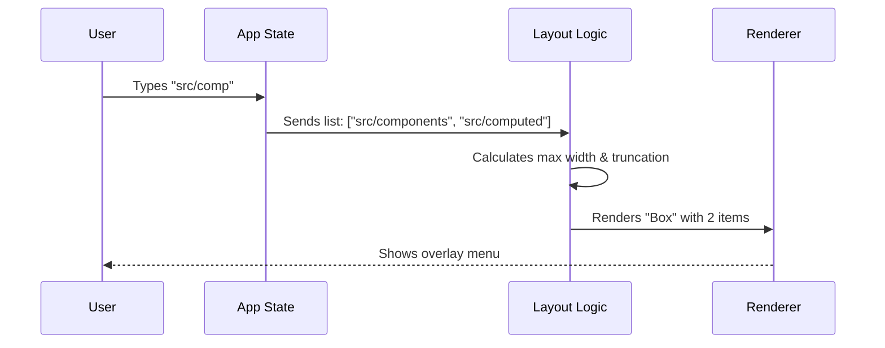

# Chapter 4: Autocomplete Suggestion Overlay

In the previous chapter, [Swarm Identity Context](03_swarm_identity_context.md), we established *who* the user is talking to (the Agent). Now, we need to help the user talk *faster*.

## The Problem: Typing is Slow and Error-Prone

Imagine you need to ask an AI to refactor a specific file. You start typing:
`./src/components/dashboard/widgets/WeatherWidget.tsx`

If you make a single typo, the AI might hallucinate or fail to find the file. In modern IDEs (like VS Code), we are used to "IntelliSense"—a popup box that guesses what we are typing.

The **Autocomplete Suggestion Overlay** brings this modern convenience to the terminal.

## The Solution: A "Floaty" List

This component watches what you type. If it recognizes a pattern (like the start of a filename or a command), it renders a list of options.

### Key Concepts

1.  **The Trigger:** The application logic (outside this UI component) detects you are typing a path and passes a list of `suggestions`.
2.  **The Overlay:** Unlike the Footer (which sits at the bottom), this list needs to "float" visually above the prompt so it doesn't push your text off the screen.
3.  **Smart Truncation:** Terminal screens are narrow. We need to squeeze long file paths into short lines without losing important information.

---

## Visualizing the Flow

Before looking at code, let's see how the data flows from your keystroke to the screen.



---

## Implementation Details

The core logic lives in `PromptInputFooterSuggestions.tsx`. Let's break down how it renders this list.

### 1. Determining Icons

We don't just want text; we want visual cues. A file looks different from an AI Agent or a Database resource.

We use a helper function to decide which symbol to draw:

```typescript
// From PromptInputFooterSuggestions.tsx
function getIcon(itemId: string): string {
  if (itemId.startsWith('file-')) return '+';        // File
  if (itemId.startsWith('mcp-resource-')) return '◇'; // Resource
  if (itemId.startsWith('agent-')) return '*';       // AI Agent
  return '+';
}
```

*   **Files** get a `+` (to imply "adding context").
*   **Resources** get a `◇` (a diamond).
*   **Agents** get a `*` (a star).

### 2. The "Unified" Suggestion Row

We treat files and agents as "Unified Suggestions." This means they get special formatting.

The most important part of rendering a file is **Middle Truncation**.
*   *Bad Truncation:* `./src/components/dashboa...` (You lost the filename!)
*   *Good Truncation:* `.../dashboard/WeatherWidget.tsx` (You see the folder and the file).

Here is how the row component decides what to render:

```tsx
// Inside SuggestionItemRow
const isUnified = isUnifiedSuggestion(item.id);

if (isUnified) {
  // 1. Get the icon
  const icon = getIcon(item.id);
  
  // 2. Truncate path in the middle so filename remains visible
  const displayText = truncatePathMiddle(item.displayText, maxPathLength);

  // 3. Render
  return <Text>{icon} {displayText}</Text>;
}
```

**Why Middle Truncation?**
In a terminal, the end of the string (the file extension and name) is usually more important than the beginning (the root folder).

### 3. Handling Descriptions

Sometimes a suggestion needs a description (e.g., an Agent's capabilities). We append this after the name, separated by a dash.

```tsx
// Inside SuggestionItemRow (Unified logic)

if (item.description) {
  // Calculate how much space is left for the description
  const maxDescLength = Math.max(0, availableWidth);
  
  // Truncate the description to fit
  const truncatedDesc = truncateToWidth(item.description, maxDescLength);
  
  lineContent = `${icon} ${displayText} – ${truncatedDesc}`;
}
```

### 4. The Overlay Container

Finally, the main component wrapping these rows needs to decide *how* to stack them.

If `overlay` is true, we render a fixed number of items (usually 5). If `overlay` is false, we might render them inline at the bottom of the screen.

```tsx
// PromptInputFooterSuggestions.tsx
export function PromptInputFooterSuggestions({ suggestions, overlay }) {
  // If overlay mode, cap at 5 items. Otherwise fill available rows.
  const maxVisibleItems = overlay 
    ? OVERLAY_MAX_ITEMS 
    : Math.min(6, rows - 3);

  if (suggestions.length === 0) return null;

  // Render the list
  return (
    <Box flexDirection="column">
      {visibleItems.map(item => (
        <SuggestionItemRow item={item} />
      ))}
    </Box>
  );
}
```

**Note:** The `Box` component here creates a vertical column of items. The `visibleItems.map` loop creates the rows we defined in the previous steps.

---

## How to Use It

To use this component in your application, you simply pass it an array of suggestion objects and the index of the one currently highlighted by the user's arrow keys.

```tsx
<PromptInputFooterSuggestions 
  suggestions={[
    { id: 'file-1', displayText: 'src/App.tsx', description: 'Main Entry' },
    { id: 'file-2', displayText: 'src/utils.ts', description: 'Helpers' }
  ]}
  selectedSuggestion={0} // The first item is highlighted
  overlay={true}         // Render as a floating box
/>
```

**What the user sees:**
```text
+ .../src/App.tsx – Main Entry  <-- (Highlighted Blue)
+ .../src/utils.ts – Helpers    <-- (Dimmed Gray)
```

## Conclusion

The **Autocomplete Suggestion Overlay** transforms the terminal from a blank void into an intelligent editor. By using smart icons and middle-truncation for file paths, we make it easy for users to select the right context for their AI agents.

Now that the user has successfully typed their command and selected the right context, the system needs to process the action and let the user know what's happening.

[Next Chapter: Notification & Feedback System](05_notification___feedback_system.md)

---

Generated by [Code IQ](https://github.com/adityasoni99/Code-IQ)