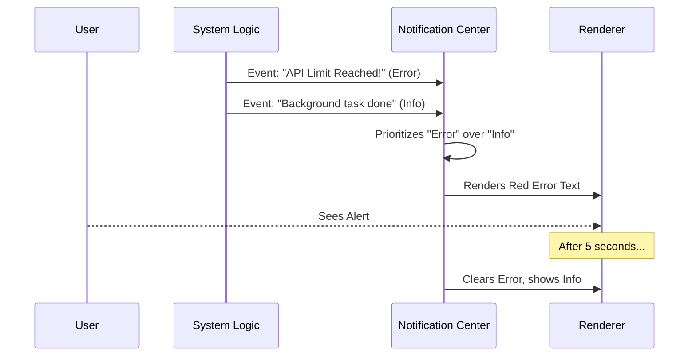

# Chapter 5: Notification & Feedback System

In the previous chapter, [Autocomplete Suggestion Overlay](04_autocomplete_suggestion_overlay.md), we helped the user type faster by predicting what they wanted to say.

Now, we need to handle the conversation going the *other* way. How does the system talk back to the user without interrupting them?

## The Problem: "Is it working?"

Imagine you send a command to the AI. While it thinks, your internet connection drops.
*   **Bad Experience:** The cursor just blinks forever. You don't know if it's thinking or broken.
*   **Good Experience:** A red text appears saying "Connection Lost," but your typed text remains safe.

In a traditional terminal, programs usually just `console.log` errors, which messes up the layout. We need a **Heads-Up Display (HUD)**—a centralized layer that manages alerts, status updates, and errors neatly.

## Key Concepts

We divide system feedback into three categories:

1.  **Persistent Status:** Information that is always true right now (e.g., "Debug Mode is ON" or "Token Usage: 500").
2.  **Transient Notifications:** Temporary messages that appear and vanish (e.g., "File saved" or "API Error").
3.  **Mode Overrides:** When a specific feature takes over the entire notification area (e.g., **Voice Mode**).

---

## The Workflow: The Traffic Controller

The Notification System acts like an air traffic controller. It receives signals from everywhere in the app (Auth, API, File System) and decides what is important enough to show.



---

## Internal Implementation

The core logic lives in `Notifications.tsx`. This component doesn't just render one thing; it checks a list of conditions in a specific order of importance.

### 1. The Priority Stack

The component is essentially a big list of `if` statements. It renders the most critical information available.

```tsx
// Simplified logic structure of Notifications.tsx
export function Notifications(props) {
  // 1. Critical: Voice Mode takes over everything
  if (isVoiceModeActive) {
    return <VoiceIndicator />;
  }

  // 2. High Priority: Transient Notifications (Toasts)
  if (currentNotification) {
    return <Text color={notification.color}>{notification.text}</Text>;
  }

  // 3. Medium Priority: Account Issues
  if (props.apiKeyStatus === 'missing') {
    return <Text color="error">Not logged in · Run /login</Text>;
  }
  
  // ... more checks
}
```

*Explanation:* If Voice Mode is active, the user doesn't care about token usage; they need to see the microphone status. If there is no voice mode, but there is a login error, that is more important than debug info.

### 2. Transient Notifications (The "Toast")

"Toast" notifications are messages that pop up and disappear. We use a hook `useNotifications` to manage this queue.

```tsx
// How a notification is rendered
{notifications.current && (
  <Text 
    color={notifications.current.color} 
    wrap="truncate"
  >
    {notifications.current.text}
  </Text>
)}
```

**How to trigger one:**
Anywhere in the app, a developer can call `addNotification`.

```typescript
addNotification({
  key: "save-success",
  text: "File saved successfully",
  priority: "low",
  timeoutMs: 3000 // Disappears after 3 seconds
});
```

### 3. Persistent Status Indicators

If there are no urgent alerts, the system falls back to showing helpful context. A common example is **Token Usage** (how much "memory" the AI has used).

```tsx
// Showing token usage if verbose mode is on
{apiKeyStatus === 'valid' && verbose && (
  <Box>
    <Text dimColor>
      {tokenUsage} tokens
    </Text>
  </Box>
)}
```

*Explanation:* This uses logical `&&` (AND) operators. We only show the token count if the API key is valid AND the user has enabled verbose logging.

---

## Special Feature: Voice Indicator

The `VoiceIndicator.tsx` is a unique part of the notification system. It replaces text with a visual animation when the user is speaking.

It uses a mathematical sine wave to create a "breathing" or "pulsing" effect, making the terminal feel organic.

### The Animation Loop

```tsx
// Inside ProcessingShimmer component
const [ref, time] = useAnimationFrame(50); // Updates every 50ms

// Calculate opacity using a Sine wave
const elapsedSec = time / 1000;
const opacity = (Math.sin(elapsedSec) + 1) / 2;

// Interpolate between Dim and Bright colors
const color = interpolateColor(DIM_GRAY, BRIGHT_GRAY, opacity);

return <Text color={color}>Voice: processing...</Text>;
```

*Explanation:*
1.  **`useAnimationFrame`**: Tells React to re-run this code constantly (animation loop).
2.  **`Math.sin`**: Creates a value that goes up and down smoothly over time.
3.  **`interpolateColor`**: Blends two colors based on that value.

This results in text that glows in and out, signaling that the AI is "listening" or "thinking."

---

## External Integrations

The Notification system also watches external tools. For example, it checks if your IDE (VS Code) is connected.

```tsx
// Inside Notifications.tsx
const { status: ideStatus } = useIdeConnectionStatus(mcpClients);

const shouldShowIdeSelection = ideStatus === "connected" && ideSelection;

return (
  <>
    <IdeStatusIndicator />
    {/* ... other notifications ... */}
  </>
);
```

This ensures that if you select code in VS Code, the terminal acknowledges it immediately via the notification layer.

## Conclusion

The **Notification & Feedback System** transforms the terminal from a silent black box into a communicative interface. By prioritizing messages—Critcal Mode > Transient Alert > Persistent Status—we ensure the user always sees the most important information without being overwhelmed.

Now that the user can see what the system is doing, we need to show them what actions are queued up to run next.

[Next Chapter: Command Queue Preview](06_command_queue_preview.md)

---

Generated by [Code IQ](https://github.com/adityasoni99/Code-IQ)