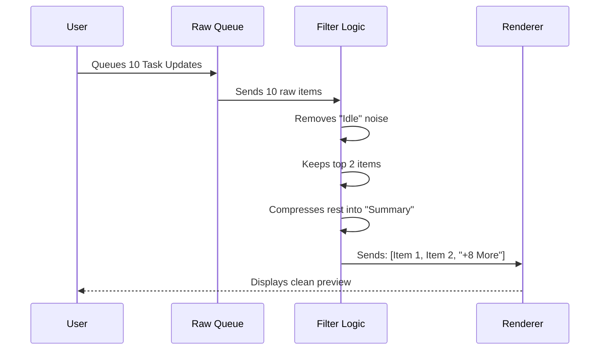

# Chapter 6: Command Queue Preview

Welcome to the final chapter of the **PromptInput** tutorial!

In the previous chapter, [Notification & Feedback System](05_notification___feedback_system.md), we learned how the system sends messages *to* the user. Now, we will focus on the messages the user is about to send *to* the system.

## The Problem: The "Blind Batch"

Imagine you are a manager assigning tasks to an employee. You write down 10 sticky notes and hand them over in a stack.
*   If the employee takes the stack without looking, they might start working on the wrong priority.
*   If you hand them over but forget what you wrote on the 5th note, you lose control of the workflow.

In an AI Agent terminal, things happen fast. Agents often generate their own sub-tasks, or you might paste a script that queues up 50 commands at once. If you can't see this queue, you are flying blind.

## The Solution: The "Outbox"

The **Command Queue Preview** acts like an email Outbox or a shopping cart. It sits above your input line and visualizes everything that is waiting to be executed.

### Key Concepts

1.  **The Queue:** A waiting line of data. Items enter from the bottom and leave from the top (FIFO: First In, First Out).
2.  **Normalization:** The queue might contain a user chat ("Hello"), a system command (`!ls`), or a task update. We need to format them so they all look like readable messages.
3.  **Visual Capping:** If there are 100 items in the queue, we shouldn't fill the entire screen. We need to show the first few and summarize the rest (e.g., "+95 more").

---

## Visualizing the Flow

Before rendering, the component has to clean up the raw data.



---

## Internal Implementation

The logic for this feature is contained in `PromptInputQueuedCommands.tsx`. It acts as a gatekeeper between the raw data and the screen.

### Step 1: Filtering Noise

Not everything in the queue is meant for humans. Some items are "Idle Notifications" (internal system pings). We filter these out so the user only sees actionable items.

```typescript
// Inside processQueuedCommands function
function processQueuedCommands(queuedCommands) {
  // Remove items that are just internal system noise
  const filteredCommands = queuedCommands.filter(cmd => 
    typeof cmd.value !== 'string' || 
    !isIdleNotification(cmd.value)
  );
  
  return filteredCommands;
}
```
*Explanation:* We look at every command. If `isIdleNotification` returns true, we throw it away. This keeps the UI clean.

### Step 2: The "Overload" Protection

If an agent generates 50 task notifications in one second, we don't want to scroll the user's chat history off the screen. We enforce a limit (e.g., 3 lines).

```typescript
// Define the limit
const MAX_VISIBLE_NOTIFICATIONS = 3;

// Check if we have too many
if (taskNotifications.length > MAX_VISIBLE_NOTIFICATIONS) {
  // Keep the first few
  const visible = taskNotifications.slice(0, MAX_VISIBLE_NOTIFICATIONS - 1);
  
  // Calculate how many are hidden
  const overflowCount = taskNotifications.length - visible.length;
}
```
*Explanation:* We slice the array to get just the top items. We then do simple math to figure out how many items are being hidden.

### Step 3: Creating the Summary Message

If we hid items in Step 2, we need to generate a fake message that represents them. We use XML tags to style this message so it looks like a system summary.

```typescript
// Creating the summary string
function createOverflowNotificationMessage(count: number) {
  return `
    <task-notification>
      <summary>+${count} more tasks completed</summary>
      <status>completed</status>
    </task-notification>
  `;
}
```
*Explanation:* We inject a formatted string into the queue. The rendering engine will see `<summary>` and know to draw it as a collapsed box, rather than a full chat message.

### Step 4: Rendering the Preview

Finally, we map these processed commands to the screen. We use the same `Message` component used for the main chat, but with a special flag.

```tsx
// Inside the Component Return
return (
  <Box flexDirection="column">
    {messages.map((msg, i) => (
      <QueuedMessageProvider key={i} isFirst={i === 0}>
        <Message 
          message={msg} 
          isStatic={true} // Important!
        />
      </QueuedMessageProvider>
    ))}
  </Box>
);
```
*Explanation:* 
*   **`QueuedMessageProvider`**: Wraps the message to give it "Draft" styling (usually slightly transparent or dimmed).
*   **`isStatic={true}`**: This tells the `Message` component, "Don't animate this text. Don't type it out character-by-character. Just show it immediately."

---

## Special Case: Agent Transcript View

There is one scenario where we hide the queue entirely. 

If you are "Zoomed In" on a specific sub-agent (using the Identity Context from [Chapter 3](03_swarm_identity_context.md)), you shouldn't see the Main Coordinator's queue. It would be confusing to see commands that don't belong to the agent you are watching.

```tsx
const viewingAgent = useAppState(s => !!s.viewingAgentTaskId);

// If we are looking at a specific agent's history, hide the global queue
if (viewingAgent) {
  return null;
}
```
*Explanation:* This follows the "Return Null" pattern. If the context isn't right, the component renders nothing, effectively disappearing from the DOM.

## Conclusion

The **Command Queue Preview** is the final safety check in the interface.
1.  It **Filters** out system noise.
2.  It **Caps** large lists to prevent UI clutter.
3.  It **Normalizes** data so tasks and chats look consistent.

By combining all the chapters:
*   We know **Status** via the Footer.
*   We handle **Input** via Smart Processing.
*   We know **Who** we are via Identity Context.
*   We type **Faster** via Autocomplete.
*   We receive **Feedback** via Notifications.
*   And now, we **Verify** our actions via the Command Queue.

You have now completed the **PromptInput** tutorial series! You have the knowledge to build a robust, user-friendly terminal interface for complex AI agents.

---

Generated by [Code IQ](https://github.com/adityasoni99/Code-IQ)