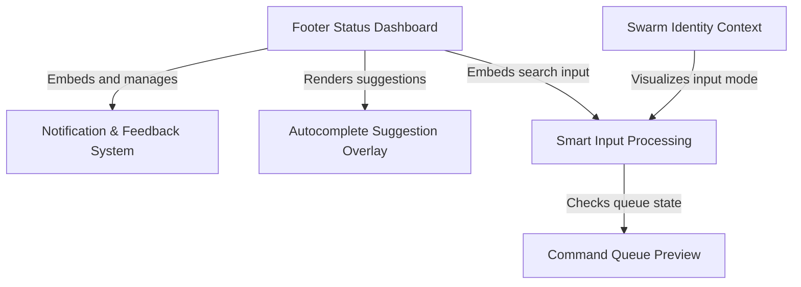

# Tutorial: PromptInput

A sophisticated, context-aware **terminal input interface** for an AI coding assistant. It features a responsive **Footer Status Dashboard** that adapts to the terminal width, displaying critical information like current mode and background tasks. The system includes an intelligent **Smart Input** area with visual effects, *autocomplete suggestions*, and a **Notification System** for non-blocking feedback, all while dynamically reflecting the **Swarm Identity** of active AI agents.

## Chapters

1. [Footer Status Dashboard](01_footer_status_dashboard.md)
2. [Smart Input Processing](02_smart_input_processing.md)
3. [Swarm Identity Context](03_swarm_identity_context.md)
4. [Autocomplete Suggestion Overlay](04_autocomplete_suggestion_overlay.md)
5. [Notification & Feedback System](05_notification___feedback_system.md)
6. [Command Queue Preview](06_command_queue_preview.md)

---

Generated by [Code IQ](https://github.com/adityasoni99/Code-IQ)