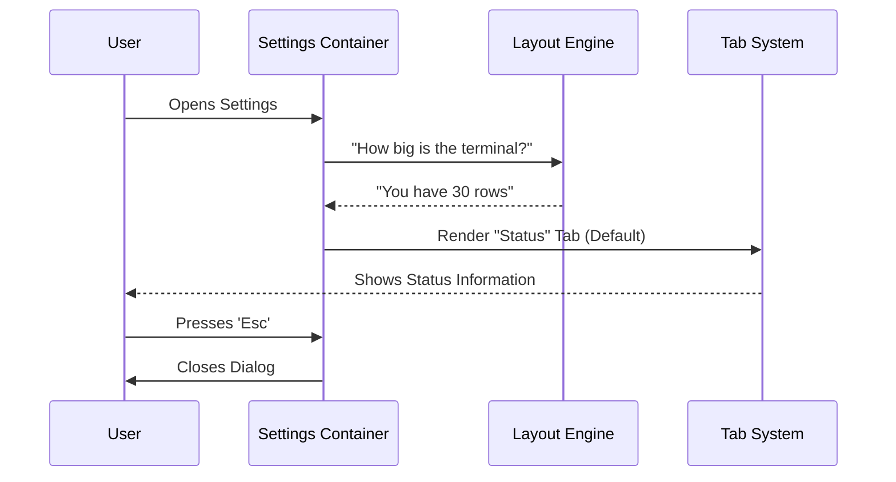

# Chapter 1: Settings Container

Welcome to the **Settings** project tutorial! If you are new to building interactive terminal applications, you are in the right place.

We are starting with the **Settings Container**. Think of this as the "Control Panel" or the "Settings App" on your smartphone. Before we look at individual settings like Wi-Fi or Bluetooth, we need the app itself—the window that holds everything together, handles the tabs, and knows when to close.

### Why do we need a Container?

Imagine you have three different tools: a status checker, a configuration editor, and a usage monitor. Without a container, they are just loose pieces.

**The Problem:**
You need a way to:
1.  Group these tools together.
2.  Switch between them easily (like tabs in a browser).
3.  Make sure the window fits inside your terminal screen.
4.  Close the entire menu when the user presses `Esc`.

**The Solution:**
The `Settings` component acting as a **Container**. It manages the state of the application (which tab is active) and the global layout.

---

### Key Concepts

To build this container, we need to understand three main concepts.

#### 1. The Hub (State Management)
The container needs a memory. It needs to remember: *"Is the user looking at the Status tab or the Config tab?"* It uses React state to keep track of this.

#### 2. The Frame (Responsive Layout)
Terminal windows can be tiny or huge. The container asks the system, *"How many rows do I have?"* and adjusts the height of the settings box so it doesn't get cut off.

#### 3. The Gatekeeper (Interaction Handling)
The container listens for global keys. If you press `Esc`, the container decides if it should close the settings or if a sub-component (like a search bar) needs that key press first.

---

### How to Use It

Using the Settings Container is simple. It is the entry point for your settings interface. You simply render the `<Settings />` component.

Here is a simplified example of how it is used in the application:

```tsx
import { Settings } from './Settings';

// When the user runs the "settings" command:
<Settings 
  onClose={() => console.log("User closed settings")} 
  defaultTab="Status" 
  context={commandContext}
/>
```

**What happens here?**
1.  The `Settings` component launches.
2.  It opens the **Status** tab by default.
3.  When the user is done, the `onClose` function runs to clean up.

---

### Internal Implementation: How it Works

Let's look under the hood. When the Settings component loads, a specific sequence of events occurs to set up the screen.



Now, let's break down the actual code implementation into small, digestible blocks.

#### 1. Managing Tabs
First, we need to know which tab is currently open. We use a standard React Hook for this.

```tsx
// Inside Settings.tsx function
export function Settings({ defaultTab, ...props }) {
  // 1. Setup state for the active tab
  const [selectedTab, setSelectedTab] = useState(defaultTab);
  
  // 2. Setup state to hide tabs (useful for sub-menus)
  const [tabsHidden, setTabsHidden] = useState(false);
```
*   **Explanation:** `selectedTab` keeps track of whether we are viewing "Status", "Config", or "Usage".

#### 2. Handling Terminal Size
A common issue in CLI apps is drawing content that is too tall for the screen. We use a custom hook to calculate safe boundaries.

```tsx
  // Get the size of the modal or terminal
  const { rows } = useModalOrTerminalSize(useTerminalSize());

  // Calculate safe height (leave room for borders)
  const contentHeight = insideModal 
    ? rows + 1 
    : Math.max(15, Math.min(Math.floor(rows * 0.8), 30));
```
*   **Explanation:** We ask for the `rows` (height). We then do some math to ensure the settings box takes up about 80% of the screen but never gets too small or too huge. This touches on concepts we will explore in [Terminal UI Composition (Ink)](04_terminal_ui_composition__ink_.md).

#### 3. Handling the Escape Key
This is a critical part of the User Experience. We need to close the settings when `Esc` is pressed, but **not** if the user is currently typing in a search box inside the Config tab.

```tsx
  // Logic: Only handle Escape if a sub-component doesn't own it
  const isActive = !tabsHidden && 
                   !(selectedTab === "Config" && configOwnsEsc);

  useKeybinding("confirm:no", () => {
     onClose("Status dialog dismissed");
  }, { isActive });
```
*   **Explanation:** We check if `configOwnsEsc` is true. If it is, the Container ignores the `Esc` key so the Config tab can use it to clear a search. If not, the Container closes the app. For more on keys, see [Keybinding & Interaction System](05_keybinding___interaction_system.md).

#### 4. Assembling the Tabs
Finally, we build the list of tabs that will be displayed inside our container.

```tsx
  const tabs = [
    <Tab key="status" title="Status">
      <Status context={context} />
    </Tab>,
    <Tab key="config" title="Config">
      <Config onClose={onClose} />
    </Tab>,
    // ... Usage tab and others
  ];
```
*   **Explanation:** We create an array of `Tab` components. Notice how we pass `Status` and `Config` as children. We will dive into these in [System Status & Diagnostics](02_system_status___diagnostics.md).

#### 5. The Final Render
We wrap everything in a `Pane` (the outer box color) and the `Tabs` system (the navigation bar).

```tsx
  return (
    <Pane color="permission">
      <Tabs 
        selectedTab={selectedTab} 
        onTabChange={setSelectedTab} 
        contentHeight={contentHeight}
      >
        {tabs}
      </Tabs>
    </Pane>
  );
}
```
*   **Explanation:** This is what actually draws the UI to the terminal. The `Pane` gives it a border color, and `Tabs` renders the navigation header and the content of the `selectedTab`.

---

### Summary
In this chapter, we built the **Settings Container**.
*   It acts as the **skeleton** for our settings screen.
*   It manages **Tabs** to switch views.
*   It calculates **Terminal Height** to look good on any screen.
*   It intelligently handles the **Escape Key**.

Now that we have our container, let's fill in the first tab.

[Next Chapter: System Status & Diagnostics](02_system_status___diagnostics.md)

---

Generated by [Code IQ](https://github.com/adityasoni99/Code-IQ)