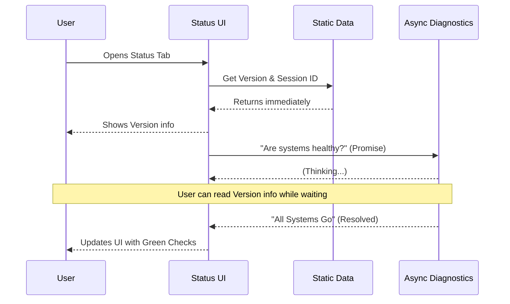

# Chapter 2: System Status & Diagnostics

Welcome back! In the previous chapter, [Settings Container](01_settings_container.md), we built the "frame" for our application—the window that holds tabs and handles closing.

Now, we are going to fill the first and most important tab: **System Status**.

### Motivation: The Car Dashboard

Imagine driving a car that has no dashboard. To check your speed, you have to guess. To check your fuel, you have to pull over and look in the tank. To see if the engine is overheating, you have to wait for smoke. That would be terrible.

**The Problem:**
In a complex terminal application, users often face similar "blindness":
1.  *Where am I running this?* (Current Working Directory)
2.  *Which version is this?*
3.  *Is the backend API connected?*
4.  *Is the system running out of memory?*

**The Solution:**
We need a **System Status & Diagnostics** view. It acts like a car dashboard. It instantly shows you the "read-only" facts (Version, ID) and runs diagnostic checks (Engine Health) in the background to ensure everything is running smoothly.

---

### Key Concepts

To build this dashboard, we split the information into two types.

#### 1. The Snapshot (Synchronous Data)
This is information we know *immediately*. It sits in the application's memory.
*   **Examples:** Version number, Session ID, Current folder.
*   **Behavior:** Appears instantly when the tab opens.

#### 2. The Checkup (Asynchronous Diagnostics)
This is information we have to *calculate* or *fetch*. It might take a second or two.
*   **Examples:** Checking if the installation is corrupt, verifying API keys, checking memory usage.
*   **Behavior:** Shows a loading state (or appears later) so it doesn't slow down the rest of the interface.

---

### How to Use It

From the perspective of our [Settings Container](01_settings_container.md), using the Status component is very straightforward. We just need to pass it the context (data about the app) and a "Promise" that will eventually return the results of our diagnostic health check.

```tsx
import { Status, buildDiagnostics } from './Status';

// 1. Start the health check in the background
const healthCheck = buildDiagnostics();

// 2. Render the component
<Status 
  context={commandContext} 
  diagnosticsPromise={healthCheck} 
/>
```

**What happens here?**
The `Status` component will immediately show the version and ID. Meanwhile, it will "watch" the `healthCheck` promise. When that promise finishes, the diagnostics section will pop in automatically.

---

### Internal Implementation: How it Works

This component uses a modern React pattern called **Suspense**. Think of it like a waiter at a restaurant.

1.  **The Waiter (React)** brings you water (Static Data) immediately.
2.  **The Kitchen (Async Logic)** is preparing your meal (Diagnostics).
3.  **The Table (UI)** shows the water now, and automatically places the food down when it arrives, without you having to ask again.



Let's look at the code step-by-step.

#### 1. Gathering Static Data
First, we gather the "Snapshot" data. We build a simple list of objects containing labels and values.

```tsx
function buildPrimarySection() {
  const sessionId = getSessionId();
  
  return [
    { label: 'Version', value: '1.0.0' },
    { label: 'Session ID', value: sessionId },
    { label: 'cwd', value: process.cwd() },
    // ... other instant properties
  ];
}
```
*   **Explanation:** This function runs instantly. It grabs data that is already available in memory variables.

#### 2. Rendering the Data List
We need a clean way to display this list. We iterate over the array and render a `Box` for each item. This touches on layout concepts from [Terminal UI Composition (Ink)](04_terminal_ui_composition__ink_.md).

```tsx
// Inside the component rendering logic
const properties = buildPrimarySection();

return (
  <Box flexDirection="column">
    {properties.map((prop, index) => (
      <Box key={index} gap={1}>
        <Text bold>{prop.label}:</Text>
        <Text>{prop.value}</Text>
      </Box>
    ))}
  </Box>
);
```
*   **Explanation:** We loop through our data. `Box gap={1}` adds a space between the Label and the Value.

#### 3. Handling Async Diagnostics (The "Magic")
This is the most advanced part of this component. We use React's `use` hook (or `Suspense`) to handle the waiting.

```tsx
import { use } from 'react';

function Diagnostics({ promise }) {
  // This line PAUSES rendering of this specific component
  // until the promise resolves.
  const diagnostics = use(promise); 

  if (diagnostics.length === 0) return null;

  return <Box>{/* Render warnings */}</Box>;
}
```
*   **Explanation:** The `use(promise)` hook tells React: *"Stop right here. Don't render the rest of this function until the data is ready."*

#### 4. Combining with Suspense
To prevent the *entire* dashboard from freezing while waiting for diagnostics, we wrap the `Diagnostics` component in a `Suspense` boundary.

```tsx
import { Suspense } from 'react';

export function Status({ diagnosticsPromise }) {
  return (
    <Box flexDirection="column">
      {/* 1. This shows immediately */}
      {buildPrimarySection()} 

      {/* 2. This waits gracefully */}
      <Suspense fallback={<Text>Checking health...</Text>}>
        <Diagnostics promise={diagnosticsPromise} />
      </Suspense>
    </Box>
  );
}
```
*   **Explanation:**
    *   The `PrimarySection` renders instantly.
    *   The `Suspense` block acts as a safety net. While `Diagnostics` is waiting for data, React (optionally) shows the `fallback`.
    *   Once the data arrives, `Diagnostics` renders the actual health warnings.

### Summary

In this chapter, we built a **System Status & Diagnostics** dashboard.
*   We learned to distinguish between **Snapshot Data** (fast) and **Diagnostic Data** (slow).
*   We used **React Suspense** to load heavy data without freezing the UI.
*   We structured our data into simple lists for easy rendering.

Now that we know the system is healthy, let's see how much we are using it.

[Next Chapter: Usage & Quota Monitoring](03_usage___quota_monitoring.md)

---

Generated by [Code IQ](https://github.com/adityasoni99/Code-IQ)