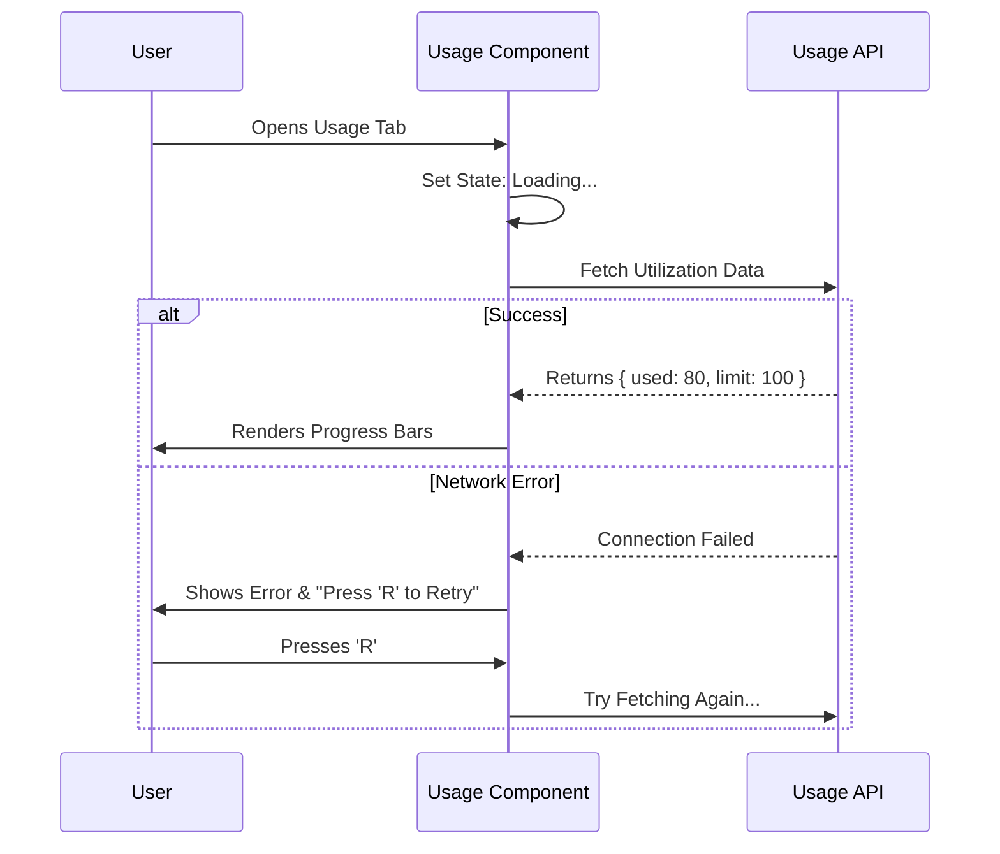

# Chapter 3: Usage & Quota Monitoring

Welcome to Chapter 3! In the previous chapter, [System Status & Diagnostics](02_system_status___diagnostics.md), we built a dashboard to check if our system is healthy.

Now that we know the engine is running, we need to check the fuel tank. In the world of APIs, "fuel" usually means **Usage Credits** or **Rate Limits**.

### Motivation: The Data Plan Analogy

Think about your mobile phone plan. You have a limit of 10GB of data per month.
*   **Without a monitor:** You stream videos blindly until suddenly your internet stops working because you hit the limit.
*   **With a monitor:** You check an app that shows a bar: *"80% used"*. You know to slow down.

**The Problem:**
Users need to know:
1.  *How many tokens/credits have I used?*
2.  *When does my quota reset?*
3.  *Am I about to get blocked?*

**The Solution:**
The **Usage & Quota Monitoring** component. It acts like a fuel gauge, fetching real-time data and drawing visual progress bars in the terminal.

---

### Key Concepts

To build this, we move away from the "Suspense" model we used in Chapter 2 and use a standard **Fetch-then-Render** cycle. This gives us more control over errors and retries.

#### 1. The Async Fetch
We don't know the usage data when the app starts. We have to send a request to the server: *"Hello, how much quota is left?"*. This takes time (milliseconds to seconds).

#### 2. The Three States
Since fetching takes time, our component must handle three distinct scenarios:
1.  **Loading:** The "Spinner" phase. We are waiting for an answer.
2.  **Success:** We got the numbers. We draw the bars.
3.  **Error:** The internet is down. We show a red message and a "Retry" button.

#### 3. The Visual Bar (LimitBar)
Text like "50000 / 100000 tokens" takes time to read. A bar that is half-filled is understood instantly. We need to calculate the width of this bar based on the terminal size.

---

### How to Use It

Integrating this into our [Settings Container](01_settings_container.md) is simple. Unlike the Status component, the `Usage` component handles its own data fetching internally, so you just render it.

```tsx
import { Usage } from './Usage';

// Inside your Tabs definition
<Tab key="usage" title="Usage">
  <Usage />
</Tab>
```

**What happens here?**
When the user clicks the "Usage" tab, the component mounts, immediately triggers a network request, and updates the screen when data arrives.

---

### Internal Implementation: How it Works

Let's visualize the lifecycle of this component. It is more interactive than the Status page because it allows the user to **Retry** if something goes wrong.



Now, let's look at the code blocks to see how this logic is constructed.

#### 1. Setting up the State
We use standard React `useState` hooks to track the three states we discussed earlier.

```tsx
export function Usage() {
  // 1. Hold the data (null initially)
  const [utilization, setUtilization] = useState(null);
  
  // 2. Hold the error message (if any)
  const [error, setError] = useState(null);
  
  // 3. Track if we are currently working
  const [isLoading, setIsLoading] = useState(true);
```
*   **Explanation:** These variables act as the component's short-term memory.

#### 2. The Fetch Function
We create a specific function to get the data. We wrap it in `try/catch` to handle network failures safely.

```tsx
  const loadUtilization = useCallback(async () => {
    setIsLoading(true); // Start loading
    setError(null);     // Clear previous errors

    try {
      const data = await fetchUtilization();
      setUtilization(data); // Success! Save data.
    } catch (err) {
      setError('Failed to load usage data'); // Failure! Save error.
    } finally {
      setIsLoading(false); // Done (success or fail)
    }
  }, []);
```
*   **Explanation:** This function attempts to get data. If it fails, it doesn't crash the app; it just updates the `error` state so we can show a message.

#### 3. Triggering the Load
We want this to happen automatically when the tab opens. We use `useEffect`.

```tsx
  useEffect(() => {
    void loadUtilization();
  }, [loadUtilization]);
```
*   **Explanation:** React runs this code exactly once when the component first appears on the screen.

#### 4. The Retry Mechanism
If the fetch failed, we want to let the user try again without restarting the app. We listen for a specific key press. This utilizes the system we will discuss in [Keybinding & Interaction System](05_keybinding___interaction_system.md).

```tsx
  useKeybinding('settings:retry', () => {
    void loadUtilization();
  }, { 
    isActive: !!error && !isLoading 
  });
```
*   **Explanation:** We tell the system: *"If there is an error and we aren't currently loading, run `loadUtilization` again when the retry key is pressed."*

#### 5. Drawing the Bars (The View)
If we have data, we render the `LimitBar`. This visualizes the math.

```tsx
  // Inside the return statement
  return (
    <Box flexDirection="column" gap={1}>
      {limits.map(item => (
        <LimitBar 
          key={item.title} 
          title={item.title} 
          limit={item.limit} 
          maxWidth={80} 
        />
      ))}
    </Box>
  );
```
*   **Explanation:** We loop through the data (e.g., Daily Limit, Monthly Limit) and draw a bar for each one.

### Visualizing the Progress Bar (LimitBar)
The `LimitBar` component is a great example of **Terminal UI Composition**. It takes a number (like 0.45 for 45%) and turns it into a string of block characters (like `████░░░░░`).

We will explore exactly how `Box`, `Text`, and creating custom visual components like `ProgressBar` work in the next chapter.

---

### Summary
In this chapter, we built the **Usage & Quota Monitoring** screen.
*   We learned how to manage **Async State** (Loading, Success, Error).
*   We implemented a **Retry Pattern** for resilience.
*   We saw how to map data into visual **Progress Bars**.

Now that our data logic is solid, let's learn how to actually draw these beautiful bars, boxes, and layouts using the graphics engine.

[Next Chapter: Terminal UI Composition (Ink)](04_terminal_ui_composition__ink_.md)

---

Generated by [Code IQ](https://github.com/adityasoni99/Code-IQ)