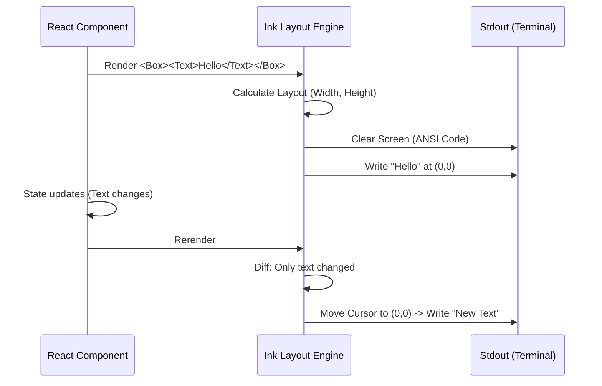

# Chapter 4: Terminal UI Composition (Ink)

Welcome to Chapter 4! In the previous chapter, [Usage & Quota Monitoring](03_usage___quota_monitoring.md), we focused on fetching data and handling errors. We ended up with some numbers—like knowing you have used 80% of your quota.

But looking at raw numbers isn't very exciting. We want to **visualize** it.

### Motivation: Beyond `console.log`

If you have written a basic script before, you probably used `console.log("Hello")` to output text. This works for simple logs, but it has limitations:
1.  **It flows down:** New text pushes old text up. You can't update a specific line.
2.  **It's boring:** It's just plain text. No columns, no sidebars, no layout.

**The Problem:**
We want our Settings app to look like a real application with a header, tabs, side-by-side columns, and progress bars. We want to treat the terminal like a graphical canvas, not a typewriter.

**The Solution:**
We use a library called **Ink**. Ink allows us to write **React components** (just like a website), but instead of rendering HTML (like `<div>` or `<h1>`), it renders text and layout commands to the terminal.

---

### Key Concepts

To build a UI in Ink, you only need to master two main components and one layout system.

#### 1. The `<Text>` Component
Think of this as the `<span>` or `<p>` tag of the terminal. It handles the **content** and the **styling** (color, bold, underline).
*   **HTML:** `<span style="color: green">Success</span>`
*   **Ink:** `<Text color="green">Success</Text>`

#### 2. The `<Box>` Component
Think of this as the `<div>` tag. It is invisible by default. Its only job is to **hold other components** and decide how they are arranged.

#### 3. Flexbox Layout
This is the "glue". Ink uses the CSS Flexbox model.
*   **Column:** Items stack vertically (like a stack of pancakes).
*   **Row:** Items sit side-by-side (like books on a shelf).
*   **Gap:** The empty space between items.

---

### The Use Case: Building a Progress Bar

Let's build the **Usage Bar** we saw in the previous chapter. We want to turn a number (like `0.5` or 50%) into a visual bar: `█████░░░░░`.

#### Step 1: Basic Text
First, let's just render the label.

```tsx
import { Text } from 'ink';

// Simple text rendering
<Text bold>Current Session Usage:</Text>
```
*   **Explanation:** This prints "Current Session Usage:" in bold text.

#### Step 2: Creating a Layout
We want the label to be above the bar. We need a "Column" layout.

```tsx
import { Box, Text } from 'ink';

<Box flexDirection="column">
  <Text bold>Current Session Usage:</Text>
  <Text> [Bar goes here] </Text>
</Box>
```
*   **Explanation:** `flexDirection="column"` tells the Box: "Put the first child on top, and the second child below it."

#### Step 3: Side-by-Side Layout
What if we want the label on the left and the value on the right? We change the direction to "row".

```tsx
<Box flexDirection="row" justifyContent="space-between">
  <Text>Usage:</Text>
  <Text>50%</Text>
</Box>
```
*   **Explanation:** `justifyContent="space-between"` pushes the two text items to the far edges of the terminal window.

---

### Internal Implementation: How it Works

How does writing React code result in a terminal UI? It involves a process called **Reconciliation**.

1.  **React State Changes:** Your component says "Progress is now 50%".
2.  **Ink Reconciler:** Ink calculates what characters need to change on the screen.
3.  **ANSI Escape Codes:** Ink sends special invisible codes to the terminal to say "Move cursor to row 3, column 5, and paint a green block."



Let's look at the actual code for the `LimitBar` we used in [Usage & Quota Monitoring](03_usage___quota_monitoring.md).

#### 1. The Structure (LimitBar)
In `Usage.tsx`, we combine these concepts to create the usage visualization.

```tsx
// Inside Usage.tsx -> LimitBar function
if (maxWidth >= 62) {
  return (
    <Box flexDirection="column">
      {/* 1. Title on top */}
      <Text bold={true}>{title}</Text>
      
      {/* 2. Bar and Text side-by-side below */}
      <Box flexDirection="row" gap={1}>
        <ProgressBar ratio={utilization / 100} width={50} />
        <Text>{Math.floor(utilization)}% used</Text>
      </Box>
    </Box>
  );
}
```
*   **Explanation:**
    *   We use an outer `<Box>` (column) to stack the Title above the content.
    *   We use an inner `<Box>` (row) to put the `<ProgressBar>` and the "50% used" text next to each other.
    *   `gap={1}` adds exactly one character of space between the bar and the text.

#### 2. The Visual Logic (ProgressBar)
We often create custom components to handle visual logic. The `ProgressBar` (imported from `design-system`) does the math to determine how many "filled" blocks vs "empty" blocks to draw.

*Note: This logic is simplified for understanding.*

```tsx
function ProgressBar({ ratio, width }) {
  // Calculate how many filled blocks we need
  const filledCount = Math.floor(ratio * width);
  const emptyCount = width - filledCount;

  // Create the strings
  const filled = '█'.repeat(filledCount);
  const empty = '░'.repeat(emptyCount);

  return (
    <Text>
      <Text color="green">{filled}</Text>
      <Text color="gray">{empty}</Text>
    </Text>
  );
}
```
*   **Explanation:**
    *   If `width` is 10 and `ratio` is 0.5, `filledCount` is 5.
    *   We repeat the `█` character 5 times.
    *   We render the filled part in green and the empty part in gray.
    *   We wrap them in a `<Text>` tag so they appear on the same line.

#### 3. Handling Window Resizing
In `Usage.tsx`, we also see this hook:

```tsx
const { columns } = useTerminalSize();
const availableWidth = columns - 2; 
const maxWidth = Math.min(availableWidth, 80);
```
*   **Explanation:**
    *   Ink allows us to ask "How wide is the terminal right now?" using `useTerminalSize`.
    *   If the user resizes their window, `columns` changes, the component re-renders, and the `<ProgressBar>` automatically adjusts its width.

---

### Summary

In this chapter, we learned how to paint our application:
*   We use **`<Text>`** for content and styling.
*   We use **`<Box>`** with **Flexbox** for layout (Rows vs Columns).
*   We treat the terminal like a reactive canvas.

We now have a Settings container (Chapter 1), populated with data (Chapters 2 & 3), and beautifully rendered (Chapter 4).

However, a pretty interface is useless if you can't control it. How do we switch tabs? How do we close the modal?

[Next Chapter: Keybinding & Interaction System](05_keybinding___interaction_system.md)

---

Generated by [Code IQ](https://github.com/adityasoni99/Code-IQ)