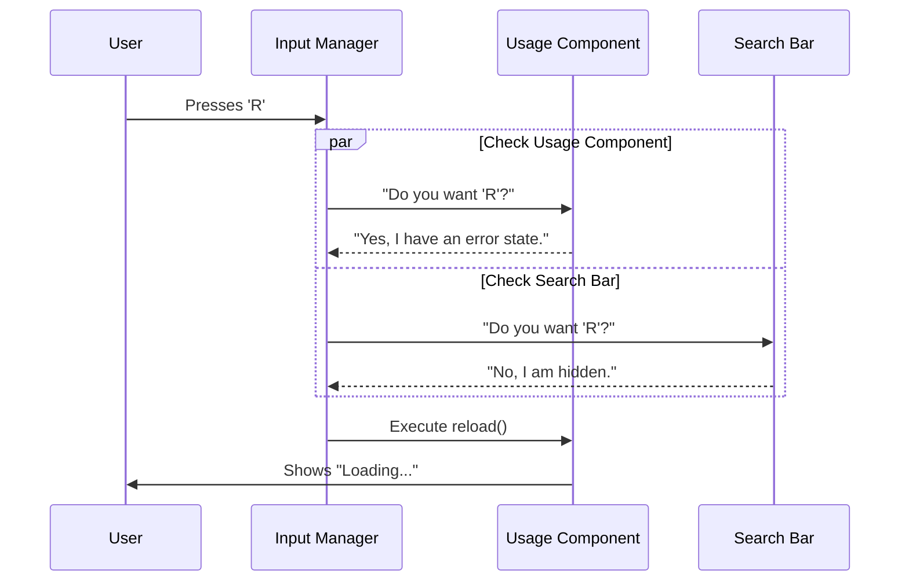

# Chapter 5: Keybinding & Interaction System

Welcome to Chapter 5! In the previous chapter, [Terminal UI Composition (Ink)](04_terminal_ui_composition__ink_.md), we turned our data into beautiful visual layouts using Ink.

However, a pretty interface is useless if you can't interact with it. Since we are in a terminal, we don't have a mouse cursor. We can't "click" the Retry button. We have to press keys.

### Motivation: The "Smart" Keyboard

Imagine you are in a text editor.
*   If you are typing a sentence, pressing `R` writes the letter "r".
*   If you are navigating a menu, pressing `R` might mean "Rename".
*   If you are looking at a network error, pressing `R` might mean "Retry".

**The Problem:**
How does the application know *which* `R` you meant? If we just listened for "any key press," we would trigger "Retry" every time the user tried to type a word containing the letter 'r'.

**The Solution:**
We need a **Keybinding System**. This system acts like a traffic controller. It knows which part of the app is "Active" (in focus) and routes the key presses only to the correct component.

---

### Key Concepts

To master interactions in this project, we use three main concepts.

#### 1. The Trigger (The Key)
This is the physical input. usually a string like `"r"`, `"Esc"`, `"Ctrl+c"`, or `"Enter"`.

#### 2. The Action (The Handler)
This is the function that runs when the key is pressed. For example: `() => reloadData()`.

#### 3. The Guard (Context & Activity)
This is the most important part. It answers the question: *"Is it safe to run this now?"*
*   **isActive:** A boolean (true/false). If `false`, the key press is ignored.
*   **Context:** A string label (e.g., "Settings") to group similar shortcuts.

---

### How to Use It: The `useKeybinding` Hook

We use a custom React hook called `useKeybinding`. Let's look at a real example from our [Usage & Quota Monitoring](03_usage___quota_monitoring.md) chapter. We want to reload data when the user presses `R`.

```tsx
import { useKeybinding } from '../../keybindings/useKeybinding';

// Inside your component
useKeybinding('settings:retry', () => {
  // 1. The Action: Reload the data
  void loadUtilization();
}, { 
  // 2. The Context: Where are we?
  context: 'Settings',
  // 3. The Guard: Only listen if there is an error
  isActive: !!error && !isLoading 
});
```

**What happens here?**
1.  The app registers a listener for the "retry" action (mapped to `r`).
2.  If the user presses `r`, the system checks `isActive`.
3.  If `error` is true (we failed to load) AND `isLoading` is false (we aren't already trying), the function runs.
4.  Otherwise, the key press is ignored (allowing the user to type 'r' elsewhere).

---

### Internal Implementation: How it Works

Let's visualize the flow of a keystroke through our application.



Now, let's look at a more complex example: **The Escape Key**.

In `Settings.tsx`, we have a hierarchy of "who owns the Escape key".
1.  If a **Search Bar** is focused, `Esc` should clear the text.
2.  If a **Sub-menu** is open, `Esc` should go back to the main menu.
3.  If **Neither** is happening, `Esc` should close the Settings window.

Here is how we implement that logic using the `isActive` guard:

#### Step 1: Defining the Logic
We check the state of the component to see who "owns" the key.

```tsx
// Inside Settings.tsx

// Logic: Check if Config tab is stealing focus
const configOwnsEsc = selectedTab === "Config" && isSearchMode;

// Logic: Check if Gates tab is stealing focus
const gatesOwnsEsc = selectedTab === "Gates" && isGateMode;

// The Settings container is ONLY active if nobody else is
const isSettingsActive = !tabsHidden && !configOwnsEsc && !gatesOwnsEsc;
```
*   **Explanation:** We create a boolean variable `isSettingsActive`. It is only true if no children (Config or Gates) need the key.

#### Step 2: Registering the Keybinding
We pass that boolean to the hook.

```tsx
useKeybinding('confirm:no', () => {
   // The Action: Close the settings
   onClose("Status dialog dismissed");
}, {
  context: 'Settings',
  // The Guard: Only run if we are the active owner
  isActive: isSettingsActive
});
```
*   **Explanation:** `confirm:no` is usually mapped to `Esc`. If `isSettingsActive` is false, this block is skipped, allowing the Search Bar inside the Config tab to handle the event instead.

---

### Visualizing Shortcuts: The Hint System

It is frustrating to guess which keys work. We use a component called `<ConfigurableShortcutHint>` to show the user what they can press.

This component doesn't handle the logic; it just displays the visual cue (e.g., a small "Esc" or "r" icon).

```tsx
// Inside Usage.tsx when an error occurs
if (error) {
  return (
    <Box>
      <Text color="error">{error}</Text>
      <Byline>
        {/* Visual hint for 'R' */}
        <ConfigurableShortcutHint 
          action="settings:retry" 
          description="retry" 
        />
        {/* Visual hint for 'Esc' */}
        <ConfigurableShortcutHint 
          action="confirm:no" 
          description="cancel" 
        />
      </Byline>
    </Box>
  );
}
```

**Output:**
```text
Error: Failed to load data
[r] retry   [Esc] cancel
```

This creates a self-documenting UI. If the `useKeybinding` hook is the "brains" (logic), the `<ConfigurableShortcutHint>` is the "face" (UI).

---

### Summary

In this final chapter, we breathed life into our application.
*   We learned that **Keybindings** need context to work correctly in a terminal.
*   We used **`isActive`** guards to determine which component handles a key press.
*   We implemented a **Priority Chain** for the Escape key to handle layers (Input -> Tab -> Window).
*   We added **Visual Hints** so users know what keys to press.

### Tutorial Conclusion

Congratulations! You have navigated through the entire architecture of the **Settings** project.

1.  **[Settings Container](01_settings_container.md):** You built the main window and tab system.
2.  **[System Status](02_system_status___diagnostics.md):** You loaded asynchronous health checks using Suspense.
3.  **[Usage Monitoring](03_usage___quota_monitoring.md):** You handled data fetching, loading states, and retries.
4.  **[Terminal UI (Ink)](04_terminal_ui_composition__ink_.md):** You rendered visual bars and layouts using Flexbox.
5.  **Keybinding System:** You tied it all together with keyboard interactions.

You now possess the knowledge to build robust, interactive, and beautiful CLI tools. Happy coding!

---

Generated by [Code IQ](https://github.com/adityasoni99/Code-IQ)