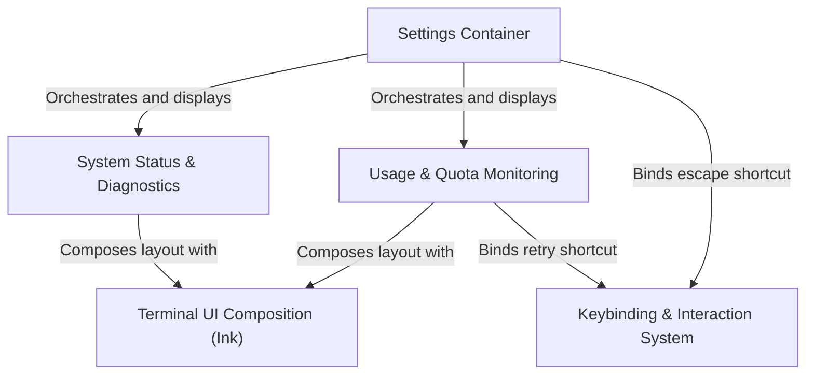

# Tutorial: Settings

This project implements a centralized **Settings and Status dashboard** for a terminal application, organizing information into navigatable tabs like *Status*, *Config*, and *Usage*. It leverages a specialized library to render rich **Terminal UI** components (such as progress bars and flexible layouts) and manages user interactions through a context-aware **keybinding system** for navigation and commands.

## Chapters

1. [Settings Container](01_settings_container.md)
2. [System Status & Diagnostics](02_system_status___diagnostics.md)
3. [Usage & Quota Monitoring](03_usage___quota_monitoring.md)
4. [Terminal UI Composition (Ink)](04_terminal_ui_composition__ink_.md)
5. [Keybinding & Interaction System](05_keybinding___interaction_system.md)

---

Generated by [Code IQ](https://github.com/adityasoni99/Code-IQ)