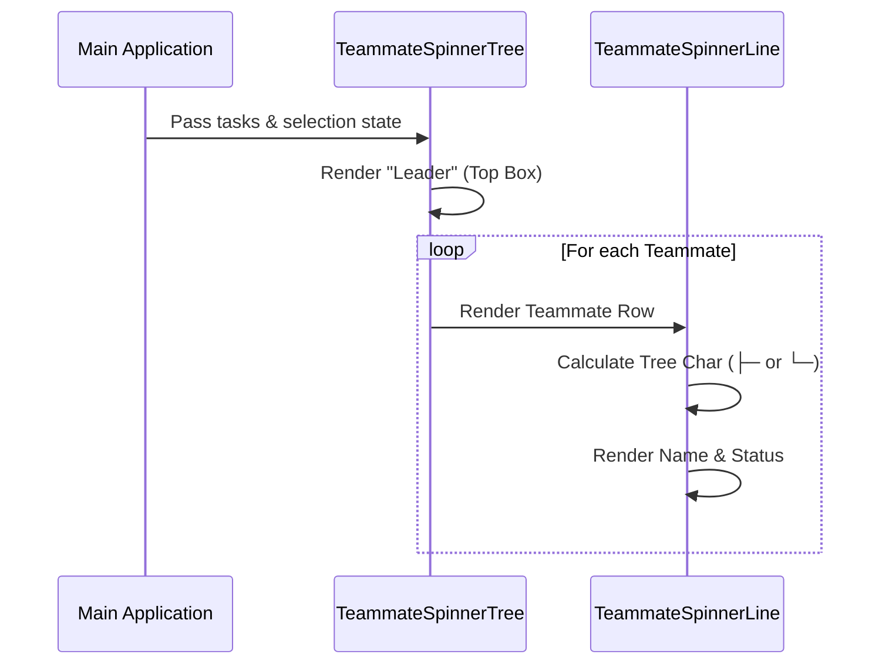

# Chapter 1: Agent Hierarchy (The Tree)

Welcome to the **Spinner** project tutorial! In this first chapter, we are going to build the visual backbone of our user interface.

## Motivation: The File Explorer for AI

Imagine you have a team of people working on a project. You have a **Team Lead** managing the big picture, and several **Teammates** handling specific jobs. If everyone shouts at once, it's chaos. You need a way to see who is doing what, organized neatly.

In **Spinner**, we face the same challenge. We have a main AI process (the **Leader**) and it might spawn sub-agents (the **Teammates**) to write code, search the web, or debug errors.

We solve this with **Agent Hierarchy (The Tree)**.

Think of it like the **File Explorer** on your computer:
*   **The Root (Leader):** The main folder holding everything.
*   **The Files (Teammates):** The items listed inside.
*   **The Structure:** Lines (`├─`, `└─`) visually connect them so you know they belong together.

## Key Concepts

Before we look at the code, let's understand the three parts of our tree:

1.  **The Leader Row**: This is always at the top. It represents the main user goal. It wraps the whole list.
2.  **The Teammate List**: This is the dynamic part. As the AI creates new sub-tasks, this list grows.
3.  **Selection State**: Just like pressing `ArrowDown` in a file explorer highlights a file, our tree needs to know which agent is currently "Active" or "Selected" so we can dim the others.

## How to Use It

To use the Tree, we use the `TeammateSpinnerTree` component. It takes the current state of the application and renders the visual hierarchy.

Here is a high-level example of how this component is used:

```tsx
<TeammateSpinnerTree
  // Are we currently pressing arrow keys to select rows?
  isInSelectionMode={true}
  // Which row is highlighted? (-1 is leader, 0 is first teammate)
  selectedIndex={0}
  // What is the leader currently doing?
  leaderVerb="thinking"
/>
```

**What happens here?**
1.  The component checks if there are any active tasks.
2.  It draws the "Leader" at the top.
3.  It draws a line for every active teammate below the leader.
4.  It highlights the row matching `selectedIndex`.

## Implementation Walkthrough

Let's look under the hood. The implementation is split into two main files:
1.  `TeammateSpinnerTree.tsx`: The container that draws the Leader and loops through teammates.
2.  `TeammateSpinnerLine.tsx`: The individual row for a single teammate.

### Step 1: The Sequence

Here is how the data flows when the Tree renders:



### Step 2: The Container (`TeammateSpinnerTree`)

The container's job is to create the "frame". It renders the Leader row manually, then maps over the list of teammates.

Here is a simplified view of the rendering logic:

```tsx
// Inside TeammateSpinnerTree.tsx
return (
  <Box flexDirection="column">
    {/* 1. The Leader Row */}
    <Box>
      <Text>team-lead</Text>
      {/* Show verb if processing, e.g. ": thinking..." */}
      {!isLeaderForegrounded && <Text>: {leaderVerb}…</Text>}
    </Box>

    {/* 2. The Teammates */}
    {teammateTasks.map((teammate, index) => (
      <TeammateSpinnerLine 
        key={teammate.id} 
        teammate={teammate} 
        // Logic to decide if this is the last item in the tree
        isLast={index === teammateTasks.length - 1} 
      />
    ))}
  </Box>
);
```

> **Beginner Tip:** Notice the `isLast` prop. This is crucial for drawing the tree lines correctly. If it's the last item, we use an L-shaped curve (`└─`). If not, we use a T-shaped connector (`├─`).

### Step 3: The Rows (`TeammateSpinnerLine`)

This component renders the actual lines connecting the tree. It uses specific characters to create the visual hierarchy.

First, we determine which "Tree Character" to use:

```tsx
// Inside TeammateSpinnerLine.tsx
// If highlighted, we use double lines (═) for emphasis
// If last, we use corner (└), otherwise intersection (├)
const treeChar = isHighlighted 
  ? (isLast ? '╘═' : '╞═') 
  : (isLast ? '└─' : '├─');
```

Then, we render the row with indentation:

```tsx
<Box flexDirection="column">
  <Box paddingLeft={3}>
    {/* The Selection Arrow (pointer) */}
    <Text>{isSelected ? figures.pointer : ' '}</Text>
    
    {/* The Tree Structure Line */}
    <Text>{treeChar} </Text>
    
    {/* The Agent's Name */}
    <Text>@{teammate.identity.agentName}</Text>
  </Box>
</Box>
```

### Step 4: Handling "Stale" or "Idle" Agents

A key part of the hierarchy is knowing when an agent is working versus waiting. The tree handles this by passing an `allIdle` prop.

When an agent is idle, we dim their text to push them into the background visually:

```tsx
if (teammate.isIdle) {
   // Dim color makes the user focus on active agents
   return <Text dimColor>Idle for {idleElapsedTime}</Text>;
}
```

*Note: We will dive deeper into how we calculate that time in [Stall Detection (Heartbeat)](06_stall_detection__heartbeat_.md).*

## Conclusion

You have now created the skeleton of the UI! We have a **Leader** at the top and a structured tree of **Teammates** below it. We can highlight specific rows and visually see the relationship between the main process and sub-tasks.

However, a tree of names isn't very useful if we don't know what they are *doing*.

In the next chapter, we will learn how to look inside these agents and preview their messages.

[Next Chapter: Teammate Activity Preview](02_teammate_activity_preview.md)

---

Generated by [Code IQ](https://github.com/adityasoni99/Code-IQ)