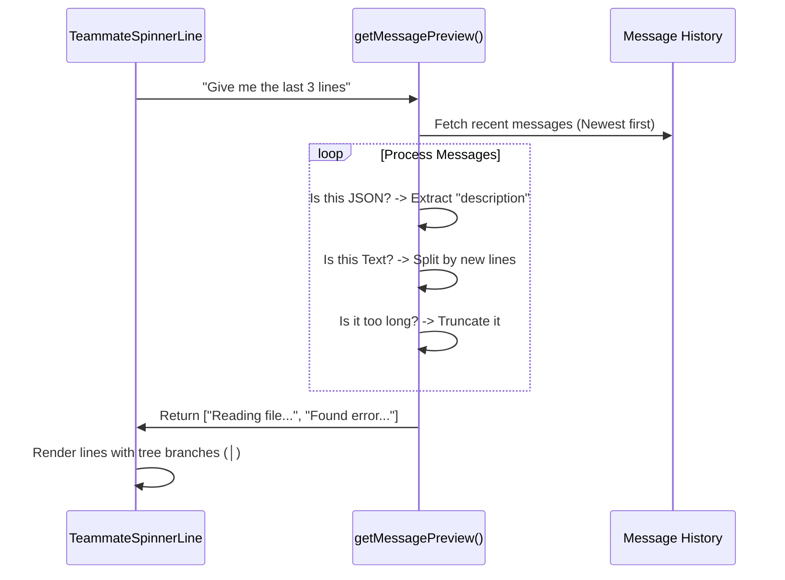

# Chapter 2: Teammate Activity Preview

Welcome back! In the previous chapter, [Agent Hierarchy (The Tree)](01_agent_hierarchy__the_tree_.md), we built a visual structure to organize our AI agents. We can see who reports to whom, similar to a file explorer.

However, currently, our agents are just names in a list. We know they are "working," but we don't know *what* they are doing.

## Motivation: The "Frosted Glass" Problem

Imagine walking past a meeting room with frosted glass walls. You can see silhouettes of your teammates inside, so you know they are present, but you can't hear what they are saying or see what they are writing on the whiteboard.

In **Spinner**, the "Raw Logs" of an AI agent are messy. They contain:
1.  **JSON data:** Complex structures for tool inputs.
2.  **System prompts:** Instructions the user shouldn't need to see.
3.  **Thought processes:** Long paragraphs of reasoning.

We don't want to dump all that text onto the screen. We want a **Preview**—a way to "wipe a small clear spot" on the frosted glass to see the last 3 sentences they wrote.

## Key Concepts

To build this, we need to implement three specific logical steps:

1.  **The Peek**: We look at the agent's message history in reverse (newest first).
2.  **The Filter**: We ignore internal JSON syntax and system noise.
3.  **The Translation**: If the agent is using a tool (like "Google Search"), we translate the complex code into a human-readable sentence like "Searching for React tutorials...".

## How to Use It

In the previous chapter, we used `TeammateSpinnerLine` to render the agent's name. Now, we simply enable the `showPreview` prop.

When `showPreview` is true, the component calculates the summary lines and renders them below the name.

```tsx
<TeammateSpinnerLine 
  teammate={activeTeammate}
  isLast={true}
  // The magic switch to enable the "Peek"
  showPreview={true} 
/>
```

**The Visual Output:**

Without preview:
```text
└─ @Researcher: working...
```

With preview:
```text
└─ @Researcher: working...
   │  Reading file "data.txt"
   │  Analyzing contents...
   └  Summarizing results
```

## Implementation Walkthrough

How does the code turn messy data into clean lines? Let's look at the flow of data.



## Implementation Deep Dive

The core logic lives in a helper function called `getMessagePreview`. Let's break down how it handles different types of AI "thoughts".

### Step 1: Handling "Tool Use"

When an agent uses a tool, it generates a strict JSON object. We want to convert that into a readable string.

We look inside the `input` block for fields like `query`, `command`, or `description`.

```tsx
// Inside getMessagePreview function
if (block.type === 'tool_use') {
  const input = block.input;
  let toolLine = `Using ${block.name}…`;

  // If the tool has a description/query, use that instead
  if (input && input.query) {
    toolLine = input.query; // e.g. "python error fix"
  }
  
  allLines.push(truncateToWidth(toolLine, 80));
}
```

### Step 2: Handling Plain Text

Sometimes the agent is just "talking" (thinking to itself). This comes as a text block. We simply split the text by new lines and take the most recent ones.

```tsx
if (block.type === 'text') {
  // Split the paragraph into individual lines
  const textLines = block.text.split('\n');
  
  // Loop backwards to get the most recent thoughts first
  for (let j = textLines.length - 1; j >= 0; j--) {
    const line = textLines[j];
    // Add to our preview list
    allLines.push(truncateToWidth(line, 80));
  }
}
```

### Step 3: Drawing the Lines

Once we have the text strings (e.g., `["Doing A", "Doing B"]`), we need to render them underneath the agent's name.

The visual challenge here is maintaining the tree structure.
*   If the agent is in the middle of the list, the connector is a vertical bar: `│`.
*   If the agent is the last item, usually we don't draw a line, or we draw an empty space indentation.

```tsx
// Inside TeammateSpinnerLine return statement
const previewTreeChar = isLast ? '   ' : '│  ';

return (
  <Box flexDirection="column">
    {/* ... Render Agent Name (covered in Ch 1) ... */}

    {/* Render the Preview Lines */}
    {previewLines.map((line, idx) => (
      <Box key={idx} paddingLeft={3}>
         <Text dimColor>   </Text>
         <Text dimColor>{previewTreeChar} </Text>
         <Text dimColor>{line}</Text>
      </Box>
    ))}
  </Box>
);
```

> **Beginner Tip:** `paddingLeft={3}` ensures the preview lines align perfectly with the agent's icon above it. Alignment is key to making the tree look connected!

## Conclusion

You have effectively "wiped the frost off the glass." By filtering raw logs and extracting the `description` or `text`, users can now watch the AI's thought process in real-time without being overwhelmed by code and brackets.

Our UI is functional, but it's a bit monochromatic. To make it truly professional, we need to style our lines, add colors, and handle icons better.

In the next chapter, we will learn how to make our UI beautiful and consistent.

[Next Chapter: Theme & Glyph Utilities](03_theme___glyph_utilities.md)

---

Generated by [Code IQ](https://github.com/adityasoni99/Code-IQ)