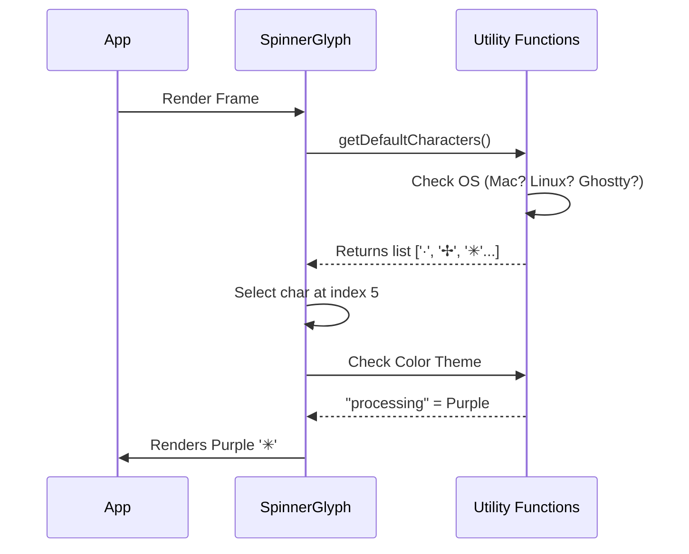

# Chapter 3: Theme & Glyph Utilities

Welcome back! In the previous chapter, [Teammate Activity Preview](02_teammate_activity_preview.md), we gave our agents a voice by previewing their logs.

However, our interface is currently a bit plain. It's just text. We want to add a spinning animation to show that the agent is "thinking."

## Motivation: The "Old TV" Problem

Imagine trying to play a modern video game on a black-and-white TV from the 1950s. If the game relies on color to tell you if you are winning or losing, the old TV won't show it.

Terminals are like TVs. Some are modern (support millions of colors, emojis, and complex animations). Others are "old school" (only support simple text and 16 colors).

If we hardcode a fancy Braille spinner (`⣾⣽⣻⢿`) or a specific shade of purple, it might look like garbage text (`???`) on an older system.

**Theme & Glyph Utilities** act as our "Universal Adapter." They ask the terminal: *"What can you do?"* and then serve the best possible visuals for that specific computer.

## Key Concepts

1.  **Glyphs**: These are the characters used for the animation frames (e.g., `✢`, `*`, `·`).
2.  **Themes**: A dictionary of colors (e.g., "doing" is purple, "error" is red).
3.  **Interpolation**: Math that calculates the color between two other colors. This lets us fade from Purple to Red smoothly.

## How to Use It

We rely mainly on a component called `SpinnerGlyph`. You don't need to manually calculate which character to show; you just tell it what "frame" of the animation you are on.

### Basic Usage

```tsx
<SpinnerGlyph 
  // The current step of the animation (0, 1, 2, etc.)
  frame={currentFrame}
  
  // The semantic color name from our theme
  messageColor="processing"
/>
```

**What happens?**
If `currentFrame` is 0, it renders the first character. If it's 1, it renders the second. It automatically loops back to the start if the number gets too big.

### Handling "Stalls"

We can also tell the glyph if the agent seems stuck. We pass a `stalledIntensity` (a number from 0 to 1).

```tsx
<SpinnerGlyph 
  frame={10}
  messageColor="processing"
  // 0 = Normal, 1 = Full Red Alert
  stalledIntensity={0.8} 
/>
```

The component will mathematically blend the "processing" color (Purple) with the "Error" color (Red) based on that number.

## Implementation Walkthrough

Let's look at how the code decides what to draw.



## Internal Implementation

Let's break down the two main files: `utils.ts` and `SpinnerGlyph.tsx`.

### 1. The Safety Check (`utils.ts`)

We need a function that returns the safe list of characters.

```ts
// inside utils.ts
export function getDefaultCharacters(): string[] {
  // Ghostty terminal has specific rendering needs
  if (process.env.TERM === 'xterm-ghostty') {
    return ['·', '✢', '✳', '✶', '✻', '*'] 
  }
  
  // Mac usually supports fancy flowers
  return process.platform === 'darwin'
    ? ['·', '✢', '✳', '✶', '✻', '✽']
    : ['·', '✢', '*', '✶', '✻', '✽'] // Windows fallback
}
```

> **Beginner Tip:** Notice we return an Array of strings. The animation works by cycling through this array one item at a time.

### 2. Color Math (`utils.ts`)

To make the spinner turn red *gradually* when an agent stalls, we need to blend colors. This is called **Linear Interpolation**.

Think of it like mixing paint. If you have 50% Blue and 50% Red, you get Purple.

```ts
// inside utils.ts
export function interpolateColor(
  c1: RGBColorType, // Start Color
  c2: RGBColorType, // End Color
  t: number,        // Percentage (0 to 1)
): RGBColorType {
  return {
    // math: start + (difference * percentage)
    r: Math.round(c1.r + (c2.r - c1.r) * t),
    g: Math.round(c1.g + (c2.g - c1.g) * t),
    b: Math.round(c1.b + (c2.b - c1.b) * t),
  }
}
```

### 3. The Component Logic (`SpinnerGlyph.tsx`)

Finally, the React component puts it all together.

**A. The Frame Logic**
We use the modulo operator (`%`) to ensure the frame number never exceeds the number of available characters.

```tsx
// inside SpinnerGlyph.tsx
const spinnerChar = SPINNER_FRAMES[frame % SPINNER_FRAMES.length];

return (
  <Text color={messageColor}>
    {spinnerChar}
  </Text>
);
```

**B. The Stall Logic**
If `stalledIntensity` is greater than 0, we calculate the danger color.

```tsx
if (stalledIntensity > 0) {
  // Convert theme string (e.g. "purple") to RGB numbers
  const baseRGB = parseRGB(theme[messageColor]);
  
  // Mix it with Error Red
  const mixedColor = interpolateColor(
     baseRGB, 
     ERROR_RED, 
     stalledIntensity
  );
  
  return <Text color={toRGBColor(mixedColor)}>{spinnerChar}</Text>;
}
```

**C. Accessibility (Reduced Motion)**
Some users prefer less movement on screen (it can cause motion sickness). If the `reducedMotion` prop is on, we stop spinning and just pulse a dot slowly.

```tsx
if (reducedMotion) {
  // Calculate a simple on/off blink based on time
  const isDim = Math.floor(time / 1000) % 2 === 1;
  
  // Return a static dot that dims in and out
  return <Text dimColor={isDim}>●</Text>;
}
```

## Conclusion

We have built a robust display system.
1.  It adapts to the user's operating system (Glyphs).
2.  It creates smooth color transitions (Interpolation).
3.  It respects accessibility needs (Reduced Motion).

However, a glyph needs to change over time to look like it's moving. Currently, we just have a component that accepts a `frame` number. Who provides that number? Who increments it?

In the next chapter, we will build the engine that drives this animation.

[Next Chapter: Isolated Animation Loop](04_isolated_animation_loop.md)

---

Generated by [Code IQ](https://github.com/adityasoni99/Code-IQ)