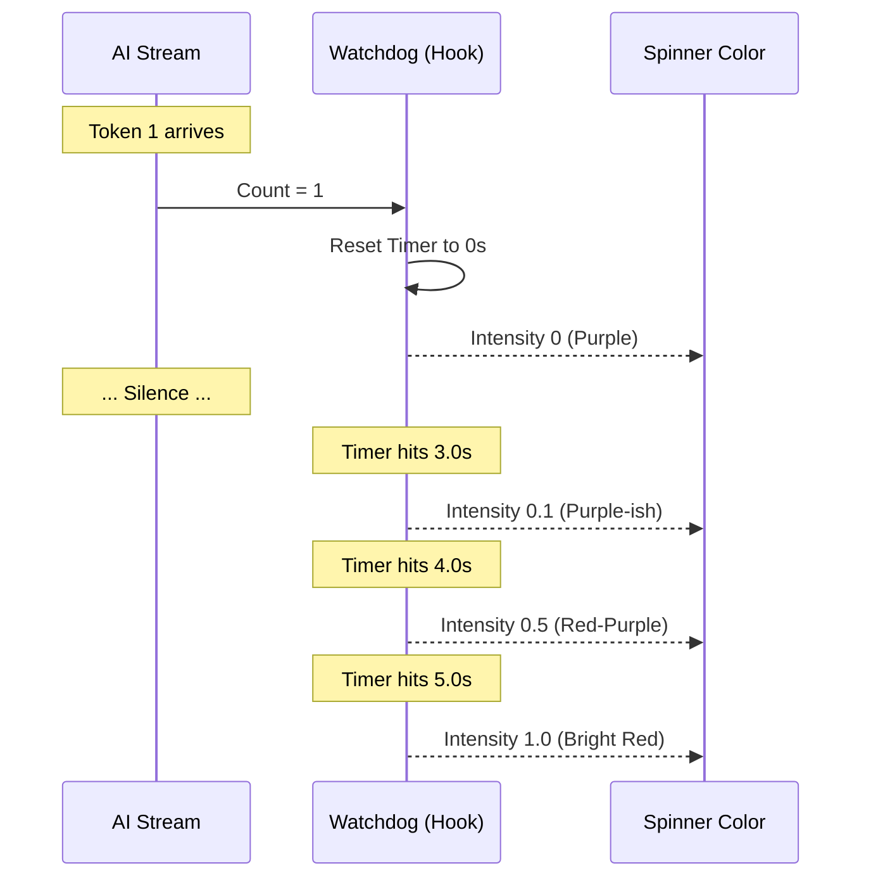

# Chapter 6: Stall Detection (Heartbeat)

Welcome to the final chapter of the **Spinner** project tutorial!

In the previous chapter, [Text Glimmer Effects](05_text_glimmer_effects.md), we made our text look alive with a shimmering wave animation. Our UI now looks professional and active.

However, there is a danger in making a UI look *too* active. If the animation keeps spinning happily while the AI process has actually crashed or frozen, the user will sit there waiting forever.

## Motivation: The "Frozen Progress Bar" Anxiety

We have all experienced this: you are downloading a file. The progress bar hits 99%... and stops. You stare at it. Is it still working? Has the internet cut out? Should you cancel it?

In **Spinner**, we are streaming text from an AI. Sometimes the network lags. Sometimes the AI takes a long time to think.

We need a **Heartbeat Monitor**.
*   **Healthy:** New words (tokens) are arriving regularly. The spinner is its normal color (e.g., Purple).
*   **Sick:** No words have arrived for 3 seconds. The spinner should slowly turn **Red** to warn the user: *"I haven't heard from the AI in a while..."*

## Key Concepts

1.  **The Watchdog**: A logic unit that holds a stopwatch. Every time a new token arrives, it resets the stopwatch to zero.
2.  **The Threshold**: The amount of time we wait before worrying (e.g., 3 seconds).
3.  **Intensity**: We don't want to flash Red instantly. We want a smooth transition. `Intensity` is a number from `0.0` (Normal) to `1.0` (Full Alert).

## How to Use It

We use a custom hook called `useStalledAnimation`. This hook doesn't draw anything; it just doing the math.

It relies on the **Animation Loop** we built in [Chapter 4: Isolated Animation Loop](04_isolated_animation_loop.md).

```tsx
// Inside your component
const { isStalled, stalledIntensity } = useStalledAnimation(
  time,           // Current animation time (e.g., 5000ms)
  tokenCount,     // Total tokens received so far (e.g., 42)
  isToolActive    // Is the AI using a tool? (If yes, don't panic)
);

// Pass the result to the visual component
<SpinnerGlyph 
  frame={frame} 
  messageColor="processing"
  stalledIntensity={stalledIntensity} 
/>
```

**What happens here?**
1.  If `tokenCount` changes, the timer resets.
2.  If `tokenCount` stops changing, `stalledIntensity` starts climbing from 0 to 1.
3.  `SpinnerGlyph` uses that number to mix Purple and Red.

## Implementation Walkthrough

Let's visualize the "Watchdog" logic.



## Implementation Deep Dive

The logic lives in `useStalledAnimation.ts`. Let's break down how it calculates that intensity.

### Step 1: Tracking the Last Heartbeat

We need to remember *when* the last token arrived. We use `useRef` to store this timestamp without causing re-renders.

```ts
// Inside useStalledAnimation.ts
export function useStalledAnimation(time, currentResponseLength) {
  const lastTokenTime = useRef(time);
  const lastResponseLength = useRef(currentResponseLength);

  // DID WE GET A NEW TOKEN?
  if (currentResponseLength > lastResponseLength.current) {
    // Yes! Reset the timer.
    lastTokenTime.current = time;
    
    // Update our "last known" count
    lastResponseLength.current = currentResponseLength;
  }
  // ...
}
```

### Step 2: Calculating Silence

Now we calculate how long it has been since that last reset.

```ts
// How long has it been?
// Current Time - Time of Last Token
const timeSinceLastToken = time - lastTokenTime.current;
```

### Step 3: Calculating Intensity

This is the math part. We want a "Grace Period" of 3000ms (3 seconds). After that, we want to fade to red over the next 2000ms (2 seconds).

```ts
// Do we have a problem? (More than 3 seconds silence)
const isStalled = timeSinceLastToken > 3000;

const intensity = isStalled
  ? Math.min((timeSinceLastToken - 3000) / 2000, 1) // Math to get 0.0 to 1.0
  : 0; // Everything is fine
```

> **Beginner Tip:** `Math.min(..., 1)` ensures that even if the silence lasts for an hour, the intensity never goes above 1.0.

### Step 4: Visualizing the Danger

Now that we have the math, we apply it. We learned about `SpinnerGlyph` in [Chapter 3: Theme & Glyph Utilities](03_theme___glyph_utilities.md). Here is how it uses the intensity.

It uses an `interpolateColor` function, which mixes paints.

```tsx
// Inside SpinnerGlyph.tsx
if (stalledIntensity > 0) {
  // Mix "Processing Purple" with "Error Red"
  // If intensity is 0.5, we get a muddy reddish-purple.
  const mixedColor = interpolateColor(
     PURPLE_RGB, 
     RED_RGB, 
     stalledIntensity
  );
  
  return <Text color={mixedColor}>{spinnerChar}</Text>;
}
```

## Special Case: Tools

There is one exception to this rule. If the AI says *"I am running a Python script"*, it might take 10 seconds to finish. It hasn't crashed; it's just working hard.

We pass a flag `hasActiveTools` to disable the stall detection during these moments.

```ts
// Inside useStalledAnimation.ts
if (hasActiveTools) {
  // Pause the timer!
  // Fake update the "last time" so the gap stays at 0
  lastTokenTime.current = time; 
}
```

## Tutorial Conclusion

Congratulations! You have completed the **Spinner** tutorial series.

You have built a sophisticated, high-performance CLI interface that:

1.  **Organizes Chaos:** Using [Agent Hierarchy](01_agent_hierarchy__the_tree_.md) to show who is working.
2.  **Communicates:** Using [Teammate Activity Preview](02_teammate_activity_preview.md) to show what they are thinking.
3.  **Adapts:** Using [Theme & Glyph Utilities](03_theme___glyph_utilities.md) to work on any terminal.
4.  **Performs:** Using an [Isolated Animation Loop](04_isolated_animation_loop.md) to save CPU.
5.  **Shines:** Using [Text Glimmer Effects](05_text_glimmer_effects.md) to look alive.
6.  **Protects:** Using **Stall Detection** to warn users when things go wrong.

You now have all the tools needed to build beautiful, responsive command-line tools for AI agents. Happy coding!

---

Generated by [Code IQ](https://github.com/adityasoni99/Code-IQ)