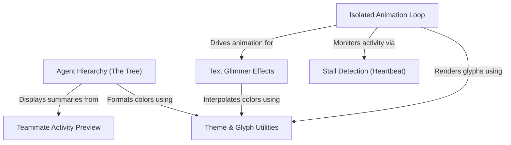

# Tutorial: Spinner

This project creates a sophisticated **CLI spinner** and progress tracker for AI agents. It uses a **hierarchical tree** to organize "Leader" and "Teammate" tasks, employing an *isolated animation loop* to render high-performance visual effects like **glimmering text** and elapsed timers without re-rendering the entire UI. It also features visual alerts for **stalled processes** and adapts its styling to different terminal themes.

## Chapters

1. [Agent Hierarchy (The Tree)](01_agent_hierarchy__the_tree_.md)
2. [Teammate Activity Preview](02_teammate_activity_preview.md)
3. [Theme & Glyph Utilities](03_theme___glyph_utilities.md)
4. [Isolated Animation Loop](04_isolated_animation_loop.md)
5. [Text Glimmer Effects](05_text_glimmer_effects.md)
6. [Stall Detection (Heartbeat)](06_stall_detection__heartbeat_.md)

---

Generated by [Code IQ](https://github.com/adityasoni99/Code-IQ)