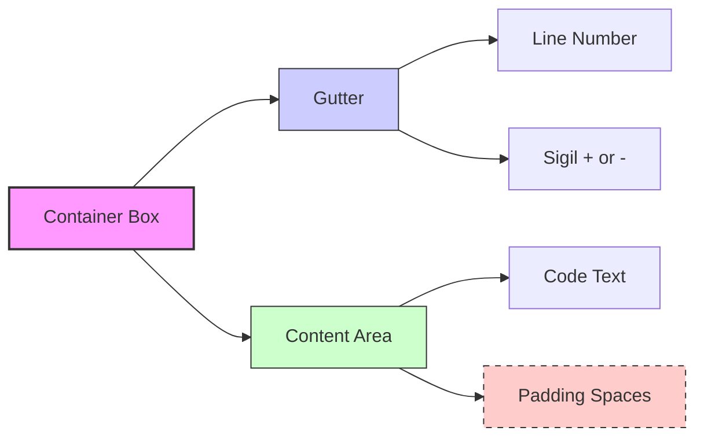
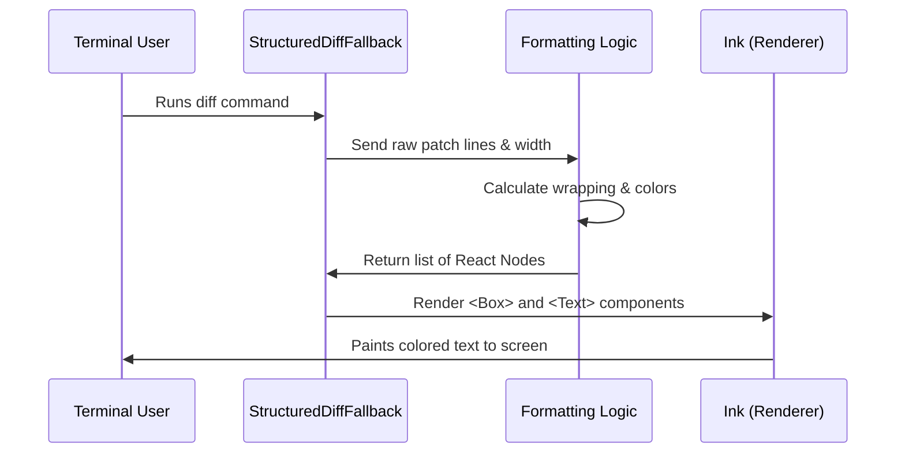

# Chapter 1: Terminal UI Rendering

Welcome to **StructuredDiff**! In this project, we are building a tool to make code differences ("diffs") look beautiful and readable directly in your terminal.

## The Problem: Reading Diffs is Hard
Have you ever looked at a standard `git diff`? It often looks like a wall of text with simple `+` and `-` signs.

```text
- const oldVal = 1;
+ const newVal = 2;
```

While functional, it’s hard to scan quickly. Modern code editors (like VS Code) and websites (like GitHub) use colors, line numbers, and distinct background bars to make changes obvious.

**Our Goal:** Bring that rich, visual experience into the command line.

## The Solution: React for the Terminal
To build a complex User Interface (UI) in the terminal, we use **React**.

You might be thinking: *"Isn't React for websites?"*

Usually, yes. But we use a library called **`ink`**. It takes React components (like `<Box>` and `<Text>`) and translates them into characters and colors that your terminal understands.

This chapter explains how we render the visual layer of our diff tool.

## High-Level Strategy

Our rendering logic has one main job: **Translate abstract data into a grid of colored characters.**

Here is the visual anatomy of a single line in our UI:



1.  **Gutter:** Holds the line number and the change symbol (`+`, `-`).
2.  **Content:** Holds the actual code.
3.  **Padding:** Use extra spaces to fill the rest of the terminal width so the background color stretches all the way to the right edge.

## The Main Component

Let's look at the entry point in `Fallback.tsx`. This component receives the patch data and decides how to draw it.

```tsx
// Inside StructuredDiffFallback function
export function StructuredDiffFallback({ patch, dim, width }) {
  // ... (calculation logic) ...

  // Render a vertical column of boxes
  return (
    <Box flexDirection="column" flexGrow={1}>
      {diff.map((node, i) => (
        <Box key={i}>{node}</Box>
      ))}
    </Box>
  );
}
```

**Explanation:**
*   **`Box`**: Think of this like a `<div>` in HTML. `flexDirection="column"` stacks lines on top of each other.
*   **`diff.map`**: We loop through every processed line of the diff and render it.

## Internal Implementation: Step-by-Step

Before we look at the detailed rendering code, let's visualize the flow of data when this component renders.



### 1. The Rendering Loop
The core rendering happens in a function called `formatDiff`. It takes the raw lines and turns them into visual elements.

Here is a simplified view of how we handle a standard line of code:

```tsx
// Inside formatDiff function loop
const sigil = type === 'add' ? '+' : type === 'remove' ? '-' : ' ';
const bgColor = type === 'add' ? 'diffAdded' : 'diffRemoved';

return (
  <Box flexDirection="row">
    {/* Left Side: Gutter */}
    <Text backgroundColor={bgColor}>
       {lineNumStr} {sigil}
    </Text>

    {/* Right Side: Code */}
    <Text backgroundColor={bgColor}>
      {line}
    </Text>
  </Box>
);
```

**Explanation:**
*   We determine the **`sigil`** (the symbol) based on whether the line was added, removed, or unchanged.
*   We determine the **`bgColor`** (background color). We use theme names like `'diffAdded'` (usually green) or `'diffRemoved'` (usually red).
*   We put both the Gutter and the Code inside a `row` Box so they sit side-by-side.

### 2. The "Full Width" Bar Trick
Terminals don't naturally have "background-color" properties that stretch to the edge of the window. We have to fake it using **padding**.

If your terminal is 80 characters wide, and your code is 20 characters long, we need to add 60 spaces of background color to fill the row.

```tsx
// Calculating padding to fill the screen
const contentWidth = lineNumStr.length + 1 + stringWidth(line);

const padding = Math.max(0, width - contentWidth);

// Rendering the padding
<Text backgroundColor={bgColor}>
  {line}
  {' '.repeat(padding)} {/* <--- The Magic Padding */}
</Text>
```

**Explanation:**
*   **`width`**: The total width of the terminal window.
*   **`contentWidth`**: How much space our text actually takes.
*   **`' '.repeat(padding)`**: We append empty spaces to the end of the line. Because these spaces share the `backgroundColor`, it creates a solid colored bar.

### 3. Handling Text Wrapping
What happens if a line of code is longer than the terminal window? If we don't handle it, the visual layout breaks. We use a helper called `wrapText`.

```tsx
// Calculate space available for code (Total width - Gutter width)
const availableContentWidth = Math.max(1, safeWidth - maxWidth - 3);

// Force text to wrap nicely
const wrappedText = wrapText(code, availableContentWidth, 'wrap');
const wrappedLines = wrappedText.split('\n');
```

**Explanation:**
*   We calculate exactly how much space remains after drawing the line numbers.
*   We split one long line of code into multiple physical lines in the UI, ensuring the background color surrounds all of them.

### 4. Dimming Unchanged Code
To help the user focus, we often "dim" the lines that haven't changed, making the colorful changes pop out more.

```tsx
<Text 
  dimColor={dim || type === 'nochange'}
  backgroundColor={bgColor}
>
  {/* Content */}
</Text>
```

**Explanation:**
*   **`dimColor`**: An Ink prop that makes the text gray or faint.
*   We apply this if the `dim` setting is on, or automatically if the line type is `nochange`.

## Summary
In this chapter, we built the **Presentation Layer**. You learned:
1.  We use **React and Ink** to render UI components in the terminal.
2.  We use **Flexbox (`<Box>`)** to align the gutter and code.
3.  We calculate **padding** manually to create full-width colored bars.
4.  We **wrap text** to ensure code doesn't overflow the screen.

However, our rendering code assumed we already knew which lines were `add`, `remove`, or `nochange`. How does raw text get transformed into that structured data?

In the next chapter, we will look at the data structure that powers this view.

[Next Chapter: Diff Line Model](02_diff_line_model.md)

---

Generated by [Code IQ](https://github.com/adityasoni99/Code-IQ)