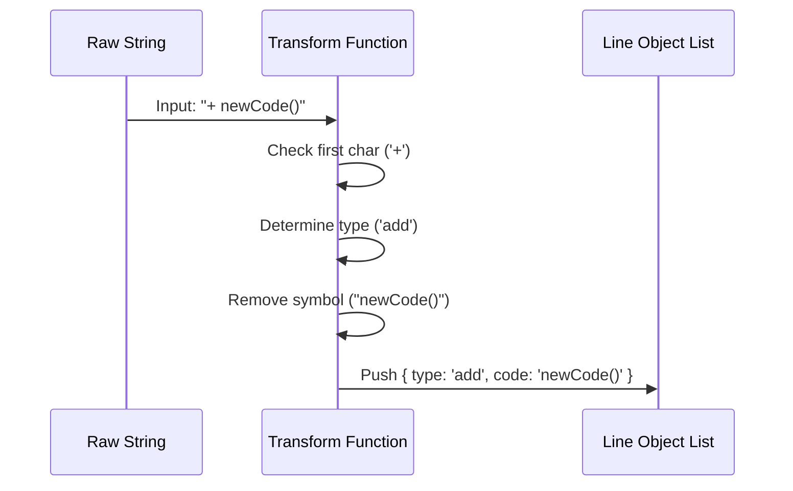

# Chapter 2: Diff Line Model

In the previous [Terminal UI Rendering](01_terminal_ui_rendering.md) chapter, we learned how to draw colored boxes and text to the screen using React and Ink. However, our drawing components made a big assumption: they assumed we already had structured data (like "this line is an addition" or "this line is number 12").

In reality, raw data from tools like `git` comes as simple, flat text strings.

## The Problem: The "Wall of Text"
When you ask for a patch, you get a "hunk" of text that looks like this:

```text
  function sum(a, b) {
-   return a + b;
+   return a + b + c;
  }
```

To a computer, this is just a list of strings. It doesn't inherently know that `-` means "red background" or that `function sum` should be on line 42.

**Our Goal:** Transform this flat list of strings into a **Structured Database** of lines that our UI can easily read and render.

## The Solution: The Line Object
We need to parse each string into a `LineObject`. Think of this like taking a messy grocery list scribbled on a napkin and typing it into a neat Excel spreadsheet with columns for "Item", "Aisle", and "Price".

We want to turn this:
`"+ const a = 1;"`

Into this:
```json
{
  "type": "add",
  "code": "const a = 1;",
  "lineNumber": 10,
  "originalCode": "+ const a = 1;"
}
```

## Key Concept: Categorization
The core logic of the Diff Line Model is simple pattern matching. We look at the **first character** of every line.

1.  **`+` (Plus):** This is an **Add**. We strip the `+` and mark it Green.
2.  **`-` (Minus):** This is a **Remove**. We strip the `-` and mark it Red.
3.  **` ` (Space):** This is **No Change**. We keep it as context.

## Implementation: Step-by-Step

Let's visualize exactly what happens when our application loads a raw patch.



### 1. Basic Parsing
The transformation happens in `Fallback.tsx` inside the `transformLinesToObjects` function.

Here is the code that handles "Add" lines:

```typescript
// Inside transformLinesToObjects
if (code.startsWith('+')) {
  return {
    code: code.slice(1), // Remove the '+'
    type: 'add',
    originalCode: code.slice(1), // Keep a copy
    i: 0 // Placeholder for line number
  };
}
```

**Explanation:**
*   We check `startsWith('+')`.
*   We use `.slice(1)` to get the actual code without the symbol.
*   We set the `type` to `'add'`. This string is what the [Terminal UI Rendering](01_terminal_ui_rendering.md) chapter uses to decide the background color.

### 2. Handling Removals and Context
We apply the exact same logic for removals and unchanged lines.

```typescript
if (code.startsWith('-')) {
  return {
    code: code.slice(1),
    type: 'remove',
    // ...
  };
}
// If it's not + or -, it's context (nochange)
return {
  code: code.slice(1),
  type: 'nochange',
  // ...
};
```

**Explanation:**
*   This covers all three states of a standard diff.
*   The result of this function is an array of objects, but notice the `i` (line number) is still `0`. We haven't calculated line numbers yet!

### 3. The Challenge of Line Numbers
Calculating line numbers in a diff is tricky.
*   If a line is **Added**, it consumes a line number in the *new* file.
*   If a line is **Removed**, it consumed a line number in the *old* file, but doesn't exist in the new one.
*   If a line is **Unchanged**, it exists in both.

We use a function called `numberDiffLines`. This acts like a counter that walks through our new list of objects.

```typescript
export function numberDiffLines(diff: LineObject[], startLine: number) {
  let i = startLine;
  const result = [];
  
  // We process the list as a queue
  const queue = [...diff];
  
  // ... loop through queue ...
}
```

**Explanation:**
*   We start with `startLine` (provided by the git patch metadata).
*   We create a `queue` so we can process lines one by one.

### 4. Incrementing the Counter
As we process the queue, we increment our counter `i` based on the logic we described above.

```typescript
switch (type) {
  case 'nochange':
    i++; // Context lines advance the counter
    result.push({ ...current, i }); 
    break;
  case 'add':
    i++; // New lines advance the counter
    result.push({ ...current, i });
    break;
   // ...
}
```

**Explanation:**
*   We attach the current value of `i` to the object.
*   We increment `i` so the next line gets the next number.

### 5. Handling "Removals" (The Tricky Part)
Removals are unique. In a "Unified Diff" view (what we are building), we usually show removed lines *before* added lines, but they don't count towards the *new* file's line count.

```typescript
case 'remove': {
  // Add the line to results, but keep 'i' as is for now
  result.push({ ...current, i });
  
  // If we have a block of removals, process them all
  // ... logic to handle grouping ...
  break;
}
```

**Explanation:**
*   We treat removals carefully to ensure the line numbers on the left side of the screen stay synchronized with the actual file content on the disk.

## Putting it Together

By combining **Parsing** and **Numbering**, we convert raw chaos into order.

**Input:**
```text
  var x = 1;
- var y = 2;
+ var y = 3;
```

**Output (The Diff Line Model):**
1.  `{ i: 10, type: 'nochange', code: 'var x = 1;' }`
2.  `{ i: 11, type: 'remove',   code: 'var y = 2;' }`
3.  `{ i: 11, type: 'add',      code: 'var y = 3;' }`

Now, our [Terminal UI Rendering](01_terminal_ui_rendering.md) component can simply loop through this list. It sees `type: 'remove'` and paints it red. It sees `i: 11` and draws "11" in the gutter.

## Summary
In this chapter, we built the **Data Layer**. You learned:
1.  How to **parse** raw strings by checking the first character.
2.  How to **structure** that data into `LineObject`s.
3.  How to **calculate line numbers** logically based on the change type.

We now have colored lines and correct numbers. But look at our example output again:
*   Removed: `var y = 2;`
*   Added: `var y = 3;`

The only thing that changed was the number `2` to `3`. Right now, we are highlighting the *entire line*. Wouldn't it be better if we could just highlight the specific word that changed?

To do that, we need to go deeper than the line level.

[Next Chapter: Word-Level Granularity Strategy](03_word_level_granularity_strategy.md)

---

Generated by [Code IQ](https://github.com/adityasoni99/Code-IQ)