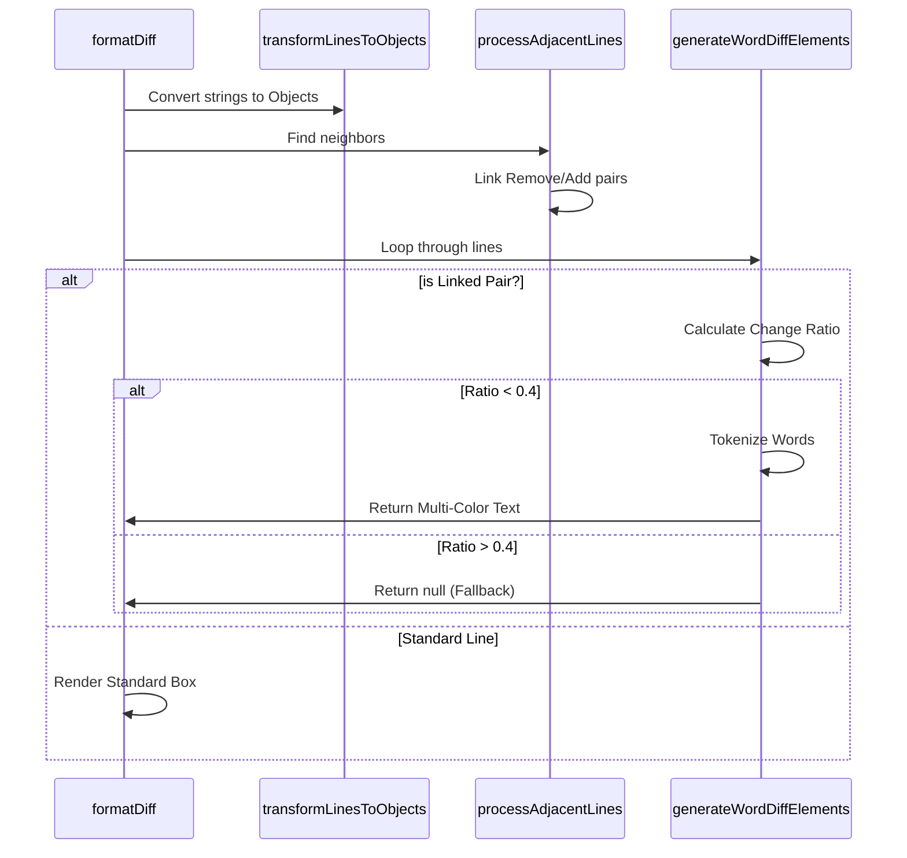

# Chapter 3: Word-Level Granularity Strategy

In the previous [Diff Line Model](02_diff_line_model.md) chapter, we successfully turned raw text into a structured list of lines. We know which lines are "Red" (removed) and which are "Green" (added).

However, we still have a user experience problem.

## The Problem: The "Spot the Difference" Game
Imagine you change a single variable name in a long line of code.

**The Change:**
```javascript
// Old
const userAuthenticationToken = "123";
// New
const userAuthorizationToken = "123";
```

**The Standard Line Diff:**
It looks like the *entire* line was deleted and a completely new one was written.
```diff
- const userAuthenticationToken = "123";
+ const userAuthorizationToken = "123";
```

To the user, this is cognitively demanding. They have to scan both lines and mentally subtract the common parts to find that `Authentication` changed to `Authorization`.

**Our Goal:** Highlight *only* the word that changed.

## The Solution: Granularity Strategy
We need to move from **Line-Level** granularity to **Word-Level** granularity.

This strategy involves three steps:
1.  **Pairing:** Find a "Removed" line sitting right next to an "Added" line.
2.  **Diffing:** Run a specific "diff" algorithm just on those two strings.
3.  **Refining:** Instead of rendering the whole line in one color, render a sequence of colored words.

## Visualizing the Strategy

Before we write code, let's look at the flow of data.

```mermaid
sequenceDiagram
    participant List as Line Object List
    participant Pair as Pairing Logic
    participant Word as Word Diff Algo
    participant UI as Final Output

    List->>Pair: 1. Remove: "let a = 1;"
    List->>Pair: 2. Add:    "let b = 1;"
    Pair->>Pair: Detect Neighbors!
    Pair->>Word: Send strings to compare
    Word->>Word: Tokenize: ["let ", "a", "b", " = 1;"]
    Word->>UI: Return Parts
    UI->>UI: Draw "let " (Gray)
    UI->>UI: Draw "a" (Red)
    UI->>UI: Draw "b" (Green)
    UI->>UI: Draw " = 1;" (Gray)
```

## Step 1: Grouping Adjacent Lines
In `Fallback.tsx`, we have a function called `processAdjacentLines`. It iterates through our list of lines looking for specific patterns.

The pattern we want is: **One or more removals, immediately followed by one or more additions.**

```typescript
// Inside processAdjacentLines loop
if (current.type === 'remove') {
  // 1. Collect all consecutive removals
  const removeLines = collectRemovals(lineObjects, i);
  
  // 2. Look immediately ahead for additions
  const addLines = collectAdditions(lineObjects, nextIndex);

  // 3. If we have both, we have a candidate for word diffing!
  if (removeLines.length > 0 && addLines.length > 0) {
    pairAndMarkLines(removeLines, addLines);
  }
}
```

**Explanation:**
*   We can't just look at one line at a time anymore. We need to "peek ahead".
*   If we find a lonely `remove` with no `add` after it, it's just a deletion. We leave it alone.

## Step 2: The "Diff within a Diff"
Once we have a pair (e.g., `removeLine` and `addLine`), we mark them with a flag `wordDiff: true` and link them together.

When it's time to render, we calculate the differences between the two strings. We use a helper from the `diff` library called `diffWordsWithSpace`.

**Input:**
*   Old: `"const a = 1"`
*   New: `"const b = 1"`

**Output (Token List):**
```json
[
  { "value": "const ", "added": undefined, "removed": undefined },
  { "value": "a",      "removed": true },
  { "value": "b",      "added": true },
  { "value": " = 1",   "added": undefined, "removed": undefined }
]
```

Here is the wrapper function we use:

```typescript
export function calculateWordDiffs(oldText: string, newText: string) {
  // We use 'WithSpace' to ensure spacing implies a token boundary
  return diffWordsWithSpace(oldText, newText, {
    ignoreCase: false
  });
}
```

## Step 3: Rendering the Parts
This is where the [Terminal UI Rendering](01_terminal_ui_rendering.md) logic gets an upgrade.

Previously, we rendered one `<Text>` component for the whole line. Now, if `wordDiff` is enabled, we loop through the **Token List** (from Step 2) and render a chain of `<Text>` components.

```typescript
// Inside generateWordDiffElements
wordDiffs.forEach((part) => {
  // Determine color based on part status
  let partColor = undefined; // Default (Gray/White)
  
  if (type === 'add' && part.added) {
    partColor = 'diffAddedWord'; // Bright Green
  } else if (type === 'remove' && part.removed) {
    partColor = 'diffRemovedWord'; // Bright Red
  }

  // Render the specific word
  currentLine.push(
    <Text backgroundColor={partColor}>{part.value}</Text>
  );
});
```

**Explanation:**
*   **Common Text:** Parts that haven't changed don't get a background color (or get a dim one), creating context.
*   **Changed Text:** Specific words get a specialized theme color (e.g., `'diffAddedWord'`), which is usually a brighter or more intense version of the line color.

## The "Ship of Theseus" Problem
What if a line changes *too* much?

```javascript
// Old
var x = 1;
// New
import { Button } from 'react';
```

Technically, these are adjacent `remove`/`add` lines. But trying to highlight "word differences" between them would result in a messy rainbow of colors that makes no sense. They aren't related.

To solve this, we implement a **Change Threshold**.

```typescript
const CHANGE_THRESHOLD = 0.4; // 40%

// Calculate how much of the string actually changed
const changeRatio = changedLength / totalLength;

// If too much changed, abort!
if (changeRatio > CHANGE_THRESHOLD) {
  return null; // Fall back to standard line-by-line rendering
}
```

**Explanation:**
*   We calculate the percentage of characters that are different.
*   If more than 40% of the line is different, we assume it's a completely new line and simply show the standard Red/Green blocks from [Chapter 2](02_diff_line_model.md).

## Internal Implementation: The Full Flow

Let's trace exactly what happens in `Fallback.tsx` when `formatDiff` is called.



## Summary
In this chapter, we refined our intelligence layer. You learned:
1.  **Granularity:** Moving from whole lines to specific words improves readability.
2.  **Pairing Strategy:** We identify changes by looking for `Remove` lines immediately followed by `Add` lines.
3.  **Tokenization:** We break strings into words to find the exact difference.
4.  **Heuristics:** We use a "Change Threshold" to stop the UI from doing word-diffs on completely unrelated lines.

We now have a beautiful, intelligent UI. But there is a hidden cost. calculating word diffs in JavaScript (especially inside a loop for thousands of lines) is **slow**.

To make `StructuredDiff` production-ready, we need to offload this heavy calculation to a faster language.

[Next Chapter: Native Module Bridge](04_native_module_bridge.md)

---

Generated by [Code IQ](https://github.com/adityasoni99/Code-IQ)