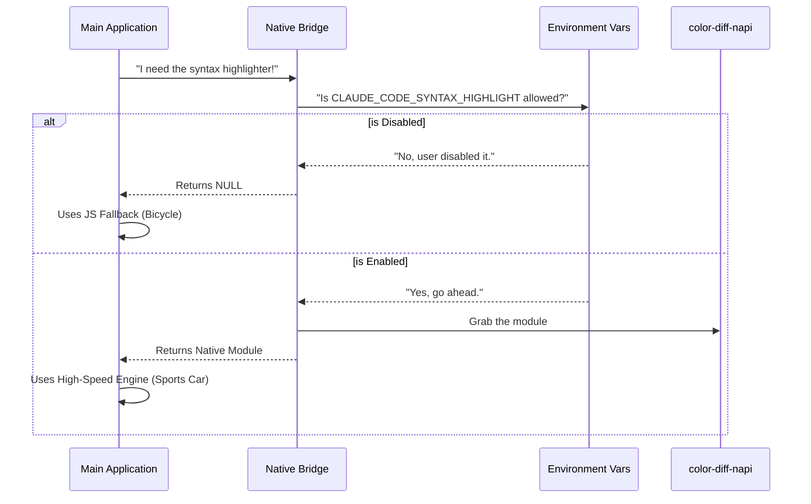

# Chapter 4: Native Module Bridge

In the previous [Word-Level Granularity Strategy](03_word_level_granularity_strategy.md) chapter, we learned how to make our diffs intelligent by highlighting specific words that changed.

However, calculating word-level differences for massive files using standard JavaScript can be slow. It might make your terminal feel "laggy." To solve this, we want to use a **Native Module** (written in a fast language like Rust or C++) called `color-diff-napi`.

But native modules can be risky. If they fail to load, the whole application crashes.

## The Problem: Risky Speed
Imagine you have a super-fast sports car (the Native Module) and a trusty bicycle (the JavaScript code).

1.  **The Goal:** Get to the destination (Render the Diff) as fast as possible.
2.  **The Risk:** The sports car might not start if the weather is bad (Environment issues).
3.  **The Requirement:** If the car doesn't start, we must seamlessly switch to the bicycle so the user still gets home, even if it's a bit slower.

We need a **Bridge** that connects our application to the fast code safely.

## The Solution: The Smart Switch
The **Native Module Bridge** acts like a smart switch or a gatekeeper. It sits between your application logic and the high-performance native code.

Its job is simple:
1.  **Check:** Is the native module allowed to run?
2.  **Route:** If yes, hand over the native tool. If no, hand over `null` (which tells the app to use the bicycle).

## Key Concepts

### 1. The Environment Variable
Sometimes, a user *wants* to turn off the fancy features. Maybe they are debugging, or maybe their computer doesn't support it.

We use an **Environment Variable** named `CLAUDE_CODE_SYNTAX_HIGHLIGHT`.
*   If set to `true` (or empty): We try to use the sports car.
*   If set to `false` (or `0`): We force the bicycle.

### 2. The Gatekeeper Function
We don't let our UI components import the native module directly. Instead, they import a wrapper function. This wrapper performs the safety check every time it is called.

## Internal Implementation: Step-by-Step

Let's visualize the flow when the application asks for the syntax highlighter.



### 1. Checking the Environment
First, we look at `colorDiff.ts`. We have a helper function that checks if the user has explicitly disabled the feature.

```typescript
// Inside colorDiff.ts
import { isEnvDefinedFalsy } from '../../utils/envUtils.js'

export function getColorModuleUnavailableReason() {
  // Check if CLAUDE_CODE_SYNTAX_HIGHLIGHT is set to "false" or "0"
  if (isEnvDefinedFalsy(process.env.CLAUDE_CODE_SYNTAX_HIGHLIGHT)) {
    return 'env'; // Return the reason: Environment disabled it
  }
  
  return null; // No reason to block it!
}
```

**Explanation:**
*   **`isEnvDefinedFalsy`**: A utility that looks at the computer's settings.
*   **Return Value**: If it returns `'env'`, we know we must stop. If it returns `null`, we are green to go.

### 2. The Safe Exporter
Now we build the bridge function that the rest of the app actually calls. This corresponds to `expectColorDiff`.

```typescript
import { ColorDiff } from 'color-diff-napi'

// The application calls this function, NOT the module directly
export function expectColorDiff() {
  // 1. Check the reason
  const reason = getColorModuleUnavailableReason();

  // 2. If there is a reason to stop, return null
  if (reason !== null) {
    return null;
  }

  // 3. Otherwise, return the powerful native object
  return ColorDiff;
}
```

**Explanation:**
*   **Safety First**: We never return `ColorDiff` without checking the environment variable first.
*   **Consistent Interface**: The app knows that calling this might return `null`, so it is forced to have a backup plan (the JS fallback).

### 3. Usage in the Application
How does a developer use this? They simply ask the bridge for the tool.

```typescript
// Inside a rendering component (e.g., Chapter 1's code)
const nativeModule = expectColorDiff();

if (nativeModule) {
  // FAST PATH: Use C++/Rust logic
  nativeModule.highlight(code);
} else {
  // SLOW PATH: Use JavaScript logic (from Chapter 3)
  fallbackHighlight(code);
}
```

**Explanation:**
*   The UI doesn't care *why* the native module is missing. It just checks `if (nativeModule)`.
*   This keeps our rendering logic clean and prevents the app from crashing if the native module fails to load.

### 4. Special Case: Syntax Themes
The native module also handles coloring themes (like "Dark Mode" vs "Light Mode"). We bridge this too.

```typescript
import { getSyntaxTheme as nativeGetSyntaxTheme } from 'color-diff-napi'

export function getSyntaxTheme(themeName: string) {
  // Again, check if we are allowed to run
  if (getColorModuleUnavailableReason() !== null) {
    return null;
  }

  // Pass the request through to the native function
  return nativeGetSyntaxTheme(themeName);
}
```

**Explanation:**
*   This is a "Pass-through" wrapper.
*   It looks exactly like the original function, but adds that crucial safety check layer.

## Summary

In this chapter, we built the **Safety Layer** of our application. You learned:

1.  **The Bridge Pattern:** How to wrap complex or risky code behind a safe gatekeeper function.
2.  **Environment Control:** Using process variables (`process.env`) to act as a "Kill Switch" for features.
3.  **Graceful Degradation:** The bridge ensures that if the fast way isn't available, the app falls back to the slow way instead of crashing.

This concludes the beginner's guide to the **StructuredDiff** project!

### Recap of your journey:
1.  [Terminal UI Rendering](01_terminal_ui_rendering.md): You learned how to draw boxes and text in the terminal.
2.  [Diff Line Model](02_diff_line_model.md): You turned raw text into a structured list of changes.
3.  [Word-Level Granularity Strategy](03_word_level_granularity_strategy.md): You added intelligence to highlight specific word changes.
4.  **Native Module Bridge:** You ensured the app remains fast and crash-proof.

You now understand the core architecture of a professional terminal-based diff tool! Happy coding!

---

Generated by [Code IQ](https://github.com/adityasoni99/Code-IQ)