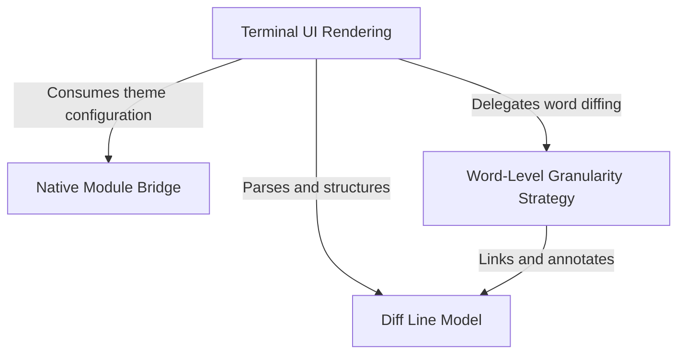

# Tutorial: StructuredDiff

The **StructuredDiff** project provides a sophisticated mechanism for displaying code differences in a command-line interface. It goes beyond simple line-by-line comparisons by using a **Word-Level Granularity Strategy** to identify and highlight specific changes within lines (such as variable renames). The system uses a **Native Module Bridge** to ensure high performance while offering a robust *fallback* rendering logic that transforms raw patches into structured **Diff Line Models** for rich, colored terminal output.

## Chapters

1. [Terminal UI Rendering](01_terminal_ui_rendering.md)
2. [Diff Line Model](02_diff_line_model.md)
3. [Word-Level Granularity Strategy](03_word_level_granularity_strategy.md)
4. [Native Module Bridge](04_native_module_bridge.md)

---

Generated by [Code IQ](https://github.com/adityasoni99/Code-IQ)