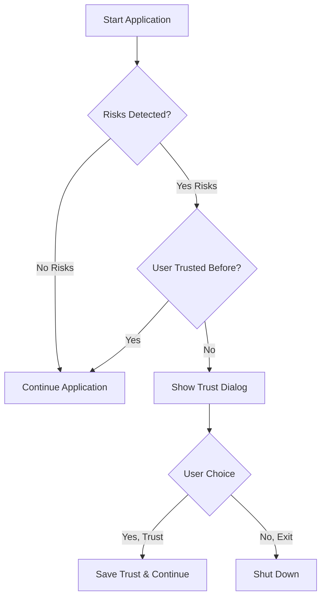
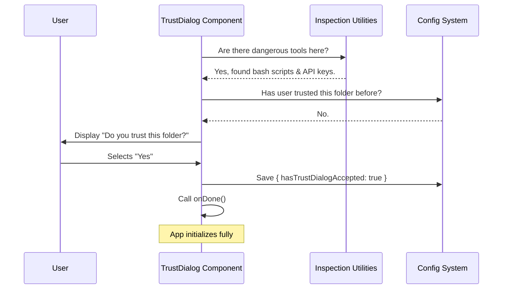

# Chapter 1: Trust Verification UI

Welcome to the **TrustDialog** project! 

Before we dive into how our tool works, we need to talk about safety. Imagine you are running a powerful tool that can read files, execute terminal commands, and talk to cloud servers. Now, imagine accidentally running that tool in a folder you just downloaded from a suspicious website. **Scary, right?**

This is where the **Trust Verification UI** comes in. It acts as the **"Bouncer"** of our application.

### The Problem: Unsafe Environments
When our tool starts up in a new folder (workspace), it doesn't know if that folder is safe. It might contain:
1.  Malicious scripts.
2.  Configuration files that expose your API keys.
3.  Instructions to connect to untrusted servers.

### The Solution: The Bouncer
The **Trust Verification UI** intercepts the startup process. Before the tool allows any "dangerous" actions, it scans the room. If it sees anything risky, it stops and asks you:

> *"Do you trust this folder?"*

If you say **Yes**, the tool proceeds.
If you say **No**, the tool shuts down immediately.

---

## High-Level Logic

The logic is simple but critical. Here is how the "Bouncer" decides whether to let the user in:



## How It Works: A Code Tour

Let's look at the implementation in `TrustDialog.tsx`. This component is built using **React** and **Ink** (a library for building command-line user interfaces).

### 1. Scouting for Risks
First, the component needs to know *what* makes this folder risky. It calls several helper functions to inspect the environment.

*Note: We will learn exactly how these inspectors work in [Capability Inspection Utilities](02_capability_inspection_utilities.md).*

```typescript
// Inside TrustDialog.tsx
export function TrustDialog({ onDone, commands }: Props) {
  // 1. Check for Config Servers (MCP)
  const { servers } = getMcpConfigsByScope('project');
  const hasMcpServers = Object.keys(servers).length > 0;

  // 2. Check for Dangerous Environment Variables
  const dangerousEnvVars = getDangerousEnvVarsSources();
  const hasDangerousEnvVars = dangerousEnvVars.length > 0;
  
  // ... checks for AWS, Bash scripts, etc.
}
```

**Explanation:**
The code initializes by gathering intelligence. Variables like `hasMcpServers` or `hasDangerousEnvVars` become `true` if risk factors are found.

### 2. Rendering the Warning
If risks are found and the user hasn't accepted them yet, we render the UI. We use a `<PermissionDialog>` to make it look like a serious warning.

```tsx
// Displaying the UI
return (
  <PermissionDialog 
    color="warning" 
    title="Accessing workspace:"
  >
    <Text bold={true}>{getFsImplementation().cwd()}</Text>
    <Text>
      Quick safety check: Is this a project you created 
      or one you trust?
    </Text>
    {/* ... Links to security guide ... */}
    {/* ... The Selection Menu ... */}
  </PermissionDialog>
);
```

**Explanation:**
This renders text to the terminal explaining *why* we paused. It shows the current working directory (`cwd`) so the user knows exactly which folder is being questioned.

### 3. The Choice (The Menu)
We present the user with a strict choice using a `<Select>` component.

```tsx
<Select 
  options={[
    { label: "Yes, I trust this folder", value: "enable_all" },
    { label: "No, exit", value: "exit" }
  ]} 
  onChange={value => onChange(value)} 
  onCancel={() => onChange("exit")} 
/>
```

**Explanation:**
*   **enable_all**: The user explicitly consents.
*   **exit**: The user denies access.
*   **onCancel**: If the user hits `Esc`, we treat it as an "exit" for safety.

### 4. Handling the Decision
When the user selects an option, the `onChange` function handles the logic.

```typescript
const onChange = (value) => {
  if (value === "exit") {
    // Stop everything immediately
    gracefulShutdownSync(1);
    return;
  }

  // If we are here, the user said "Yes"
  if (isHomeDir) {
    setSessionTrustAccepted(true); // Temporary trust for Home
  } else {
    saveCurrentProjectConfig(current => ({
      ...current,
      hasTrustDialogAccepted: true // Permanent trust for Project
    }));
  }
  
  onDone(); // Let the app continue!
};
```

**Explanation:**
*   **Refusing Trust:** We call `gracefulShutdownSync(1)`. This is a clean way to kill the program. We'll cover this in [Graceful Exit Management](04_graceful_exit_management.md).
*   **Granting Trust:**
    *   If it's your **Home Directory**, we only trust it for *this session* (security precaution).
    *   If it's a **Project Folder**, we save a config file so we don't ask you again next time.
*   **onDone():** This is a callback function that tells the main application "The Bouncer let them in, you may proceed."

## Internal Sequence: What happens when you run the app?

Here is the flow of data when `TrustDialog` is active.



## Summary

In this chapter, we learned:
1.  **The Bouncer Concept:** We never run in an untrusted environment without asking first.
2.  **Risk Detection:** We check for specific capabilities (like Bash or MCP) to decide if we need to ask.
3.  **Persistence:** We remember the user's choice so we don't annoy them every time they open a safe project.

But how exactly does the application know if a folder has "Bash permissions" or "AWS commands"?

To find out, proceed to the next chapter:
[Capability Inspection Utilities](02_capability_inspection_utilities.md)

---

Generated by [Code IQ](https://github.com/adityasoni99/Code-IQ)