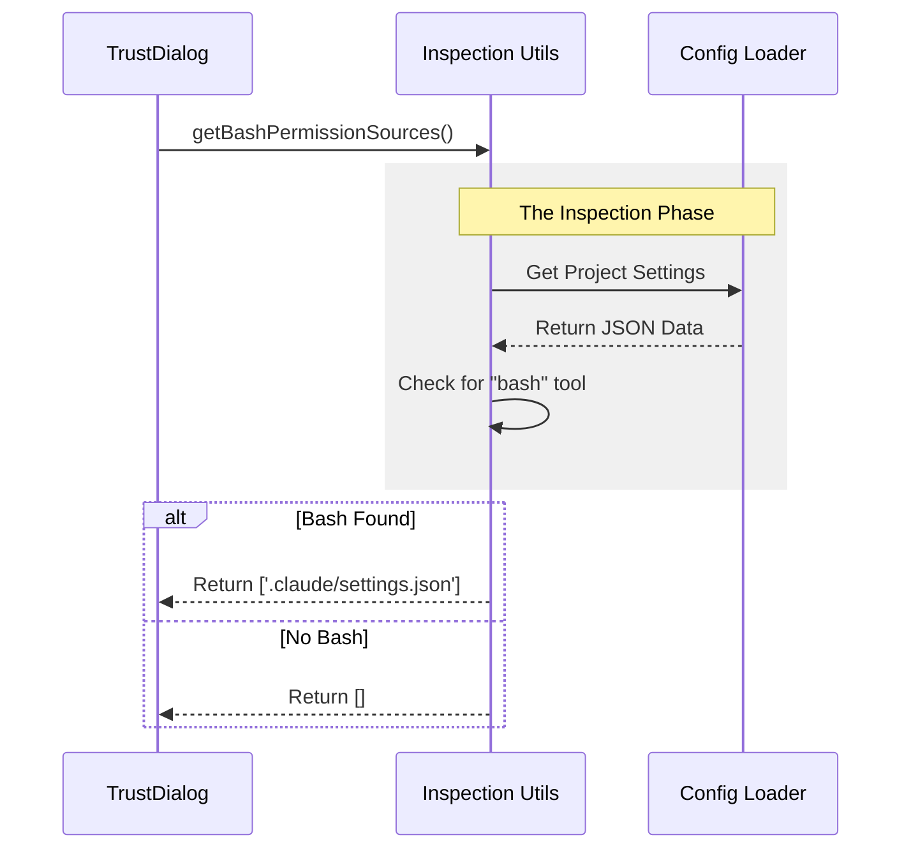

# Chapter 2: Capability Inspection Utilities

Welcome back! In the previous chapter, [Trust Verification UI](01_trust_verification_ui.md), we met the **"Bouncer"** (the Trust Dialog). We learned that it stops the application from running in dangerous folders until you give permission.

But here is the million-dollar question: **How does the Bouncer know if a folder is dangerous?**

Does it guess? Does it flip a coin? No. It uses **Capability Inspection Utilities**.

---

## The Concept: The X-Ray Scanner

If the Trust Dialog is the security guard at the airport, the **Capability Inspection Utilities** are the X-Ray machines.

When you enter an airport, the guard doesn't stop everyone. They stop people carrying "sharp objects" or prohibited items. In our application, a "sharp object" is a configuration setting that gives the AI too much power, such as:
1.  **Bash Access:** The ability to run terminal commands.
2.  **Cloud Access:** Permission to talk to AWS or Google Cloud.
3.  **Git Hooks:** Scripts that run automatically when you save or commit files.

The Inspection Utilities scan the project's settings files to see if any of these "sharp objects" are packed inside.

### Use Case: The Hidden Script
Imagine you download a project that has a hidden setting: *"Allow AI to delete files using Bash."*

1.  **Without Inspection:** The app starts, the AI sees the setting, and might accidentally delete files.
2.  **With Inspection:** The utility scans the settings *before* the app fully loads, detects the "Bash" permission, and alerts the Trust Dialog.

---

## How It Works: Scanning for Danger

These utilities live in `utils.ts`. Their job is to look at configuration data and return a list of files that contain risky settings.

Here are the specific "sensors" we use:

### 1. The Bash Sensor
This is the most critical check. Giving an AI access to `bash` means it can run almost any command on your computer.

```typescript
// Simplified concept from utils.ts
function hasBashPermission(rules: PermissionRule[]): boolean {
  // Loop through all permissions
  return rules.some(rule =>
    // Is the rule "allow"? AND Is the tool "bash"?
    rule.ruleBehavior === 'allow' &&
    rule.ruleValue.toolName === 'bash'
  );
}
```
**Explanation:**
This function looks through a list of permission rules. If it finds one that explicitly allows `bash`, it returns `true`. This raises a red flag.

### 2. The Dangerous Environment Variables Sensor
Some projects set environment variables (like API keys) automatically. We check if the project is trying to set anything unusual.

```typescript
// Simplified concept from utils.ts
function hasDangerousEnvVars(settings): boolean {
  // Get all environment variable keys defined in settings
  const keys = Object.keys(settings.env);
  
  // Check if any key is NOT in our "Safe List"
  return keys.some(key => !SAFE_ENV_VARS.has(key));
}
```
**Explanation:**
We have a list of safe variables (like `PORT` or `HOST`). If a project tries to set `AWS_SECRET_KEY` (which is not safe), this sensor trips the alarm.

---

## Utilizing the Inspectors

The Trust Dialog uses these functions to build a report. It doesn't just want to know *if* there is a risk; it wants to know *where* it is coming from (e.g., is it in your project settings or your local settings?).

Here is how we use the utilities to get the source of the danger:

```typescript
// Usage in TrustDialog.tsx
import { getBashPermissionSources } from './utils';

// Returns an array, e.g., ['.claude/settings.json']
const bashSources = getBashPermissionSources();

if (bashSources.length > 0) {
    console.log("Warning: Bash execution enabled in:", bashSources);
    // Trigger the Trust Dialog!
}
```

**What happens here?**
1.  We call `getBashPermissionSources()`.
2.  It checks the project configuration files.
3.  It returns a list of filenames that enable Bash.
4.  If the list is not empty (`length > 0`), the UI knows it must ask for trust.

---

## Internal Implementation

Let's look under the hood. How does the utility actually get the data to inspect?

It follows a **Pull & Check** pattern.



### Deep Dive: The `get...Sources` Pattern

Most functions in `utils.ts` follow the exact same structure. They check **Project Settings** (shared with your team) and **Local Settings** (private to you).

Here is the actual implementation structure for detecting Git Hooks:

```typescript
// From utils.ts
export function getHooksSources(): string[] {
  const sources: string[] = []

  // 1. Inspect Project Settings
  const projectSettings = getSettingsForSource('projectSettings')
  if (hasHooks(projectSettings)) {
    sources.push('.claude/settings.json')
  }

  // 2. Inspect Local Settings
  const localSettings = getSettingsForSource('localSettings')
  if (hasHooks(localSettings)) {
    sources.push('.claude/settings.local.json')
  }

  return sources
}
```

**Code Walkthrough:**
1.  **`sources` array:** We start with an empty list.
2.  **`getSettingsForSource`:** We fetch the configuration (we will learn how this works in the next chapter).
3.  **`hasHooks(...)`:** We run our "sensor" logic on that configuration.
4.  **`push`:** If hooks are found, we add the filename to our list.
5.  **Return:** We give the list back to the UI.

### Why return the filename?
By returning the filename (e.g., `.claude/settings.json`), the Trust Dialog can tell the user: *"Hey, check the file `.claude/settings.json`, it looks suspicious."* This makes the tool helpful, not just annoying.

---

## Summary

In this chapter, we learned:
1.  **The X-Ray Analogy:** Inspection utilities scan for "sharp objects" like Bash commands or API keys.
2.  **Sensors:** We have specific functions (`hasBashPermission`, `hasHooks`) to detect specific risks.
3.  **Source Identification:** We don't just return `true/false`; we return the *filenames* causing the risk so the user can investigate.

**But wait...** inside these utilities, we kept calling `getSettingsForSource(...)`. Where do these settings come from? How does the app know the difference between "Project Settings" and "Local Settings"?

To find out, proceed to the next chapter:
[Configuration Source Hierarchy](03_configuration_source_hierarchy.md)

---

Generated by [Code IQ](https://github.com/adityasoni99/Code-IQ)