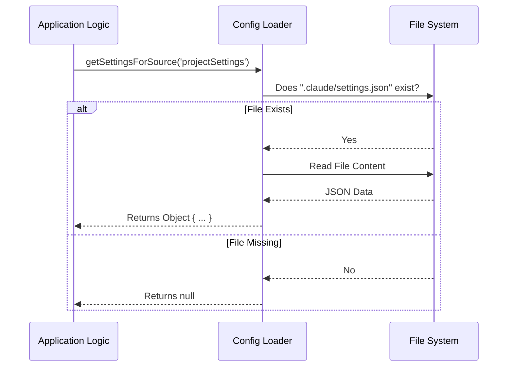

# Chapter 3: Configuration Source Hierarchy

Welcome back! 

In the previous chapter, [Capability Inspection Utilities](02_capability_inspection_utilities.md), we learned how our application uses "X-Ray Scanners" to find risky settings like Bash access or API keys.

We saw code that looked like this:

```typescript
const projectSettings = getSettingsForSource('projectSettings');
const localSettings = getSettingsForSource('localSettings');
```

But **what are these two sources?** Why do we need two different ways to configure the same project? And which one wins if they disagree?

This chapter introduces the **Configuration Source Hierarchy**.

---

## The Concept: House Rules vs. Personal Preferences

Imagine you are moving into a shared house with roommates. There are two types of rules:

1.  **House Rules (The Fridge Note):** These are agreed upon by everyone. "Quiet hours after 10 PM." Everyone who lives there sees them.
2.  **Personal Preferences (Your Diary):** These are private to you. "I like to wake up at 6 AM." Your roommates don't need to know or copy this.

In **TrustDialog**, we use this exact model for configuration:

### 1. Project Settings (`projectSettings`)
*   **File:** `.claude/settings.json`
*   **Role:** The "House Rules."
*   **Behavior:** This file is shared with your team (usually via Git). It ensures everyone working on the project has the same base configuration.

### 2. Local Settings (`localSettings`)
*   **File:** `.claude/settings.local.json`
*   **Role:** The "Personal Preferences."
*   **Behavior:** This file is **private** (ignored by Git). It is specific to *your* computer. This is where you put secrets (like API keys) or overrides that only you want.

---

## The Hierarchy: The "OR" Rule

When checking for **safety**, we don't just pick one file and ignore the other. We check **both**.

If *either* the Project Settings **OR** the Local Settings enable a dangerous feature (like Bash), the Trust Dialog considers the project "Risky."

> **The Rule of Danger:**
> You are only safe if **neither** file contains dangerous settings.

### Examples

| Feature | Project Settings | Local Settings | **Result** |
| :--- | :--- | :--- | :--- |
| **Bash Access** | ❌ Disabled | ❌ Disabled | ✅ **Safe** |
| **Bash Access** | ✅ Enabled | ❌ Disabled | ⚠️ **Risky** (Needs Trust) |
| **Bash Access** | ❌ Disabled | ✅ Enabled | ⚠️ **Risky** (Needs Trust) |

Even if the project owner disabled Bash (Project Settings), if *you* enabled it locally to debug something, the tool must still warn you (or treat it as a trusted action).

---

## How to Use: Fetching the Data

As a developer using this system, you rarely check the files manually. You use the helper function `getSettingsForSource`.

### Usage Example

Let's say we want to check if the user has defined any "Hooks" (automatic scripts). We need to check both layers.

```typescript
import { getSettingsForSource } from './settings';

function checkForHooks() {
  // 1. Check House Rules
  const publicConfig = getSettingsForSource('projectSettings');
  
  // 2. Check Personal Rules
  const privateConfig = getSettingsForSource('localSettings');

  // Logic: Do hooks exist in EITHER?
  return hasHooks(publicConfig) || hasHooks(privateConfig);
}
```

**Explanation:**
1.  We call `getSettingsForSource` with the specific string ID of the source we want.
2.  It returns a JSON object (the contents of the file) or `null` if the file doesn't exist.
3.  We combine the results to see if hooks are present anywhere.

---

## Internal Implementation: Under the Hood

How does the application actually find these files? The logic is straightforward but robust.

### The Flow

When you ask for `'projectSettings'`, the system looks for the file on your hard drive.



### The Code Implementation

Here is a simplified look at how `settings.ts` implements this.

```typescript
// settings.ts (Simplified)
import fs from 'fs';
import path from 'path';

export function getSettingsForSource(sourceType: string) {
  // 1. Determine the filename based on the source type
  let filename = '';
  if (sourceType === 'projectSettings') {
    filename = '.claude/settings.json';
  } else if (sourceType === 'localSettings') {
    filename = '.claude/settings.local.json';
  }

  // 2. Build the full path
  const fullPath = path.resolve(process.cwd(), filename);

  // 3. Try to read and parse it
  if (fs.existsSync(fullPath)) {
    const content = fs.readFileSync(fullPath, 'utf-8');
    return JSON.parse(content);
  }

  return null; // File doesn't exist
}
```

**Step-by-Step Explanation:**
1.  **Select Filename:** We switch between the standard `.json` and the `.local.json` based on the argument.
2.  **Resolve Path:** We combine the filename with the `cwd` (Current Working Directory) to find exactly where the file should be.
3.  **Read & Parse:**
    *   If the file exists, we read the text and convert it from a JSON string into a JavaScript object.
    *   If the file is missing, we simply return `null` so the rest of the app knows there are no settings there.

---

## Why this Architecture Matters

This separation is crucial for the **Trust Verification UI** we built in Chapter 1.

Imagine if we combined everything into one big file.
1.  You download a repo.
2.  It has `settings.json` with dangerous settings.
3.  You want to add your own API key safely.

If there were only one file, you would have to edit the dangerous file to add your key. This makes it hard to distinguish between "Rules I downloaded" (potentially untrusted) and "Rules I wrote" (trusted).

By keeping them separate:
1.  The **Inspector** can tell you: *"The danger is coming from `settings.json` (the file you downloaded)."*
2.  It allows you to keep your secrets in `settings.local.json` without accidentally uploading them to the internet.

---

## Summary

In this chapter, we learned:
1.  **Two Layers:** We split configuration into "Project" (Shared) and "Local" (Private).
2.  **Aggregated Risk:** When checking for permissions, if *either* file enables a feature, the feature is active.
3.  **Implementation:** The `getSettingsForSource` function reads the specific file from the disk and parses it.

Now we have a fully functioning Trust System:
1.  It stops execution (Chapter 1).
2.  It scans for danger (Chapter 2).
3.  It knows where to look for that danger (Chapter 3).

**But what happens if the user says "No"?**

If the user denies trust, we need to shut down the application instantly but safely. We can't just crash the program. We need a **Graceful Exit**.

Next up: [Graceful Exit Management](04_graceful_exit_management.md)

---

Generated by [Code IQ](https://github.com/adityasoni99/Code-IQ)