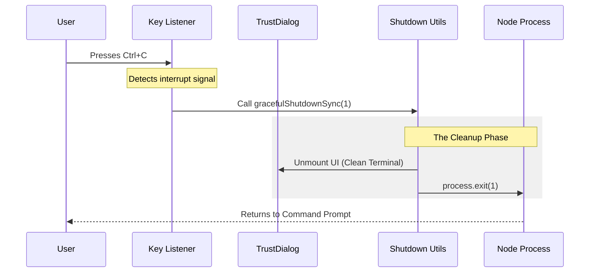

# Chapter 4: Graceful Exit Management

Welcome back! 

In the previous chapter, [Configuration Source Hierarchy](03_configuration_source_hierarchy.md), we learned how our application combines "House Rules" and "Personal Preferences" to decide if a project is risky.

But what happens if the result is **"Too Risky"** and the user shouts **"STOP!"**?

Or what if the user simply changes their mind and hits `Ctrl+C` on their keyboard?

We cannot just pull the plug on the application. If we do that, we might leave the terminal in a broken state (cursor missing, colors messed up) or leave files half-written. We need a way to leave the room politely.

This chapter introduces **Graceful Exit Management**.

---

## The Concept: The Emergency Brake

Imagine you are driving a car. You see a roadblock (the Trust Dialog). You decide not to proceed.

1.  **Hard Exit (`process.exit`):** This is like teleporting out of the car while it's moving. The car crashes, the engine is still running, and it's a mess.
2.  **Graceful Exit:** This is applying the brakes, putting the car in "Park", turning off the engine, and locking the doors.

In the **TrustDialog** project, we need to handle exits gracefully to ensure the user's terminal remains usable and clean.

### The Problem: Terminal Hijacking
Our application uses a library called **Ink** to take control of your terminal (to draw menus and colors). If we crash or exit abruptly, the terminal might think the application is still running. You might lose your typing cursor or get stuck in a weird color mode.

### The Solution: `gracefulShutdownSync`
We use a centralized function called `gracefulShutdownSync`. Its job is to:
1.  **Unmount the UI:** Tell the terminal "We are done drawing."
2.  **Restore the Cursor:** Give the user back their blinking cursor.
3.  **Exit the Process:** Finally, stop the Node.js program.

---

## Key Components

There are two main parts to this system:

1.  **The Trigger (The Hook):** `useExitOnCtrlCDWithKeybindings`
    *   This acts like a sensor. It listens for `Ctrl+C` (Cancel) or `Ctrl+D` (End of Input).
2.  **The Action (The Logic):** `gracefulShutdownSync`
    *   This is the actual shutdown procedure.

---

## How to Use: Wiring the Brake

Let's look at how we wire this up in `TrustDialog.tsx`. We want the application to stop if the user selects "Exit" from the menu OR if they use a keyboard shortcut.

### 1. Manual Exit (Menu Selection)
When the user manually selects "No, exit" in the dropdown menu:

```typescript
// Inside TrustDialog.tsx - onChange handler
const onChange = (value) => {
  if (value === "exit") {
    // 1. User chose to exit
    // 2. We call the shutdown function with error code 1
    gracefulShutdownSync(1);
    return;
  }
  // ... else proceed with trust
};
```

**Explanation:**
*   **`gracefulShutdownSync(1)`**: We pass the number `1`. In computer programming, an exit code of `0` means "Success", and anything else (like `1`) means "Something went wrong" or "The user cancelled."

### 2. Key Binding Exit (Ctrl+C)
Users are used to pressing `Ctrl+C` to kill command-line apps. We use a React Hook to listen for this.

```typescript
// Inside TrustDialog.tsx
import { useExitOnCtrlCDWithKeybindings } from '../../hooks/useExitOnCtrlCDWithKeybindings';

// This hook listens for Ctrl+C and Ctrl+D
const exitState = useExitOnCtrlCDWithKeybindings(() => {
  // Logic to run when keys are pressed:
  return gracefulShutdownSync(1);
});
```

**Explanation:**
*   **`useExitOnCtrlCDWithKeybindings`**: This function runs in the background.
*   **The Callback:** We pass it a function that tells it what to do when those keys are pressed. In this case: Shut down immediately.

---

## Internal Sequence: The Shutdown Flow

What actually happens when you press `Ctrl+C`?



---

## Implementation Deep Dive

Let's look at the simplified implementation of the "Brake" system.

### The Shutdown Utility

This utility lives in `utils/gracefulShutdown.ts`. It acts as the final gatekeeper.

```typescript
// utils/gracefulShutdown.ts (Simplified)
import { unmount } from '../ink'; // Our UI library

export function gracefulShutdownSync(exitCode: number) {
  // 1. Clean up the UI
  // This restores the cursor and clears the screen buffer
  unmount();

  // 2. Force stop the process
  // We use the exit code provided (0 or 1)
  process.exit(exitCode);
}
```

**Explanation:**
*   **`unmount()`**: This is critical. Without this, your terminal might look "glitched" after the app closes.
*   **`process.exit()`**: This is the standard Node.js command to stop a program.

### The Key Listener Hook

This lives in `hooks/useExitOnCtrlCDWithKeybindings.ts`. It connects the keyboard to the shutdown utility.

```typescript
// hooks/useExitOnCtrlCDWithKeybindings.ts (Simplified concept)
import { useInput } from 'ink';

export function useExitOnCtrlCDWithKeybindings(onExit: () => void) {
  // Ink provides a hook to read raw keystrokes
  useInput((input, key) => {
    // If Ctrl+C or Ctrl+D is pressed
    if ((input === 'c' && key.ctrl) || (input === 'd' && key.ctrl)) {
      // Trigger the exit function passed in
      onExit();
    }
  });

  return { pending: false };
}
```

**Explanation:**
*   **`useInput`**: This allows us to intercept every keystroke before it appears on the screen.
*   **Logic:** We check specifically for the combination of the `Ctrl` key and the letter `c`.
*   **`onExit()`**: This executes the `gracefulShutdownSync` we defined earlier.

---

## Why is this "Abstraction"?

You might wonder, "Why not just write `process.exit(1)` everywhere?"

1.  **Consistency:** If we change how we clean up the terminal, we only change it in one place (`gracefulShutdownSync`).
2.  **Safety:** It ensures we *never* forget to unmount the UI, preventing display bugs.
3.  **Readability:** `gracefulShutdownSync` describes *intent* better than `process.exit`.

---

## Summary

In this chapter, we learned:
1.  **The Emergency Brake:** We need a safe way to stop the app without breaking the user's terminal.
2.  **`gracefulShutdownSync`:** The utility that cleans up the UI and stops the process.
3.  **Keybindings:** How we use React hooks to listen for `Ctrl+C` to trigger the shutdown.

Now the application is safe. It asks for permission (Chapter 1), detects risks (Chapter 2 & 3), and stops cleanly if refused (Chapter 4).

**But what if the user says "Yes"?**

If the user trusts the application, we let them in. But we also want to keep a record of what happened. Did they say yes? Was it a risky project? We need to log this data.

Next up: [Trust Analytics & Auditing](05_trust_analytics___auditing.md)

---

Generated by [Code IQ](https://github.com/adityasoni99/Code-IQ)