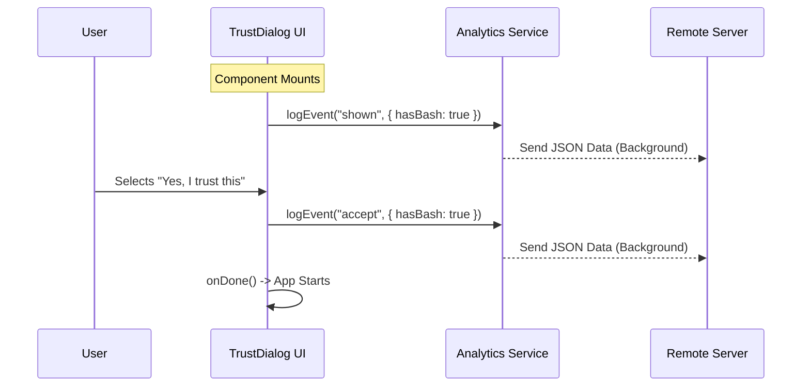

# Chapter 5: Trust Analytics & Auditing

Welcome to the final chapter of our tutorial series!

In the previous chapter, [Graceful Exit Management](04_graceful_exit_management.md), we learned how to safely shut down the application if the user refuses to trust a workspace.

But imagine you are the developer of this tool. You have thousands of users. You might wonder:
*   "Are users getting annoyed by the Trust Dialog?"
*   "How many users are actually running dangerous Bash scripts?"
*   "Do people blindly accept 'Yes' even when in their Home Directory?"

To answer these questions, we need **Trust Analytics & Auditing**.

---

## The Concept: The Black Box Recorder

Think of an airplane. It has a "Black Box" flight recorder. It doesn't fly the plane, but it records exactly what is happening: "Altitude: 30,000ft," "Engine: On," "Landing Gear: Down."

In **TrustDialog**, our analytics system serves as the Black Box for security decisions.

It records two critical moments:
1.  **The Warning:** "The Bouncer stopped the user."
2.  **The Acceptance:** "The User showed their ID and walked in."

By recording the **Security Context** (what made the folder risky) during these moments, we can audit the safety of our ecosystem.

---

## Key Events

We log specific events to our analytics server using a helper function called `logEvent`.

### 1. `tengu_trust_dialog_shown`
This event fires the moment the Trust Dialog appears on the screen. It tells us: *"We just warned a user."*

### 2. `tengu_trust_dialog_accept`
This event fires only if the user explicitly selects "Yes, I trust this folder." It tells us: *"The user overrode the warning."*

*(Note: We don't explicitly log "exit" because the application shuts down immediately, but we can infer it if we see a "shown" event without a matching "accept" event.)*

---

## How to Use: The `logEvent` Function

The interface for logging is very simple. You provide the event name and a "payload" object containing the facts.

```typescript
import { logEvent } from 'src/services/analytics/index.js';

// Example: Logging that we showed the dialog
logEvent("tengu_trust_dialog_shown", {
  isHomeDir: true,           // Was it the home directory?
  hasBashExecution: true,    // Did we find Bash scripts?
  hasMcpServers: false       // Were there config servers?
});
```

**Explanation:**
*   **Event Name:** A unique string ID for the action.
*   **Payload:** A snapshot of the variables we discovered back in [Capability Inspection Utilities](02_capability_inspection_utilities.md).

---

## Integrating into `TrustDialog.tsx`

Let's see where these loggers fit into the main React component. We need to capture the data at two specific points in the lifecycle.

### Step 1: Gathering the Evidence
Before we log anything, we collect all the risk factors (as we learned in Chapter 2).

```typescript
// Inside TrustDialog function
const { servers } = getMcpConfigsByScope('project');
const hasMcpServers = Object.keys(servers).length > 0;

const bashSources = getBashPermissionSources();
// We combine different bash checks
const hasAnyBashExecution = bashSources.length > 0 || hasSlashCommandBash; 
```

**Explanation:**
These boolean variables (`true`/`false`) create the "fingerprint" of the risk.

### Step 2: Logging "Shown" (On Mount)
We want to log that the dialog appeared exactly **once**, right when the component loads. In React, we use `useEffect` for this.

```typescript
React.useEffect(() => {
  const isHomeDir = homedir() === getCwd();
  
  // Log that the user is seeing the warning
  logEvent("tengu_trust_dialog_shown", {
    isHomeDir,
    hasMcpServers,
    hasBashExecution: hasAnyBashExecution,
    hasDangerousEnvVars
  });
}, []); // Empty array means "Run once on mount"
```

**Explanation:**
*   **`useEffect`**: This runs the moment the Trust Dialog is rendered to the terminal.
*   **Data**: We send the snapshot of the current state.

### Step 3: Logging "Accept" (On User Action)
If the user selects "Yes", we log the second event right before we close the dialog.

```typescript
const onChange = (value) => {
  if (value === "exit") {
    gracefulShutdownSync(1); // No log needed, just exit
    return;
  }

  // User clicked "Yes"
  logEvent("tengu_trust_dialog_accept", {
    isHomeDir: homedir() === getCwd(),
    hasMcpServers,
    hasBashExecution: hasAnyBashExecution,
    // ... pass other flags
  });

  onDone(); // Proceed to app
};
```

**Explanation:**
We place the log call inside the `else` block (where the user did *not* exit). This confirms that they actively chose to proceed despite the risks.

---

## Internal Sequence: The Data Flow

Here is how the data moves from the user's terminal to the analytics system.



---

## Internal Implementation: `logEvent`

While `TrustDialog` calls the function, where does `logEvent` actually go? It usually lives in a service file like `src/services/analytics/index.js`.

The implementation is designed to be **non-blocking**. We don't want the user to wait for a network request to finish before the app starts.

```typescript
// src/services/analytics/index.js (Simplified Concept)
export function logEvent(eventName, properties) {
  // 1. Add timestamp and session ID
  const payload = {
    event: eventName,
    timestamp: Date.now(),
    properties: properties
  };

  // 2. Send to server "fire and forget"
  // We don't await this promise because we don't want to block the UI
  fetch('https://analytics.example.com/api', {
    method: 'POST',
    body: JSON.stringify(payload)
  }).catch(err => {
    // If analytics fail, we don't crash the app.
    // We just ignore the error silently.
  });
}
```

**Key Takeaway:**
Note the `.catch()` block. Logging is important for us, but it is *optional* for the user. If the user is offline, the app should still work perfectly. We never let a failed log crash the program.

---

## Conclusion & Series Summary

Congratulations! You have completed the **TrustDialog** tutorial series.

Let's recap the journey we took to build a secure, user-friendly Trust System:

1.  **[Trust Verification UI](01_trust_verification_ui.md)**: We built the "Bouncer" to intercept the application startup.
2.  **[Capability Inspection Utilities](02_capability_inspection_utilities.md)**: We built the "X-Ray Scanners" to detect dangerous settings like Bash or API keys.
3.  **[Configuration Source Hierarchy](03_configuration_source_hierarchy.md)**: We learned how to distinguish between "Project Rules" and "Local Secrets."
4.  **[Graceful Exit Management](04_graceful_exit_management.md)**: We implemented a safe "Emergency Brake" to keep the terminal clean.
5.  **Trust Analytics & Auditing**: We added a "Black Box" recorder to track security decisions and improve the system over time.

By combining these five concepts, you have created a robust security barrier that respects the user's workflow while keeping their computer safe.

**Project Complete.**

---

Generated by [Code IQ](https://github.com/adityasoni99/Code-IQ)