# Tutorial: TrustDialog

This system acts as a **security bouncer** for the application, preventing it from initializing in unknown environments without user consent. It scans the current workspace configuration for "sharp objects" like **bash execution** or *cloud credentials* and presents a **Trust Dialog** outlining these risks. Users must explicitly grant permission to proceed, otherwise the tool performs a safe, **graceful shutdown**.

```mermaid
flowchart TD
    A0["Trust Verification UI"]
    A1["Capability Inspection Utilities"]
    A2["Configuration Source Hierarchy"]
    A3["Graceful Exit Management"]
    A4["Trust Analytics & Auditing"]
    A0 -->|"Detects risks using"| A1
    A1 -->|"Reads settings from"| A2
    A0 -->|"Exits via"| A3
    A0 -->|"Logs security decisions to"| A4
```

## Chapters

1. [Trust Verification UI](01_trust_verification_ui.md)
2. [Capability Inspection Utilities](02_capability_inspection_utilities.md)
3. [Configuration Source Hierarchy](03_configuration_source_hierarchy.md)
4. [Graceful Exit Management](04_graceful_exit_management.md)
5. [Trust Analytics & Auditing](05_trust_analytics___auditing.md)

---

Generated by [Code IQ](https://github.com/adityasoni99/Code-IQ)