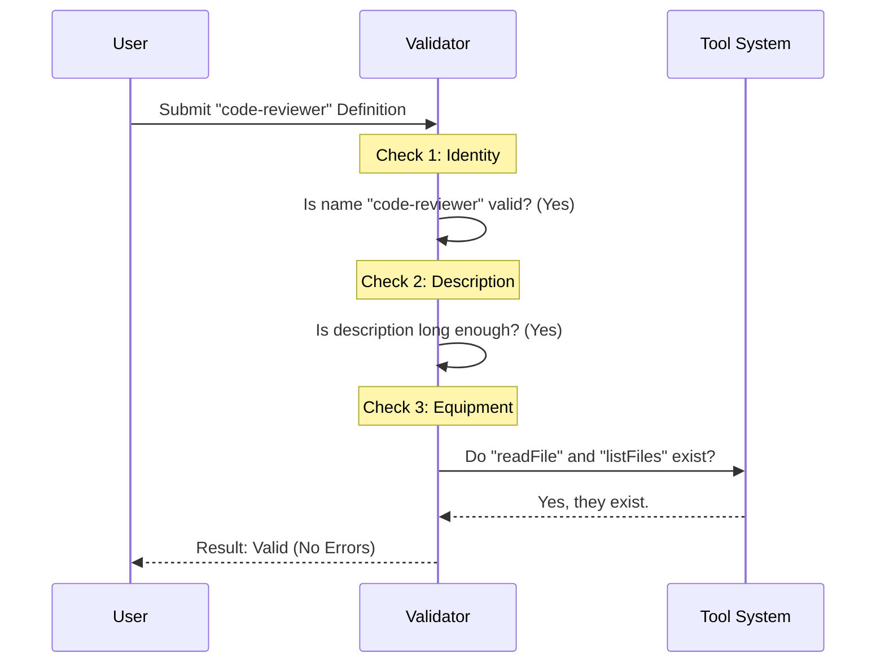

# Chapter 1: Agent Definition & Validation

Welcome to the first chapter of the **Agents** project tutorial! 

Before we can build an AI that helps us write code or manage files, we need to define *who* that AI is. In this chapter, we will explore the core building block of our system: the **Agent Definition**.

## The Problem: Who is the AI?

Imagine you are playing a Role-Playing Game (RPG). Before you start an adventure, you need a **Character Sheet**. This sheet tells you:
1.  **Name:** What is the character called? (e.g., "Gandalf")
2.  **Class/Stats:** Is it a wizard or a warrior? (e.g., "High Intelligence")
3.  **Backstory:** Where do they come from?
4.  **Equipment:** What items do they carry? (e.g., "Magic Staff", "Map")

In our project, an **Agent** is exactly like an RPG character. We need a structured way to tell the AI: "You are a Senior JavaScript Developer, you have access to the file system, and your name is `code-reviewer`."

Without this definition, the AI is just a generic chatterbox with no specific purpose or tools.

### The Use Case: Creating a "Code Reviewer"

Throughout this chapter, we will try to solve a specific problem: **We want to define an agent named `code-reviewer` that checks our code for bugs.**

## Key Concepts

To create our `code-reviewer`, we need to understand the four pillars of an **Agent Definition**:

1.  **Identity (`agentType`):** A unique, computer-friendly name. It acts like an ID card.
2.  **Description (`whenToUse`):** A short sentence telling the system *when* to pick this agent (e.g., "Use this agent when the user asks to debug code").
3.  **System Prompt:** The "soul" of the agent. This is a text block that gives the AI its personality and instructions.
4.  **Tools:** The "equipment." These are the specific functions the agent is allowed to use (like reading files or running terminal commands).

## Solving the Use Case

Let's look at how we define our `code-reviewer` in code. We use a Javascript object to hold this data.

### 1. The Blueprint
Here is what a simple agent definition looks like.

```typescript
const codeReviewerAgent = {
  agentType: "code-reviewer",
  whenToUse: "Analyzes code for bugs and security issues",
  tools: ["readFile", "listFiles"],
  // The prompt defines behavior
  getSystemPrompt: () => "You are an expert code reviewer..."
};
```

This object is the "Character Sheet" we discussed earlier. It holds everything the system needs to know.

### 2. Validating the Agent
Just writing the definition isn't enough. What if we accidentally named the agent `"Code Reviewer!"` (with spaces and special characters) or gave it a tool that doesn't exist?

We need a **Validator**—think of it as the "Game Master" checking your character sheet to make sure it follows the rules.

The validation logic ensures:
1.  The name contains only letters, numbers, and hyphens.
2.  The description is descriptive enough (not too short).
3.  The tools actually exist in the system.

## Internal Implementation

Let's see what happens under the hood when we try to save or use an agent definition.

### The Validation Flow

When an agent definition is processed, it passes through a series of checks.



### Code Deep Dive

The validation logic is located in `validateAgent.ts`. Let's look at the simplified code logic to understand how it protects our system.

#### Checking the Name (`agentType`)
First, we ensure the name follows strict formatting rules (no spaces, no weird symbols).

```typescript
// From validateAgent.ts
export function validateAgentType(agentType: string) {
  // Regex: Only alphanumeric characters and hyphens allowed
  if (!/^[a-zA-Z0-9][a-zA-Z0-9-]*[a-zA-Z0-9]$/.test(agentType)) {
    return 'Agent type must contain only letters, numbers, and hyphens';
  }
  return null; // No error means it's valid!
}
```
*Explanation:* This code uses a "Regular Expression" (regex) to ensure the name is clean. If you try to name an agent `My Agent!`, this function returns an error message.

#### Checking the Tools
Next, we ensure the agent isn't trying to use tools that don't exist.

```typescript
// From validateAgent.ts
if (agent.tools && Array.isArray(agent.tools)) {
  // Check against available tools
  const resolvedTools = resolveAgentTools(agent, availableTools, false);

  if (resolvedTools.invalidTools.length > 0) {
     errors.push(`Invalid tools: ${resolvedTools.invalidTools.join(', ')}`);
  }
}
```
*Explanation:* We call a helper function `resolveAgentTools`. It compares the agent's "equipment list" against the "shop" of available tools. If the agent asks for a "LaserGun" but we only have "readFile", it adds an error.

#### Visualizing the Agent
Once valid, how do we see this data? The file `AgentDetail.tsx` takes this definition and renders it to the screen.

```typescript
// From AgentDetail.tsx
export function AgentDetail({ agent }) {
  return (
    <Box flexDirection="column">
      <Text bold>Description:</Text>
      <Text>{agent.whenToUse}</Text>
      
      <Text bold>Tools:</Text>
      <Text>{agent.tools.join(", ")}</Text>
    </Box>
  );
}
```
*Explanation:* This is a React component for the terminal. It simply reads the data from our "Character Sheet" object (`agent`) and displays it nicely for the user to read.

## Conclusion

In this chapter, we learned that an **Agent** is simply a data structure (an object) that acts as a blueprint. It defines the **Identity**, **Job Description**, and **Tools** available to the AI. We also learned that we strictly **Validate** this data to prevent bugs in our system.

Now that we have a valid agent character sheet, we need a way to navigate through different agents and select them.

[Next Chapter: Menu Controller](02_menu_controller.md)

---

Generated by [Code IQ](https://github.com/adityasoni99/Code-IQ)