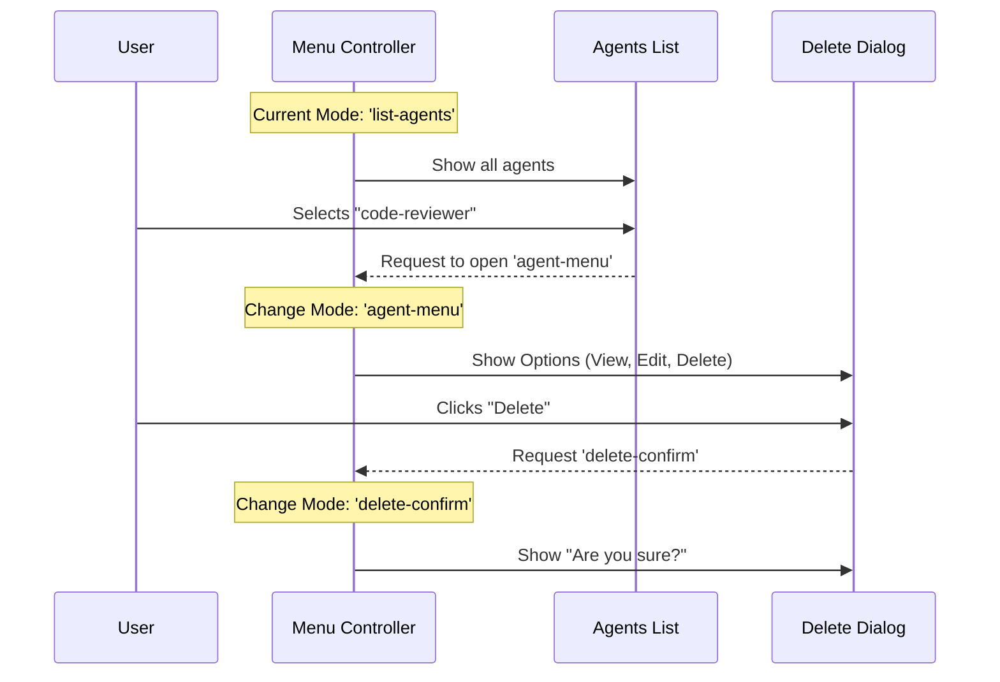

# Chapter 2: Menu Controller

Welcome to the second chapter of the **Agents** project tutorial!

In the previous chapter, [Agent Definition & Validation](01_agent_definition___validation.md), we defined the "Character Sheet" for our AI agent, the `code-reviewer`. Now that we have these definitions, we need a way to organize, view, and manage them.

## The Problem: The Need for a Dashboard

Imagine you have created 20 different agents: a poet, a coder, a chef, a debugger, etc.

Without a **Menu Controller**, you would have no way to:
1.  See a list of who is available.
2.  Switch from the "Poet" to the "Coder."
3.  Delete an agent you no longer need.

We need a central hub—like a smartphone's home screen—that lets us navigate between different tasks.

### The Use Case: Managing Our Agents

In this chapter, we will build the navigation logic that allows us to:
1.  **List** all available agents.
2.  **Select** our `code-reviewer` agent.
3.  **Route** the user to a "Delete Confirmation" screen if they want to remove it.

## Key Concepts

The **Menu Controller** acts as the traffic police for the application. It relies on three main concepts:

1.  **Mode State:** A variable that tracks "Where are we right now?" (e.g., Are we viewing the list? Or creating a new agent?).
2.  **The Router (Switch):** A logic block that looks at the *Mode State* and decides which screen to show.
3.  **Sub-Screens:** The actual views (List, Wizard, Editor) that the controller swaps in and out.

## Internal Implementation

Before diving into the code, let's visualize how the Menu Controller handles a user interaction.

### The Navigation Flow

Imagine a user wants to delete an agent. Here is how the Menu Controller routes that request.



## Code Deep Dive

The core logic lives in `AgentsMenu.tsx`. Let's look at how it manages the state and routing.

### 1. Defining the State (`modeState`)

The "brain" of the menu is a single state variable called `modeState`. It acts like a GPS coordinate for the UI.

```typescript
// From AgentsMenu.tsx
type ModeState = 
  | { mode: 'list-agents'; source: string }
  | { mode: 'create-agent' }
  | { mode: 'edit-agent'; agent: AgentDefinition };

export function AgentsMenu({ tools, onExit }: Props) {
  // This state determines which screen is visible
  const [modeState, setModeState] = useState<ModeState>({
    mode: 'list-agents',
    source: 'all',
  });
```
*Explanation:* When the app starts, `mode` is set to `'list-agents'`. This tells the system to show the main dashboard first.

### 2. The Router (The Switch Statement)

The Menu Controller checks `modeState.mode` and renders the corresponding component. This is the "Traffic Police" logic.

```typescript
// From AgentsMenu.tsx (Simplified)
switch (modeState.mode) {
  case 'list-agents':
    return (
      <AgentsList 
        onSelect={(agent) => setModeState({ 
          mode: 'agent-menu', 
          agent: agent 
        })}
        onCreateNew={() => setModeState({ mode: 'create-agent' })} 
      />
    );
    
  case 'create-agent':
    return <CreateAgentWizard onCancel={() => setModeState({ mode: 'list-agents' })} />;

  case 'edit-agent':
    return <AgentEditor agent={modeState.agent} />;
    
  // ... cases for delete, view, etc.
}
```
*Explanation:*
*   If mode is `list-agents`, we show the **List**. We also pass functions to the list so it knows how to change the mode (e.g., `onCreateNew` switches mode to `create-agent`).
*   If mode is `create-agent`, we hide the list and show the **Wizard**.

### 3. Displaying the List (`AgentsList.tsx`)

The controller delegates the actual drawing of items to `AgentsList.tsx`. This component iterates over the agent definitions we created in Chapter 1.

```typescript
// From AgentsList.tsx
export function AgentsList({ agents, onSelect }) {
  // We sort agents alphabetically
  const sortedAgents = [...agents].sort(compareAgentsByName);

  return (
    <Box flexDirection="column">
      {sortedAgents.map(agent => (
        <Box key={agent.agentType}>
           <Text>{agent.agentType}</Text>
        </Box>
      ))}
    </Box>
  );
}
```
*Explanation:* This component receives the data (the list of agents) and the callbacks (what to do when clicked) from the Controller. It focuses purely on display.

### 4. Navigation Hints (`AgentNavigationFooter.tsx`)

To make the app beginner-friendly, we always show keyboard instructions at the bottom.

```typescript
// From AgentNavigationFooter.tsx
export function AgentNavigationFooter({ instructions }) {
  const defaultText = "Press ↑↓ to navigate · Enter to select · Esc to go back";
  
  return (
    <Box marginLeft={2}>
      <Text dimColor>{instructions || defaultText}</Text>
    </Box>
  );
}
```
*Explanation:* This is a simple visual component included by the Menu Controller at the bottom of every screen to guide the user.

## Solving the Use Case

Let's trace exactly what happens in the code when we want to delete our `code-reviewer`:

1.  **Start:** `AgentsMenu` initializes with `mode: 'list-agents'`.
2.  **View:** `AgentsList` renders `code-reviewer` on the screen.
3.  **Action:** User presses Enter on `code-reviewer`.
4.  **State Change:** `AgentsList` calls `onSelect`.
    *   `setModeState({ mode: 'agent-menu', agent: codeReviewer })` runs.
5.  **Re-render:** The `switch` statement sees `'agent-menu'` and renders a generic `<Select>` menu with options: "View", "Edit", "Delete".
6.  **Action:** User selects "Delete".
7.  **State Change:** `setModeState({ mode: 'delete-confirm', ... })` runs.
8.  **Re-render:** The `switch` statement sees `'delete-confirm'` and shows the confirmation dialog.

## Conclusion

In this chapter, we learned how to build a **Menu Controller**. This abstraction separates the **Logic** (state management and routing) from the **Presentation** (the actual list or dialogs).

This architecture allows our app to be flexible. We can easily add a "Settings" screen or a "Help" screen just by adding a new `case` to our switch statement, without rewriting the entire application.

Now that we can navigate to agents and select them, we need to handle what happens when we actually create or delete one. Where does that data go?

[Next Chapter: File Persistence Layer](03_file_persistence_layer.md)

---

Generated by [Code IQ](https://github.com/adityasoni99/Code-IQ)