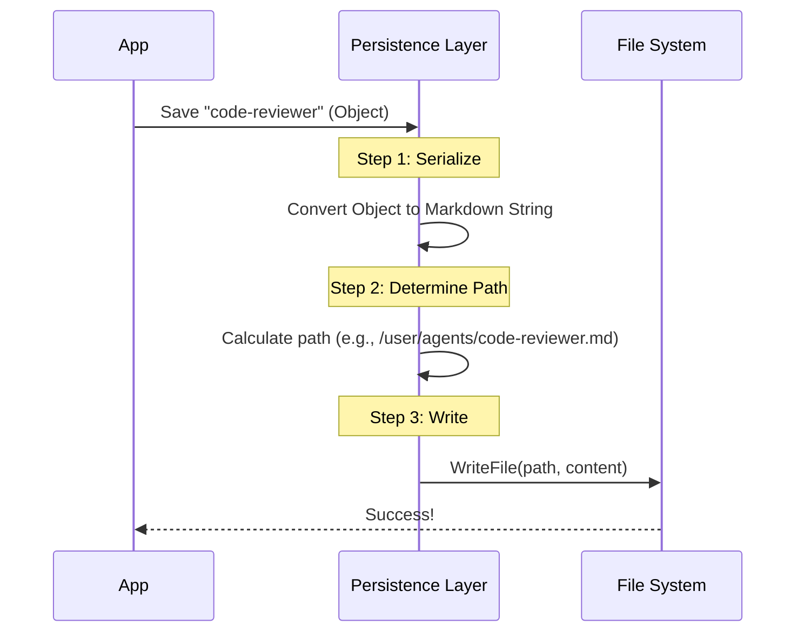

# Chapter 3: File Persistence Layer

Welcome to the third chapter of the **Agents** project tutorial!

In the previous chapter, [Menu Controller](02_menu_controller.md), we built a dashboard to view and select our agents. However, we have a major problem: currently, our agents only exist in the computer's memory (RAM). If we restart the application, our hard work creating the `code-reviewer` agent disappears!

## The Problem: "Game Saves" for Agents

Imagine playing a long video game but never being able to save your progress. Every time you turn off the console, you lose your character.

Computers have two types of memory:
1.  **Memory (RAM):** Fast but volatile (erased when power goes off). This is where our JavaScript objects live.
2.  **Disk (Storage):** Slower but permanent. This is where files live.

The **File Persistence Layer** acts as the bridge between these two. It is responsible for **saving** our agents to the hard drive and **loading** them back when we start the app.

### The Use Case: Saving the `code-reviewer`

In this chapter, we will build the logic to take our `code-reviewer` agent object and save it as a physical file named `code-reviewer.md` on your computer.

## Key Concepts

To build this layer, we need to understand three core concepts:

1.  **Serialization:** The process of translating a complex JavaScript object into a simple text string that can be written to a file. We will use **Markdown** with **YAML Frontmatter**.
2.  **Storage Locations:** Deciding *where* to save the file. Should it be available globally for all your projects, or just locally for this specific project?
3.  **File I/O (Input/Output):** The actual code commands that write data to the disk.

## Solving the Use Case

We want to transform our code object into a Markdown file.

**Input:** The JavaScript Object (from Chapter 1)
```typescript
{
  agentType: "code-reviewer",
  whenToUse: "Checks for bugs",
  tools: ["readFile"],
  systemPrompt: "You are an expert..."
}
```

**Output:** A file named `code-reviewer.md`
```markdown
---
name: code-reviewer
description: "Checks for bugs"
tools: readFile
---

You are an expert...
```

Notice the format? The top part between `---` is called **YAML Frontmatter** (used for metadata), and the bottom part is the **Body** (the system prompt).

## Internal Implementation

Let's visualize how the data flows when we ask the system to save an agent.

### The Save Flow



### Code Deep Dive

The logic for this layer is contained in `agentFileUtils.ts`. Let's break down the three steps shown in the diagram above using simplified code snippets.

#### Step 1: Formatting (Serialization)

We need a function that takes the agent's details and pastes them into our Markdown template.

```typescript
// From agentFileUtils.ts
export function formatAgentAsMarkdown(
  agentType, whenToUse, tools, systemPrompt
) {
  // We format the list of tools into a comma-separated string
  const toolsLine = tools ? `\ntools: ${tools.join(', ')}` : '';
  
  // We return the template string
  return `---
name: ${agentType}
description: "${whenToUse}"${toolsLine}
---

${systemPrompt}
`;
}
```
*Explanation:* This function acts like a "Mad Libs" game. It takes the variables (name, description, prompt) and fills in the blanks of the string structure.

#### Step 2: Determining the File Path

We need to know *where* to put the file. The system supports different "sources" (locations).

```typescript
// From agentFileUtils.ts
function getAgentDirectoryPath(location) {
  switch (location) {
    case 'userSettings':
      // Global folder (e.g., ~/.config/claude/agents)
      return join(getClaudeConfigHomeDir(), 'agents');
      
    case 'projectSettings':
      // Local folder in the current project
      return join(getCwd(), '.claude', 'agents');
      
    default:
      throw new Error('Unknown location');
  }
}
```
*Explanation:*
*   If `location` is `userSettings`, the agent is saved globally (available in any folder).
*   If `location` is `projectSettings`, the agent is saved locally (only available in this specific project).

#### Step 3: Writing to Disk

Finally, we combine the formatted string and the file path to actually create the file.

```typescript
// From agentFileUtils.ts
export async function saveAgentToFile(
  source, agentType, whenToUse, tools, systemPrompt
) {
  // 1. Calculate the full path (folder + filename)
  const dirPath = getAgentDirectoryPath(source);
  const filePath = join(dirPath, `${agentType}.md`);

  // 2. Format the content
  const content = formatAgentAsMarkdown(
    agentType, whenToUse, tools, systemPrompt
  );

  // 3. Write the file (and wait for it to finish)
  await writeFileAndFlush(filePath, content);
}
```
*Explanation:* This is the main function that coordinates the whole process. It finds the path, prepares the text content, and calls the low-level `writeFile` command.

### Deleting Files

The persistence layer also handles cleaning up. If we want to delete an agent, we simply find its path and remove it.

```typescript
// From agentFileUtils.ts
export async function deleteAgentFromFile(agent) {
  // We cannot delete built-in agents (like the default coder)
  if (agent.source === 'built-in') {
    throw new Error('Cannot delete built-in agents');
  }

  const filePath = getActualAgentFilePath(agent);
  
  // "unlink" is the system command for deleting a file
  await unlink(filePath);
}
```
*Explanation:* The code includes a safety check. It ensures we don't accidentally try to delete the built-in agents that come with the software.

## Conclusion

In this chapter, we built the storage engine for our application. We learned how to:
1.  **Serialize** our JavaScript objects into Markdown format.
2.  **Manage Paths** to decide if an agent is global or local.
3.  **Persist Data** by writing files to the disk.

With the **Agent Definition** (Chapter 1), **Menu Controller** (Chapter 2), and **File Persistence** (Chapter 3) complete, the backend of our system is solid.

However, creating an agent currently requires writing code or manually editing text files. That isn't very user-friendly! In the next chapter, we will build a step-by-step interactive tool to make creating agents easy.

[Next Chapter: Creation Wizard](04_creation_wizard.md)

---

Generated by [Code IQ](https://github.com/adityasoni99/Code-IQ)