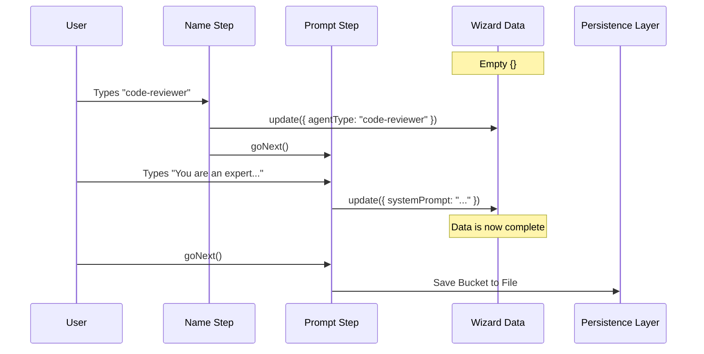

# Chapter 4: Creation Wizard

Welcome to the fourth chapter of the **Agents** project tutorial!

In the previous chapter, [File Persistence Layer](03_file_persistence_layer.md), we built the backend logic to save our agents to disk. However, currently, the only way to create an agent is to manually write a Markdown file or code a JavaScript object by hand. This is error-prone and intimidating for new users.

## The Problem: Form Filling is Hard

Imagine filing your taxes. You *could* read the raw tax code and write your submission on a blank piece of paper. But it is much easier to use software that asks you one simple question at a time: "What is your name?", "How much did you earn?", "Do you have children?".

We need a **Creation Wizard**—a guided interface that breaks down the complex task of defining an agent into small, manageable steps.

### The Use Case: Interactively Building `code-reviewer`

In this chapter, we will build a UI that asks the user the following questions in order, to recreate our `code-reviewer` agent:

1.  **Type:** "What is the agent's ID?" (User types: `code-reviewer`)
2.  **Prompt:** "How should it behave?" (User types: `You are an expert...`)
3.  **Tools:** "What tools does it need?" (User selects: `readFile`)
4.  **Confirm:** "Is this correct?" (User saves).

## Key Concepts

The Wizard is built on a "State Machine" pattern. Here are the key components:

1.  **The Step Sequence:** An ordered list of screens (components) the user must pass through.
2.  **The Accumulator (`wizardData`):** A temporary data bucket that holds the answers collected so far. It starts empty and fills up as the user moves from step to step.
3.  **Navigation Actions:** Functions like `goNext()` (validate and move forward) and `goBack()` (return to correct mistake).

## Internal Implementation

Let's visualize how the Wizard manages data. It acts like a conveyor belt.

### The Wizard Flow



## Code Deep Dive

Let's look at how we implement this structure in React.

### 1. The Orchestrator (`CreateAgentWizard.tsx`)

This component acts as the manager. It defines the *order* of the steps. It doesn't handle the logic of each step; it just lists them.

```typescript
// From CreateAgentWizard.tsx
export function CreateAgentWizard({ onCancel }) {
  // Define the sequence of screens
  const steps = [
    TypeStep,       // Step 1: Ask for Name
    PromptStep,     // Step 2: Ask for System Prompt
    ToolsStep,      // Step 3: Ask for Tools
    ConfirmStepWrapper // Step 4: Summary & Save
  ];

  // The WizardProvider manages the state between these steps
  return (
    <WizardProvider 
      steps={steps} 
      onCancel={onCancel} 
    />
  );
}
```
*Explanation:* We create an array called `steps`. The `WizardProvider` is a special component that renders the first step, then waits for a signal to render the second, and so on.

### 2. A Single Step (`TypeStep.tsx`)

How does an individual screen work? Let's look at the first step where the user enters the name.

It needs to:
1.  Read input from the user.
2.  Validate it (using logic from [Agent Definition & Validation](01_agent_definition___validation.md)).
3.  Save it to the Accumulator.
4.  Move to the next step.

```typescript
// From TypeStep.tsx
export function TypeStep() {
  // 1. Get wizard controls
  const { goNext, updateWizardData } = useWizard();
  const [input, setInput] = useState("");

  const handleSubmit = () => {
    // 2. Validate
    if (input.includes(" ")) return setError("No spaces!");

    // 3. Save to Accumulator
    updateWizardData({ agentType: input });

    // 4. Move to next screen
    goNext();
  };

  return <TextInput onSubmit={handleSubmit} />;
}
```
*Explanation:* The `useWizard` hook gives us access to the "Brain" of the wizard. `updateWizardData` merges our new input into the global data bucket. `goNext` tells the Orchestrator to switch to the next component in the list.

### 3. The Final Save (`ConfirmStepWrapper.tsx`)

The final step is special. It doesn't ask a question; it displays the summary and calls the backend to save the file.

```typescript
// From ConfirmStepWrapper.tsx
export function ConfirmStepWrapper() {
  const { wizardData } = useWizard(); // Access the full bucket

  const handleSave = async () => {
    // Call the logic we built in Chapter 3
    await saveAgentToFile(
      wizardData.agentType,
      wizardData.systemPrompt,
      wizardData.tools
    );
  };

  // Render the summary view
  return <ConfirmStep data={wizardData} onSave={handleSave} />;
}
```
*Explanation:* This component pulls all the data collected in previous steps (`wizardData`). When the user confirms, it calls `saveAgentToFile`, which we learned about in the [File Persistence Layer](03_file_persistence_layer.md) chapter.

## Solving the Use Case

By combining these components, we have solved our problem:

1.  **User starts Wizard:** `CreateAgentWizard` loads `TypeStep`.
2.  **User enters "code-reviewer":** `TypeStep` validates and saves to `wizardData`.
3.  **Wizard advances:** Loads `PromptStep`.
4.  **User enters Prompt:** Data is added to `wizardData`.
5.  **Wizard advances:** Loads `ConfirmStepWrapper`.
6.  **User saves:** The file `code-reviewer.md` is created on disk.

## Conclusion

In this chapter, we learned how to build a **Creation Wizard**. We treated the agent creation process as a **State Machine**, collecting data piece-by-piece in a `wizardData` bucket before saving it. This ensures that we never create invalid or incomplete agents.

Now that we have an agent with a list of tools (like `readFile` or `runCommand`), how does the system actually know which tool to pick during a conversation?

[Next Chapter: Tool Selection System](05_tool_selection_system.md)

---

Generated by [Code IQ](https://github.com/adityasoni99/Code-IQ)