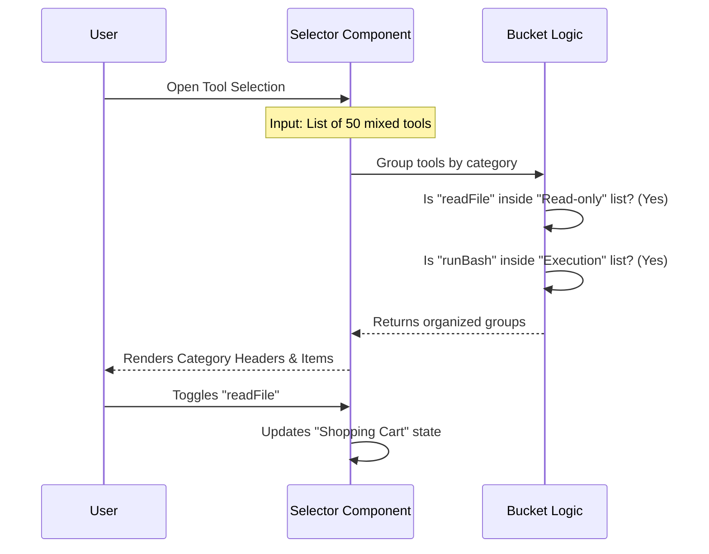

# Chapter 5: Tool Selection System

Welcome to the fifth chapter of the **Agents** project tutorial!

In the previous chapter, [Creation Wizard](04_creation_wizard.md), we built a step-by-step interface to ask the user for an agent's name and prompt. However, we skimmed over the most complex step: **selecting the tools**.

## The Problem: The "Messy Garage"

Imagine walking into a massive hardware store where there are no aisles. Hammers are mixed with laptops, drill bits are hidden under paint cans, and there are 500 different items in a single pile. Finding exactly what you need would be impossible.

In our AI system, we have dozens of capabilities (Tools):
*   `readFile`
*   `writeFile`
*   `runBashCommand`
*   `searchWeb`
*   ...and many more.

If we just showed a flat list of 50 text items to the user, it would be overwhelming. We need a way to **categorize** these tools and let the user shop for them efficiently.

### The Use Case: Equipping the `code-reviewer`

We are still building our `code-reviewer` agent. We want to ensure it has:
1.  **Safe Tools:** Like `readFile` (to look at code).
2.  **No Dangerous Tools:** It should *not* have `runBashCommand` (we don't want it deleting files accidentally!).

In this chapter, we will build the **Tool Selection System**, a specialized UI that groups tools into logical "aisles" (Buckets) so we can easily find and select `readFile`.

## Key Concepts

The Tool Selection System is built on three pillars:

1.  **The Buckets (Aisles):** Logical categories that group tools based on safety and function (e.g., "Read-only", "Editing", "Execution").
2.  **The Selector (Shopping Cart):** A state variable that keeps track of which tools are currently in your "cart."
3.  **The Toggles:** The logic that lets you select a single tool, or an entire category at once.

## Solving the Use Case

We will implement a visual interface that looks like this:

```text
[ ] All tools
[x] Read-only tools  <-- We want to look in here
    [x] readFile     <-- We select this
    [ ] searchWeb
[ ] Edit tools
[ ] Execution tools
```

By grouping `readFile` under "Read-only", the user instantly knows it is safe to use.

## Internal Implementation

How does the code take a raw list of tools and turn it into this organized menu?

### The Sorting Flow

When the `ToolSelector` component loads, it performs a sorting operation effectively "stocking the shelves."



### Code Deep Dive

The logic is primarily located in `ToolSelector.tsx`. Let's break it down.

#### 1. Defining the Aisles (`getToolBuckets`)
First, we need a hard-coded configuration that defines which tool goes where. This is our store map.

```typescript
// From ToolSelector.tsx
function getToolBuckets() {
  return {
    READ_ONLY: {
      name: 'Read-only tools',
      toolNames: new Set(['readFile', 'searchWeb', 'glob'])
    },
    EDIT: {
      name: 'Edit tools',
      toolNames: new Set(['editFile', 'writeFile'])
    },
    // ... other buckets
  };
}
```
*Explanation:* We use a `Set` for fast lookups. If a tool's name is in the `READ_ONLY` set, it belongs in that aisle.

#### 2. Stocking the Shelves
When the component renders, we iterate through the available tools and sort them into arrays based on the definitions above.

```typescript
// From ToolSelector.tsx
// We create empty arrays for our buckets
const buckets = { readOnly: [], edit: [], execution: [], other: [] };

// We loop through every tool available in the system
customAgentTools.forEach(tool => {
  if (toolBuckets.READ_ONLY.toolNames.has(tool.name)) {
    buckets.readOnly.push(tool);
  } else if (toolBuckets.EDIT.toolNames.has(tool.name)) {
    buckets.edit.push(tool);
  } 
  // ... checks for other buckets
});
```
*Explanation:* This logic acts like a store clerk sorting items. It picks up a tool, checks the map (`toolBuckets`), and places it in the correct array (`buckets.readOnly`).

#### 3. Managing the "Shopping Cart"
We use React state to track what the user has picked. This is a simple array of strings (tool names).

```typescript
// From ToolSelector.tsx
const [selectedTools, setSelectedTools] = useState(initialTools);

const handleToggleTool = (toolName) => {
  setSelectedTools(current => 
    current.includes(toolName) 
      ? current.filter(t => t !== toolName) // Remove if exists
      : [...current, toolName]              // Add if missing
  );
};
```
*Explanation:*
*   If the tool is already in the cart (`includes`), we remove it (`filter`).
*   If it's not in the cart, we add it to the list (`...current, toolName`).

#### 4. Rendering the View
Finally, we create a list of navigable items for the UI. We add headers for categories and checkboxes for items.

```typescript
// From ToolSelector.tsx
const navigableItems = [];

// Add the "Read Only" Header
navigableItems.push({
  id: 'bucket-readonly',
  label: `[ ] Read-only tools`,
  action: toggleEntireBucket // Selects everything in this group
});

// Add the individual tools inside
buckets.readOnly.forEach(tool => {
  navigableItems.push({
    id: tool.name,
    label: `[x] ${tool.name}`, // Shows checkmark if selected
    action: () => handleToggleTool(tool.name)
  });
});
```
*Explanation:* We flatten our structure into a single list (`navigableItems`) so the user can press the Down Arrow key to move smoothly from the Category Header to the tools inside it.

## Connecting to the Wizard

In the [Creation Wizard](04_creation_wizard.md) chapter, we mentioned the `ToolsStep`. That step is simply a wrapper around this complex selector.

```typescript
// From ToolsStep.tsx
export function ToolsStep({ tools }) {
  const { updateWizardData, goNext } = useWizard();

  return (
    <ToolSelector 
      tools={tools}
      onComplete={(selected) => {
        updateWizardData({ selectedTools: selected });
        goNext();
      }}
    />
  );
}
```
*Explanation:* The `ToolsStep` doesn't know about sorting or buckets. It just hands the full tool list to `ToolSelector` and waits for the user to finish "shopping."

## Conclusion

In this chapter, we learned how to build a **Tool Selection System**. By using the **Bucket Pattern**, we transformed a chaotic list of raw functions into an organized, safe, and user-friendly shopping experience.

We have now completed the entire flow of creating an agent manually:
1.  Defined it (Chapter 1).
2.  Navigated to it (Chapter 2).
3.  Saved it (Chapter 3).
4.  Built a Wizard for it (Chapter 4).
5.  Selected its tools (Chapter 5).

But what if we are too lazy to click through all these menus? What if we want the AI to write the agent definition *for* us?

[Next Chapter: AI Generator Service](06_ai_generator_service.md)

---

Generated by [Code IQ](https://github.com/adityasoni99/Code-IQ)