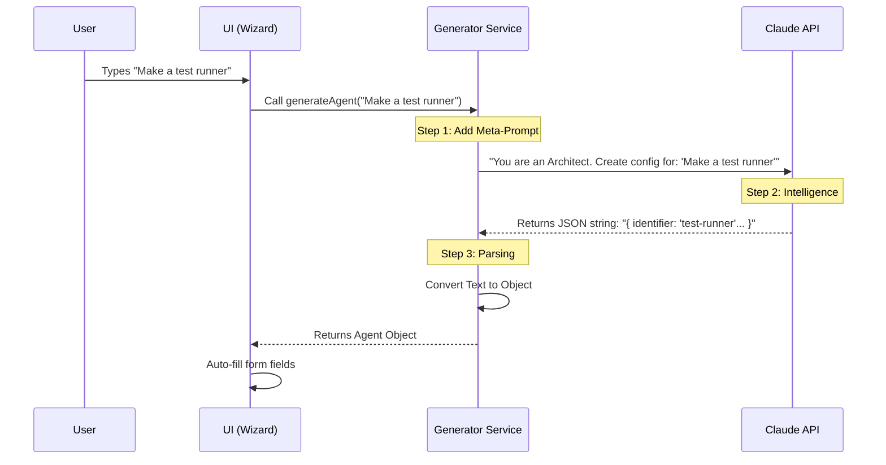

# Chapter 6: AI Generator Service

Welcome to the sixth chapter of the **Agents** project tutorial!

In the previous chapter, [Tool Selection System](05_tool_selection_system.md), we built a store-like interface to manually pick tools for our agent.

However, we still have a "Blank Page" problem. If you don't know exactly what to write for the **System Prompt** or which tools match your needs, creating an agent can feel like hard work.

## The Problem: "Writer's Block"

Imagine you need a formal job description for a "Senior React Developer." You *could* write it yourself, researching the necessary skills and formatting requirements.

Or, you could just ask a professional HR Manager: *"I need a React dev,"* and let them draft the 3-page document for you.

In our system, we want to do exactly that. We want to ask the AI: *"Make me a code reviewer,"* and have it automatically generate the name, the complex system instructions, and select the right tools.

### The Use Case: Generating a "Test Runner"

In this chapter, we will build the **AI Generator Service**.

**User Input:**
> "I need an agent that helps me write Python unit tests."

**AI Generator Output (Automatic):**
*   **Name:** `test-runner`
*   **Description:** Use this agent when the user needs to verify code logic.
*   **Prompt:** "You are an expert QA engineer specializing in Python..."
*   **Tools:** `readFile`, `runCommand` (automatically selected).

## Key Concepts

To achieve this, we use three main concepts:

1.  **The Meta-Prompt:** This is a "Prompt for the Prompt." We don't just send the user's request to Claude. We send a hidden instruction telling Claude: *"You are an elite Agent Architect. Your job is to output a JSON configuration based on this user request."*
2.  **Structured Output:** We need the AI to return computer-readable data (JSON), not a conversational sentence like "Sure, here is your agent."
3.  **Parsing:** The process of cleaning up the AI's response to extract that data.

## Internal Implementation

Let's visualize how a simple sentence is transformed into a complex agent configuration.

### The Generation Flow



## Code Deep Dive

The logic for this service lives in `generateAgent.ts`. Let's look at the implementation steps.

### 1. The Meta-Prompt (The "Job Description")

We define a constant string that tells Claude exactly how to behave. This is the secret sauce.

```typescript
// From generateAgent.ts
const AGENT_CREATION_SYSTEM_PROMPT = `
You are an elite AI agent architect.
Your expertise lies in translating user requirements into specifications.

When a user describes what they want, you will:
1. Extract Core Intent
2. Design Expert Persona
3. Create Identifier (lowercase, hyphens)

Your output must be a valid JSON object.
`;
```
*Explanation:* This text never gets seen by the user. It is sent to the AI strictly to define its "role." We strictly enforce JSON output so our code can read it later.

### 2. Sending the Request

We combine the Meta-Prompt with the user's specific request and send it to the model.

```typescript
// From generateAgent.ts
export async function generateAgent(userPrompt, model) {
  // Combine the Meta-Prompt + User Request
  const prompt = `Create an agent for: "${userPrompt}". Return ONLY JSON.`;

  // Send to Claude (API Call)
  const response = await queryModelWithoutStreaming({
    messages: [{ role: 'user', content: prompt }],
    systemPrompt: AGENT_CREATION_SYSTEM_PROMPT, 
    // ... other settings
  });

  return parseResponse(response);
}
```
*Explanation:* We use `queryModelWithoutStreaming`. Unlike a chat window where text appears letter-by-letter, here we wait for the *entire* response to arrive at once because we need the complete JSON object before we can use it.

### 3. Parsing the Result

The AI returns a string of text. We need to convert that string into a JavaScript object.

```typescript
// From generateAgent.ts
// The AI might return: "Here is your JSON: { ... }"
// We need to extract just the { ... } part.
const responseText = response.message.content[0].text;

let parsed;
try {
  // Try to parse the whole string
  parsed = JSON.parse(responseText.trim());
} catch {
  // If that fails, look for the JSON pattern inside the text
  const jsonMatch = responseText.match(/\{[\s\S]*\}/);
  parsed = JSON.parse(jsonMatch[0]);
}
```
*Explanation:* AI models can be chatty. Sometimes they add "Here is the code:" before the actual JSON. This code uses a `try/catch` block and "Regular Expressions" (regex) to hunt down the `{ }` block and discard the rest.

### 4. Connecting to the Wizard (`GenerateStep.tsx`)

Finally, we hook this service into our UI. This corresponds to the `GenerateStep` in the [Creation Wizard](04_creation_wizard.md).

```typescript
// From GenerateStep.tsx
const handleGenerate = async () => {
  setIsGenerating(true); // Show spinner
  
  // Call the service we just wrote
  const generated = await generateAgent(prompt, model, []);

  // Update the Wizard's data bucket with the AI's results
  updateWizardData({
    agentType: generated.identifier,
    systemPrompt: generated.systemPrompt,
    whenToUse: generated.whenToUse,
  });

  // Automatically jump to the confirmation step
  goToStep(6); 
};
```
*Explanation:*
1.  The user types a description and presses Enter.
2.  We call `generateAgent`.
3.  When the data comes back, we shove it into `wizardData` (the state machine we built in Chapter 4).
4.  We skip the manual entry steps and jump straight to the end!

## Solving the Use Case

Let's trace what happens when we ask for a "Test Runner":

1.  **User:** Types "Make a test runner" in `GenerateStep`.
2.  **Service:** Sends this to Claude with the instruction "You are an Agent Architect."
3.  **Claude:** Thinks... "A test runner needs to read files and run commands. I will name it `test-runner`."
4.  **Service:** Receives the JSON, cleans it up, and returns it.
5.  **Wizard:** Fills in the name `test-runner` and the system prompt automatically.

The user went from a blank screen to a fully configured agent in 5 seconds.

## Conclusion

In this chapter, we learned how to use an **AI Generator Service** to automate the creation process. We utilized **Prompt Engineering** (the Meta-Prompt) and **JSON Parsing** to turn vague human desires into structured configuration data.

This concludes the creation flow! We can now define, navigate, save, and automatically generate agents.

But what happens if we generate an agent, save it, and *then* realize we want to change its prompt slightly? We need a way to modify existing agents.

[Next Chapter: Agent Editor](07_agent_editor.md)

---

Generated by [Code IQ](https://github.com/adityasoni99/Code-IQ)