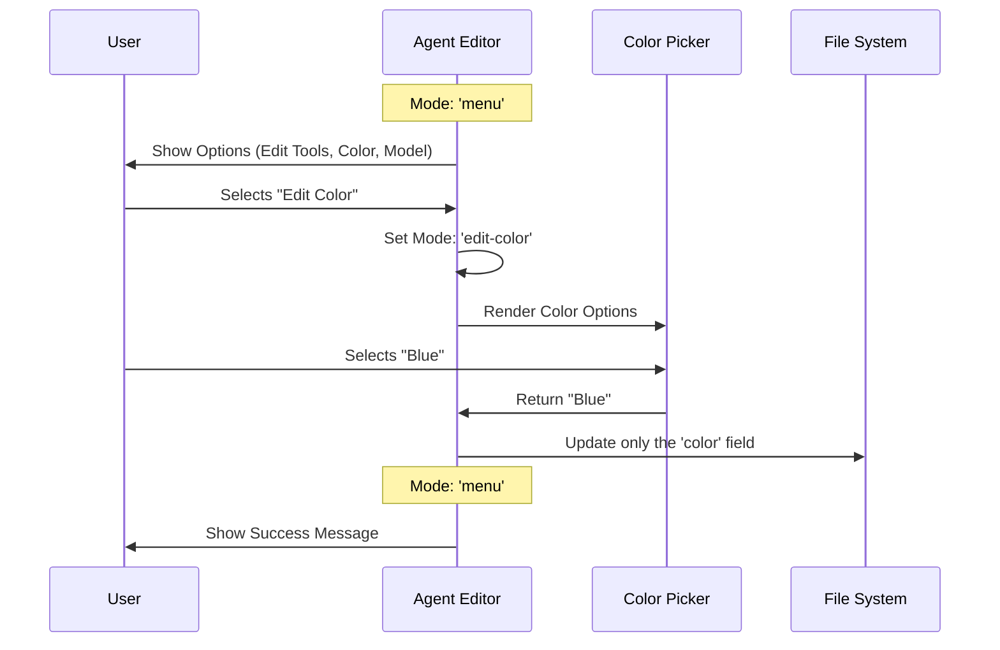

# Chapter 7: Agent Editor

Welcome to the seventh and final chapter of the **Agents** project tutorial!

In the previous chapter, [AI Generator Service](06_ai_generator_service.md), we learned how to conjure up a fully functional agent using just a simple sentence. We asked the AI to build a `test-runner`, and it did.

But what happens if you change your mind? What if you want your `test-runner` to be `blue` instead of `green`? Or perhaps you want to upgrade its "brain" to a smarter model?

## The Problem: Renovation vs. Rebuilding

Imagine you just built a house. If you decide you want to paint the kitchen yellow, you don't tear down the entire house and build a new one. You simply renovate the kitchen.

In software, without an **Editor**, changing an agent means either:
1.  **Recreating it:** Deleting the old one and running the Creation Wizard again (tedious).
2.  **Raw File Editing:** Opening the `.md` file and manually typing changes (risky—you might break the syntax).

We need a safe "Settings Screen" that allows us to tweak specific attributes of an existing agent without touching the dangerous parts.

### The Use Case: Polishing the `test-runner`

In this chapter, we will build the **Agent Editor**. We will take the `test-runner` agent we generated previously and:
1.  **Change its Color:** Give it a distinct visual identity.
2.  **Change its Model:** Switch the AI model it uses.
3.  **Save the changes:** Update the file safely.

## Key Concepts

The Agent Editor is built like a "mini-application" inside our main app. It relies on:

1.  **View Routing (Local State):** Unlike the global menu, the editor has its own internal navigation (Main Menu → Color Picker → Main Menu).
2.  **Component Reuse:** We don't write new code for selecting tools; we reuse the logic from the [Tool Selection System](05_tool_selection_system.md).
3.  **Differential Saving:** We check *what* changed (e.g., only the color) and update only that part of the file, keeping everything else (like the system prompt) intact.

## Internal Implementation

Let's look at how the Editor handles the flow of a user modifying an agent.

### The Editing Flow

The editor is a loop. It shows a menu, waits for you to pick a setting, lets you change it, and then saves.



## Code Deep Dive

The logic for this system is primarily in `AgentEditor.tsx`. Let's break down how it manages these screens.

### 1. The Internal Router (`editMode`)

Just like our main [Menu Controller](02_menu_controller.md), the Editor needs to know which screen to show.

```typescript
// From AgentEditor.tsx
type EditMode = 'menu' | 'edit-tools' | 'edit-color' | 'edit-model';

export function AgentEditor({ agent }) {
  // 1. Track which sub-screen we are on
  const [editMode, setEditMode] = useState<EditMode>('menu');

  // 2. Decide what to render
  switch (editMode) {
    case 'menu':       return renderMenu();
    case 'edit-tools': return <ToolSelector ... />;
    case 'edit-color': return <ColorPicker ... />;
    case 'edit-model': return <ModelSelector ... />;
  }
}
```
*Explanation:* This `switch` statement is the heart of the editor. By changing the `editMode` variable, we can swap the entire screen from a menu to a color picker instantly.

### 2. The Menu Interface

When `editMode` is `'menu'`, we display a list of actions.

```typescript
// From AgentEditor.tsx
const menuItems = [
  { 
    label: 'Open in editor', 
    action: handleOpenInEditor 
  },
  { 
    label: 'Edit tools', 
    action: () => setEditMode('edit-tools') 
  },
  { 
    label: 'Edit color', 
    action: () => setEditMode('edit-color') 
  }
];
```
*Explanation:* This simple array defines what the user sees. If they click "Edit color", we run the function that changes the state to `edit-color`, triggering the switch statement above.

### 3. The Sub-Screen: Color Picker (`ColorPicker.tsx`)

Let's look at one of the sub-screens. This component allows the user to visually scroll through colors.

```typescript
// From ColorPicker.tsx
export function ColorPicker({ onConfirm }) {
  // Track the user's selection
  const [selectedIndex, setSelectedIndex] = useState(0);

  // When user presses Enter
  const handleEnter = () => {
    const selected = COLOR_OPTIONS[selectedIndex];
    onConfirm(selected); // Send choice back to Parent
  };

  return <Box>{/* Render list of colors */}</Box>;
}
```
*Explanation:* This component is simple. It lets the user pick a value and then calls `onConfirm`. It doesn't know *how* to save the file; it just reports the choice back to the `AgentEditor`.

### 4. Saving the Changes

When a sub-screen returns a value, the `AgentEditor` must save it to the disk. We reuse the concepts from the [File Persistence Layer](03_file_persistence_layer.md).

```typescript
// From AgentEditor.tsx
const handleSave = async (changes) => {
  const { color, model, tools } = changes;

  // 1. Check if anything actually changed
  if (color === agent.color && !model && !tools) return;

  // 2. Update the file on disk
  await updateAgentFile(
    agent,
    agent.whenToUse,
    tools ?? agent.tools, // Use new tools OR keep old ones
    agent.getSystemPrompt(),
    color ?? agent.color  // Use new color OR keep old one
  );
};
```
*Explanation:*
*   We check if the new value is actually different from the old one.
*   We call `updateAgentFile` (a helper function similar to `saveAgentToFile`).
*   The `??` operator means: "If the user provided a new value, use it. Otherwise, keep the existing value from the agent."

## Solving the Use Case

Let's trace our goal of updating the `test-runner`:

1.  **Start:** User selects `test-runner` and chooses "Edit". `AgentEditor` opens in `menu` mode.
2.  **Action:** User selects "Edit color". `editMode` becomes `edit-color`.
3.  **View:** `ColorPicker` appears. User highlights "Blue" and presses Enter.
4.  **Callback:** `ColorPicker` calls `onConfirm('blue')`.
5.  **Save:** `handleSave` is called with `{ color: 'blue' }`.
6.  **Persistence:** The system reads the `test-runner.md` file, updates the metadata header to `color: blue`, and writes it back to disk.
7.  **Reset:** `editMode` goes back to `menu`, showing the success message.

## Tutorial Conclusion

Congratulations! You have completed the **Agents** project tutorial.

We have built a complete lifecycle management system for AI agents:

1.  **Defined** who they are ([Chapter 1](01_agent_definition___validation.md)).
2.  **Navigated** to them using a menu ([Chapter 2](02_menu_controller.md)).
3.  **Saved** them to the hard drive ([Chapter 3](03_file_persistence_layer.md)).
4.  **Created** them with a step-by-step wizard ([Chapter 4](04_creation_wizard.md)).
5.  **Equipped** them with specific tools ([Chapter 5](05_tool_selection_system.md)).
6.  **Generated** them using AI ([Chapter 6](06_ai_generator_service.md)).
7.  **Edited** and refined them ([Chapter 7](07_agent_editor.md)).

You now possess a fully modular system where AI agents can be created, managed, and persisted. You can now focus on expanding the capabilities of your agents by adding new tools or refining their system prompts!

---

Generated by [Code IQ](https://github.com/adityasoni99/Code-IQ)