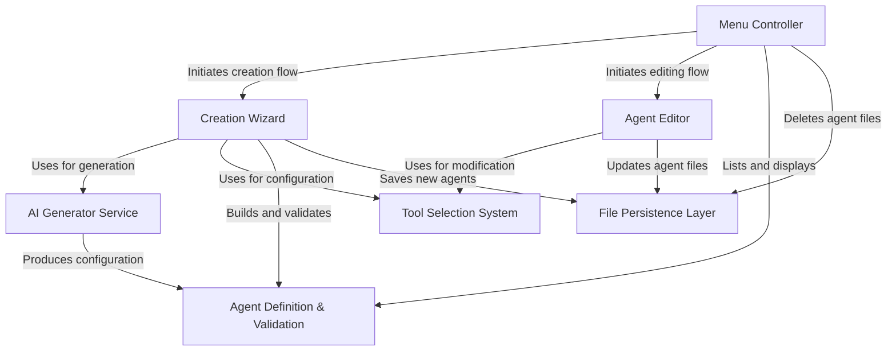

# Tutorial: agents

This project manages **AI Agents**, which are specialized configurations of the Claude model tailored with specific system prompts, tools, and capabilities. It features a central **Menu Controller** for browsing and managing agents, a **Creation Wizard** that supports both manual and *AI-assisted* setup, and an **Agent Editor** for modifying existing configurations. All agent data is validated and stored as **Markdown files** on the filesystem.

## Chapters

1. [Agent Definition & Validation](01_agent_definition___validation.md)
2. [Menu Controller](02_menu_controller.md)
3. [File Persistence Layer](03_file_persistence_layer.md)
4. [Creation Wizard](04_creation_wizard.md)
5. [Tool Selection System](05_tool_selection_system.md)
6. [AI Generator Service](06_ai_generator_service.md)
7. [Agent Editor](07_agent_editor.md)

---

Generated by [Code IQ](https://github.com/adityasoni99/Code-IQ)