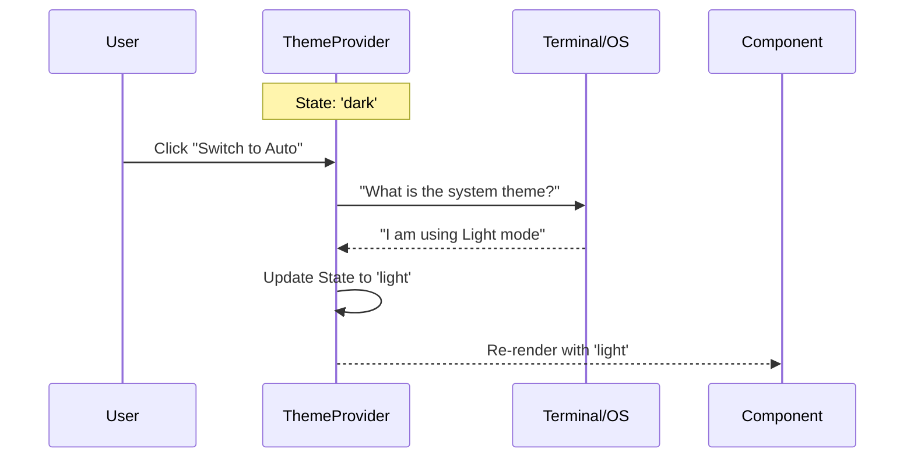

# Chapter 1: Theming Context & Utilities

Welcome to the first chapter of the **Design System** tutorial!

Before we build specific buttons or layouts, we need a foundation. Imagine painting a room. Before you paint the details, you need to decide on the palette. If you paint everything with a specific bucket of "Blue," and later decide you want "Green," you have to repaint everything.

Instead, we want to say: "Paint this the **Primary Color**." Then, we can swap the definition of "Primary Color" from Blue to Green in one central place, and the whole room updates instantly.

## The Motivation

In a complex command-line interface (CLI) or web app, hard-coding colors (like `#FF0000` or `red`) leads to messy code.
1.  **Inconsistency:** You might use five different shades of red by accident.
2.  **No Dark/Light Mode:** You can't easily switch styles if colors are hard-coded.

**The Solution:** We create a "Central Nervous System" for our styles. We call this the **Theming Context**. It holds the current state (e.g., "Dark Mode") and creates a bridge so any component in your application can ask, "What color should I be right now?"

## Key Concepts

We will break this down into three parts:

1.  **The Provider (The Source):** A wrapper component that sits at the top of your app. It holds the current theme setting.
2.  **The Hook (The Receiver):** A tool that lets individual components "tune in" to the Provider to read the current theme.
3.  **The Color Utility (The Translator):** A helper function that translates a theme name (like `primary`) into an actual renderable color based on the active theme.

## Use Case: Setting up the App

Let's look at how we set this up so your application knows whether to look like a "Dark" terminal or match the user's system settings automatically.

### 1. Wrapping the Application
First, we need to wrap our entire application in the `ThemeProvider`. Think of this as electrifying the grid of your house. Without this, the light switches won't work.

```tsx
// App.tsx
import React from 'react';
import { ThemeProvider } from './ThemeProvider';
import MyAppContent from './MyAppContent';

export default function App() {
  // We wrap the whole app here
  return (
    <ThemeProvider initialState="auto">
      <MyAppContent />
    </ThemeProvider>
  );
}
```

**What happens here?**
The `ThemeProvider` initializes the state. Because we set `initialState="auto"`, it will try to figure out if your terminal is dark or light and set the style accordingly.

### 2. Consuming the Theme
Now, inside `MyAppContent`, we can ask for the current theme.

```tsx
// MyAppContent.tsx
import React from 'react';
import { useTheme } from './ThemeProvider'; // The hook

export default function MyAppContent() {
  // "Hook" into the context to get the data
  const [currentTheme, setTheme] = useTheme();

  return (
    <Text>Current mode: {currentTheme}</Text>
  );
}
```

**What happens here?**
`useTheme` returns two things:
1.  `currentTheme`: The actual string (e.g., `'dark'`).
2.  `setTheme`: A function to change it manually (e.g., switching to `'light'`).

### 3. Resolving Colors
Sometimes you need the actual color value for a string of text. We use the `color` utility for this.

```tsx
import { color } from './color';

// 1. Setup the color translator
const makeRed = color('red', 'dark', 'foreground');

// 2. Apply it to text
const output = makeRed("This text will be red");

console.log(output); 
// Output: A string with ANSI escape codes making the text red.
```

## How It Works Under the Hood

Let's visualize the flow of data. Imagine the **User** wants to switch from Dark Mode to Light Mode.



1.  The **Provider** holds the master state.
2.  When `auto` is selected, it asks the **System** (your terminal) for its background color.
3.  Once the theme is resolved, the **Provider** broadcasts it to all listening **Components**.

## Internal Implementation Deep Dive

Let's look at the actual code in `design-system` to see how this magic happens.

### The Context Definition
In `ThemeProvider.tsx`, we create a React Context. This is the "invisible pipe" that passes data down.

```tsx
// ThemeProvider.tsx (Simplified)
const ThemeContext = createContext<ThemeContextValue>({
  themeSetting: 'dark', // Default fallback
  setThemeSetting: () => {},
  currentTheme: 'dark'
});
```
*Beginner Note:* `createContext` creates the data structure. The values inside are just placeholders until the Provider is used.

### The Provider Logic
The `ThemeProvider` component manages the state. It handles the logic of "If user wants Auto, what does the System say?"

```tsx
// ThemeProvider.tsx (Inside the component)
export function ThemeProvider({ children, initialState }) {
  // 1. State for what the user picked ('dark', 'light', 'auto')
  const [themeSetting, setThemeSetting] = useState(initialState ?? 'dark');

  // 2. State for what the system actually is
  const [systemTheme, setSystemTheme] = useState('dark');
  
  // 3. Calculate the FINAL theme to show
  const activeSetting = previewTheme ?? themeSetting;
  const currentTheme = activeSetting === 'auto' ? systemTheme : activeSetting;

  // ... pass 'currentTheme' down to children ...
}
```
*Explanation:* The component calculates `currentTheme`. If the setting is `auto`, it uses `systemTheme`. If the setting is `light`, it ignores the system and forces `light`.

### The Color Utility
In `color.ts`, we handle the "translation." This function is unique because it's **curried**. That means it's a function that returns *another* function.

```tsx
// color.ts
export function color(c, theme, type) {
  // Return a NEW function that accepts the text
  return text => {
    if (!c) return text;
    
    // If it's a raw color (like #fff), use it directly
    if (c.startsWith('#')) return colorize(text, c, type);

    // Otherwise, look it up in the theme palette
    return colorize(text, getTheme(theme)[c], type);
  }
}
```
*Why do this?* It allows us to pre-configure a color generator for a specific theme and reuse it multiple times on different strings of text.

## Conclusion

You have successfully set up the brain of your application!
1.  **ThemeProvider** manages the global state.
2.  **useTheme** lets components read that state.
3.  **color** translates theme names into visual colors.

Now that our application knows *what* theme it should use, we can start building components that actually *use* this information to render styling.

In the next chapter, we will build base-level components like Text and Boxes that automatically change color based on the Context we just created.

[Next Chapter: Theme-Aware Primitives](02_theme_aware_primitives.md)

---

Generated by [Code IQ](https://github.com/adityasoni99/Code-IQ)