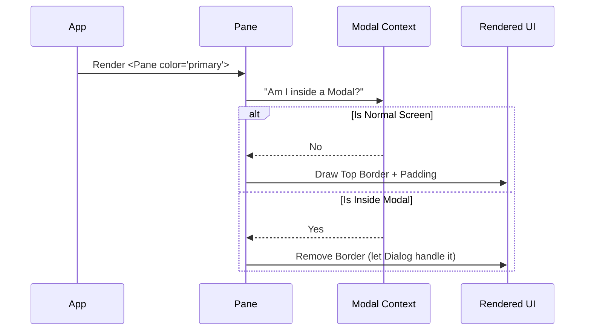

# Chapter 3: Structural Containers

Welcome back! In the previous chapter, [Theme-Aware Primitives](02_theme_aware_primitives.md), we created the "atoms" of our design system: text and boxes that change color based on the active theme.

Now that we have colored blocks, we need to arrange them into "rooms." If every screen in your CLI tool has different padding, different border styles, or different ways of handling titles, it will feel chaotic.

In this chapter, we introduce **Structural Containers**. These are pre-fabricated layouts that ensure every screen in your application feels like part of the same house.

## The Motivation

Imagine you are building a house. You don't build every wall brick-by-brick every time. You use standard frames.

In a CLI, we face similar layout challenges:
1.  **Inconsistent Margins:** One screen has 1 space on the left, another has 2.
2.  **Visual Noise:** Without clear boundaries, the user doesn't know where the content starts or ends.
3.  **Modal Management:** When asking "Are you sure?", that question needs to look different than a standard list of files.

**The Solution:** We use three specialized components:
1.  **Pane:** The standard "screen" container.
2.  **Divider:** A horizontal line to separate sections.
3.  **Dialog:** A focused overlay for questions or alerts.

## Use Case: The "Settings" Screen

Let's imagine we are building a Settings screen. It needs:
1.  A top border indicating we are in "Settings".
2.  A section for "General" and a section for "Advanced", separated by a line.
3.  A popup asking to "Save Changes" if the user tries to leave.

We will use our structural containers to build this rapidly.

## Component 1: The Pane

The `Pane` is the canvas for your content. It provides a standard top border (colored by theme) and consistent side padding.

### Basic Usage

```tsx
import { Pane, ThemedText } from './design-system';

// A standard screen with a 'primary' colored top border
<Pane color="primary">
  <ThemedText>Welcome to the Settings Menu</ThemedText>
  <ThemedText color="dim">Press arrows to navigate</ThemedText>
</Pane>
```

**What happens here?**
*   It draws a colored line at the top.
*   It adds `paddingX` (left/right padding) automatically so text doesn't touch the terminal edge.
*   It stacks content vertically.

## Component 2: The Divider

Sometimes a list gets too long, or you want to group related items. The `Divider` draws a horizontal line. It's smart—it knows how wide the terminal is.

### Dividing Sections

```tsx
import { Pane, Divider, ThemedText } from './design-system';

<Pane color="primary">
  <ThemedText>General Settings</ThemedText>
  
  {/* A divider with a title in the middle */}
  <Divider title="Advanced" color="dim" />
  
  <ThemedText>Debug Mode: ON</ThemedText>
</Pane>
```

**Output Visualization:**
```text
(Primary Color Line) ──────────────────────────
  General Settings
────────────── Advanced ──────────────
  Debug Mode: ON
```

## Component 3: The Dialog

A `Dialog` is special. It represents an "interruption" or a "modal." It is used when you need the user to stop and answer a question or acknowledge an error.

Unlike a `Pane`, a `Dialog` comes with built-in **keyboard intelligence**. It knows that `Esc` usually means "Cancel" and `Enter` usually means "Confirm."

### Creating a Confirmation Modal

```tsx
import { Dialog, ThemedText } from './design-system';

<Dialog
  title="Save Changes?"
  color="warning"
  onCancel={() => console.log('Cancelled')}
>
  <ThemedText>You have unsaved changes.</ThemedText>
</Dialog>
```

**What makes this special?**
1.  **Visuals:** It renders the title in bold and the border in the requested color (Warning/Yellow).
2.  **Keybindings:** If the user presses `Esc`, `onCancel` is called automatically. You don't have to write the key listener yourself.
3.  **Hints:** It automatically adds a footer line saying "Esc to cancel".

## How It Works Under the Hood

Let's visualize how `Pane` decides what to draw. It actually checks if it's inside a Modal or not!



This logic prevents "Double Borders." If you put a Pane inside a Dialog, the Pane becomes invisible structurally, acting just as a padding container, so the Dialog's border remains the only frame.

## Internal Implementation Deep Dive

Let's look at the code within `design-system` to see how these containers are built.

### 1. The Pane Logic (`Pane.tsx`)

The `Pane` is surprisingly simple but does one clever check using `useIsInsideModal`.

```tsx
// Pane.tsx (Simplified)
export function Pane({ children, color }) {
  const isInsideModal = useIsInsideModal();

  // 1. Inside a modal? Just give me padding, no border.
  if (isInsideModal) {
    return <Box paddingX={1}>{children}</Box>;
  }

  // 2. Normal screen? Draw the top divider + content.
  return (
    <Box flexDirection="column" paddingTop={1}>
      <Divider color={color} />
      <Box paddingX={2}>{children}</Box>
    </Box>
  );
}
```
*Beginner Note:* Notice the different padding. A standard screen has `paddingX={2}` (more spacious), but inside a modal, it shrinks to `paddingX={1}` to save space.

### 2. The Divider Math (`Divider.tsx`)

The `Divider` needs to know how wide the terminal is to draw the right number of dashes (`-`).

```tsx
// Divider.tsx (Simplified)
export function Divider({ title, width }) {
  // 1. Get terminal size
  const { columns } = useTerminalSize();
  const activeWidth = width ?? columns;

  // 2. If we have a title, calculate side lengths
  if (title) {
    // Logic to subtract title length from total width
    // and split dashes between left and right
    return <Text>── {title} ──</Text>; 
  }

  // 3. No title? Just repeat the character
  return <Text>{'─'.repeat(activeWidth)}</Text>;
}
```
*Explanation:* We use a hook `useTerminalSize` to get the width. Then strictly standard string manipulation creates the line.

### 3. The Dialog Brain (`Dialog.tsx`)

The `Dialog` handles user input for exiting.

```tsx
// Dialog.tsx (Simplified)
export function Dialog({ title, children, onCancel }) {
  // 1. Register the "Esc" key to trigger onCancel
  useKeybinding('confirm:no', onCancel);

  // 2. Render the layout
  return (
    <Pane color="warning">
      <Text bold>{title}</Text>
      {children}
      <Footer>Esc to cancel</Footer>
    </Pane>
  );
}
```
*Beginner Note:* The `Dialog` actually wraps its content inside a `Pane`! This is composition. It reuses the visual style of the Pane but adds the behavior (keybindings) of a modal.

## Conclusion

We now have the structure for our application:
1.  **Pane** gives us a standard page layout.
2.  **Divider** helps us organize sections.
3.  **Dialog** gives us a way to interrupt the user for confirmation.

However, a CLI is boring if you can't *select* anything. Just displaying text isn't enough. We need menus!

In the next chapter, we will build the **Interactive List Picker**, a component that lets users scroll through options and select items.

[Next Chapter: Interactive List Picker](04_interactive_list_picker.md)

---

Generated by [Code IQ](https://github.com/adityasoni99/Code-IQ)