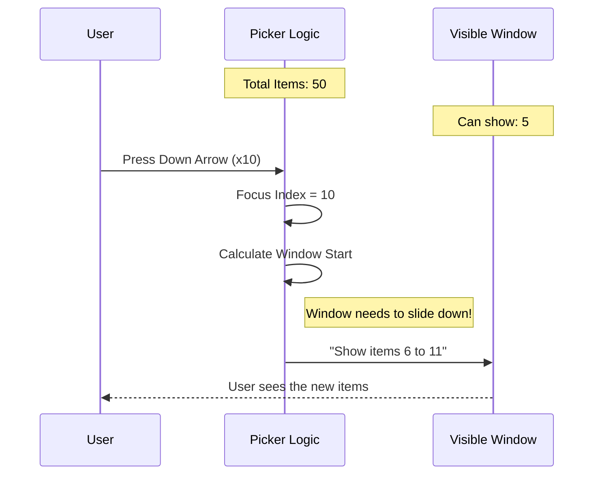

# Chapter 4: Interactive List Picker

Welcome back! In the previous chapter, [Structural Containers](03_structural_containers.md), we learned how to build the "walls" and "frames" of our application using Panes and Dividers.

However, a CLI tool where you can only *look* at things isn't very useful. You need to be able to make choices. Whether it's selecting a file to delete, picking a deployment region, or choosing a pizza topping, you need a menu.

In this chapter, we will build the **Interactive List Picker**.

## The Motivation

Building a menu in a terminal is deceptively difficult.
1.  **Scrolling:** If you have 50 items but only 10 lines of space, you have to do math to figure out which subset of items to show.
2.  **Filtering:** Users expect to type to find things (e.g., typing "prod" to find "production-db").
3.  **Focus State:** You need to track which item is currently highlighted (usually with a `>` arrow).

**The Solution:** We use the `FuzzyPicker`. This is a high-level component that handles the math, the keyboard events, and the filtering for you. You just give it a list of data.

## Key Concepts

Before we code, let's understand the two main parts of this system:

1.  **The Fuzzy Picker:** The "Brain." It handles user input, filters the list based on what they type (fuzzy search), and calculates which items fit on the screen.
2.  **The List Item:** The "Body." It represents a single row. It knows how to change color when focused and how to draw the little arrow (`>`) pointer.

## Use Case: Picking a Framework

Let's imagine our CLI tool initializes new projects. We want to ask the user: **"Which framework do you want to use?"**

### 1. Preparing the Data
First, we need a list of options.

```tsx
const frameworks = [
  { id: 'react', label: 'React' },
  { id: 'vue', label: 'Vue' },
  { id: 'angular', label: 'Angular' },
  { id: 'svelte', label: 'Svelte' },
];
```

### 2. The Render Function
The Picker needs to know *how* to draw each row. We provide a small function that returns a component.

```tsx
import { Text } from 'ink';

// This function runs for every visible item
const renderFramework = (item, isFocused) => (
  <Text color={isFocused ? 'green' : 'white'}>
    {item.label}
  </Text>
);
```

### 3. Using the Component
Now we drop in the `FuzzyPicker`.

```tsx
import { FuzzyPicker } from './design-system';

<FuzzyPicker
  title="Choose a Framework"
  items={frameworks}
  renderItem={renderFramework}
  getKey={(item) => item.id}
  onSelect={(item) => console.log('You picked:', item.label)}
/>
```

**What happens here?**
*   **Search Bar:** A search box appears automatically under the title.
*   **Navigation:** You can use Up/Down arrows to move.
*   **Selection:** Pressing `Enter` triggers `onSelect`.
*   **Filtering:** If you type "vu", the list instantly updates to show only "Vue".

## The "List Item" Component

In the example above, we manually changed the text color. However, our design system provides a pre-made `ListItem` component that handles standard styling, pointers (`>`), and checkmarks (`✓`).

Let's upgrade our render function to use it.

```tsx
import { ListItem } from './design-system';

const renderFramework = (item, isFocused) => (
  <ListItem isFocused={isFocused}>
    {item.label}
  </ListItem>
);
```

**Why use this?**
`ListItem` automatically talks to the [Theming Context](01_theming_context___utilities.md). If you switch to "Light Mode," the `ListItem` knows exactly what color the focused text should be, without you manually setting it to "green".

## How It Works Under the Hood

The magic of the List Picker is how it handles **Scrolling**. It uses a technique called a "Sliding Window."

Imagine you have a long strip of paper (your list) behind a small window (your terminal screen).



1.  **State:** We track the `focusedIndex` (e.g., item #10).
2.  **Calculation:** We calculate `windowStart`. If we can only see 5 items, and we are at item #10, our window might start at item #6.
3.  **Slice:** We perform `items.slice(6, 11)` to get only the items we need to render right now.

## Internal Implementation Deep Dive

Let's look at the actual code in `design-system` to see how this sliding window is built.

### 1. The ListItem Visuals (`ListItem.tsx`)

This component decides what "Icon" to show on the left side of the text.

```tsx
// ListItem.tsx (Simplified)
function renderIndicator() {
  if (isFocused) {
    // The "Pointer"
    return <Text color="suggestion">❯</Text>; 
  }
  if (isSelected) {
    // The "Checkmark"
    return <Text color="success">✓</Text>;
  }
  return <Text> </Text>; // Empty space for alignment
}
```
*Beginner Note:* Notice the use of semantic colors like `suggestion` and `success`. This relies on the [Theme-Aware Primitives](02_theme_aware_primitives.md) concept.

### 2. The Sliding Math (`FuzzyPicker.tsx`)

Inside the main component, we determine which items are actually visible.

```tsx
// FuzzyPicker.tsx
const windowStart = clamp(
  focusedIndex - visibleCount + 1, // Try to keep cursor at bottom
  0,                               // Don't go below 0
  items.length - visibleCount      // Don't scroll past the end
);

// Get ONLY the items that fit in the window
const visibleItems = items.slice(windowStart, windowStart + visibleCount);
```

**Explanation:**
`clamp` ensures we don't try to render item number -5 or item number 1000 in a list of 10. We essentially "slide" the viewing rectangle based on where your `focusedIndex` is.

### 3. Handling Keyboard Input

We use a custom hook to listen for arrow keys.

```tsx
// FuzzyPicker.tsx (Simplified Input Handler)
const handleKeyDown = (e) => {
  if (e.key === 'up') {
    // Move focus up, but stop at 0
    setFocusedIndex(i => Math.max(0, i - 1));
  }
  if (e.key === 'down') {
    // Move focus down, stop at last item
    setFocusedIndex(i => Math.min(items.length - 1, i + 1));
  }
  if (e.key === 'return') {
    // Select the currently focused item
    onSelect(items[focusedIndex]);
  }
};
```
*Beginner Note:* We stop the event propagation (`e.preventDefault`) so that pressing "Enter" doesn't accidentally trigger other things in your app.

## Conclusion

The **Interactive List Picker** is one of the most powerful tools in your CLI arsenal.
1.  It handles **Focus Management** (up/down arrows).
2.  It manages **Screen Real Estate** (scrolling/windowing).
3.  It simplifies **Filtering** (fuzzy search).

By combining `FuzzyPicker` with `ListItem`, you can build professional-grade menus in seconds.

But what if you have *too many* options to put in a single list? What if you need to categorize settings into "General," "Network," and "Display"? You need tabs.

In the next chapter, we will organize our UI using the **Tabbed Interface**.

[Next Chapter: Tabbed Interface](05_tabbed_interface.md)

---

Generated by [Code IQ](https://github.com/adityasoni99/Code-IQ)