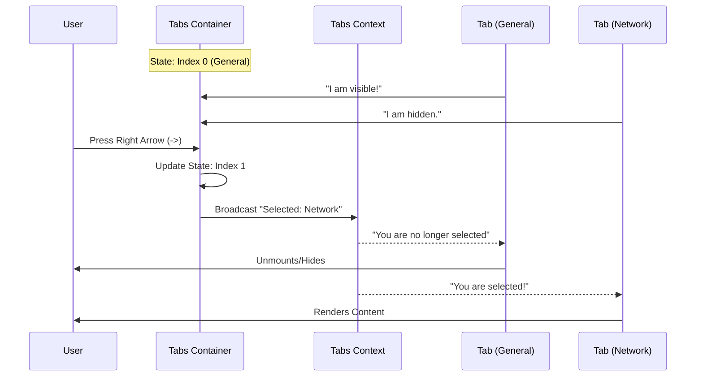

# Chapter 5: Tabbed Interface

Welcome back! In the previous chapter, [Interactive List Picker](04_interactive_list_picker.md), we learned how to let users select items from a list.

But what happens when you have *too many* lists? Or what if you have a form with 30 different fields? Dumping everything onto one screen creates a wall of text that scares users away.

In this chapter, we will build the **Tabbed Interface**. Just like the tabs in your web browser allow you to switch between websites without opening new windows, our Tabs component lets us switch between different "views" within the same terminal screen.

## The Motivation

Imagine you are building a **Server Configuration Tool**. You need to ask the user for:
1.  **General Info:** Server name, region.
2.  **Network:** IP address, ports, DNS.
3.  **Advanced:** Memory limits, CPU allocation.

**The Problem:** If you put all of this in one vertical list, the user has to scroll forever. It looks cluttered and overwhelming.

**The Solution:** We group these into three tabs. The user only sees what they need, when they need it.

## Key Concepts

There are two main components we need to understand:

1.  **The Tabs Container (`<Tabs>`):** This is the manager. It draws the row of titles at the top (e.g., `General | Network | Advanced`) and listens for keyboard inputs (Left/Right arrows) to switch views.
2.  **The Tab Item (`<Tab>`):** This is the content wrapper. It holds the text or form fields for a specific section. It only renders its children if it is currently selected.

## Use Case: The Configuration Screen

Let's build that server configuration screen. We want a clean layout where the user can toggle between "General" and "Network".

### 1. Basic Structure
We wrap our content in `Tabs`. Inside, we place individual `Tab` components.

```tsx
import { Tabs, Tab, ThemedText } from './design-system';

export function ConfigScreen() {
  return (
    <Tabs title="Server Config">
      <Tab title="General">
        <ThemedText>Name: My-Server-01</ThemedText>
      </Tab>
      <Tab title="Network">
        <ThemedText>IP: 192.168.1.1</ThemedText>
      </Tab>
    </Tabs>
  );
}
```

**What happens here?**
*   The component renders a header row: `Server Config  General  Network`.
*   "General" is highlighted because it's the first one.
*   Only "Name: My-Server-01" is visible.
*   If you press the **Right Arrow**, "Network" highlights, and the text changes to "IP: 192.168.1.1".

### 2. Controlling the State (Optional)
Sometimes you want your app to know which tab is active (maybe to save the user's preference). You can control the state yourself.

```tsx
import { useState } from 'react';
import { Tabs, Tab } from './design-system';

export function ControlledTabs() {
  const [activeId, setActiveId] = useState('gen');

  return (
    <Tabs selectedTab={activeId} onTabChange={setActiveId}>
      <Tab id="gen" title="General">...</Tab>
      <Tab id="net" title="Network">...</Tab>
    </Tabs>
  );
}
```

**Beginner Note:** If you don't provide `selectedTab`, the `Tabs` component manages its own state internally. This is called "Uncontrolled Mode" and is easier for simple screens.

## How It Works Under the Hood

Let's visualize the flow when a user presses the Right Arrow key.



1.  **Input:** The `Tabs` container listens for arrow keys.
2.  **State Change:** It calculates the next index (looping back to the start if at the end).
3.  **Broadcast:** It uses React Context to tell all children: "The active tab is now 'Network'".
4.  **Reaction:** The `Tab` components check this message. If it matches their ID, they render; otherwise, they return `null`.

## Internal Implementation Deep Dive

Let's peek inside `Tabs.tsx` to see how we built this logic.

### 1. The Context (`TabsContext`)
First, we create a "private communication channel" so the parent (`Tabs`) can talk to the children (`Tab`) without passing props manually to every single level.

```tsx
// Tabs.tsx (Simplified)
const TabsContext = createContext({
  selectedTab: undefined,  // Which tab is active?
  width: undefined,        // How wide should content be?
  headerFocused: true,     // Is the user navigating the tabs?
});
```

### 2. The Keyboard Logic
Inside the main `Tabs` function, we use our keybinding hook to handle navigation.

```tsx
// Tabs.tsx (Inside component)
useKeybindings({
  "tabs:next": () => {
    // Calculate next index, wrapping around
    const newIndex = (currentIndex + 1) % tabs.length;
    setTab(newIndex);
  },
  "tabs:previous": () => {
    // Calculate previous index
    const newIndex = (currentIndex - 1 + tabs.length) % tabs.length;
    setTab(newIndex);
  }
});
```
*Explanation:* We map standard keys (Right Arrow, Tab) to `tabs:next`. This updates the internal state variable `selectedTabIndex`.

### 3. Rendering the Header
The `Tabs` component is responsible for drawing the top bar. It maps over the children to create the titles.

```tsx
// Tabs.tsx (Rendering the header)
<Box flexDirection="row" gap={1}>
  {tabs.map((tab, i) => {
    const isSelected = selectedTabIndex === i;
    // If selected, invert colors (White text on colored background)
    return (
      <Text inverse={isSelected}>
         {tab.title} 
      </Text>
    );
  })}
</Box>
```
*Beginner Note:* `inverse` is a standard Ink prop that swaps the background and foreground colors, creating that "highlighted" block effect for the active tab.

### 4. The Child Component (`Tab`)
The child component is very simple. It connects to the Context and decides whether to exist or not.

```tsx
// Tabs.tsx (The Tab component)
export function Tab({ title, children }) {
  // 1. Ask the parent: "Who is active?"
  const { selectedTab } = useContext(TabsContext);

  // 2. Am I the active one?
  if (selectedTab !== title) {
    return null; // Don't render anything
  }

  // 3. Render content if active
  return <Box>{children}</Box>;
}
```

## Advanced Logic: Focus Management

One tricky part of tabs is **Focus**.
1.  When you first open the screen, focus is on the **Header** (so you can switch tabs).
2.  If you have a list inside the tab, you might want to press "Down" to enter the list.
3.  The `Tabs` component handles this coordination. It has a state called `headerFocused`.

If `headerFocused` is `true`, Left/Right arrows switch tabs.
If you press "Down", `headerFocused` becomes `false`, and the content inside the tab (like a List Picker) gets to handle the keyboard.

## Conclusion

The **Tabbed Interface** is your primary tool for organization.
1.  **Tabs** acts as the controller and draws the header.
2.  **Tab** acts as the content view.
3.  **Context** connects them together invisibly.

Now your application is structured, colored, and organized. But as your application performs tasks (like deploying code or saving files), you need to tell the user what is happening. Is it loading? Did it fail? Did it succeed?

In the next chapter, we will learn about **Status & Feedback Elements** to keep the user informed.

[Next Chapter: Status & Feedback Elements](06_status___feedback_elements.md)

---

Generated by [Code IQ](https://github.com/adityasoni99/Code-IQ)