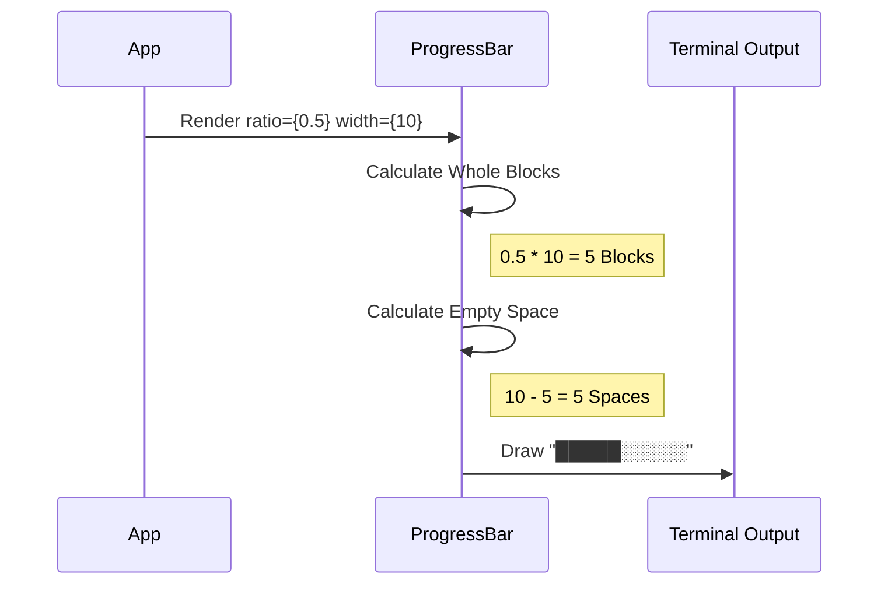

# Chapter 6: Status & Feedback Elements

Welcome back! In the previous chapter, [Tabbed Interface](05_tabbed_interface.md), we learned how to organize complex screens into clean, switchable views.

Now your application has structure. But a CLI tool is rarely static. It connects to servers, downloads files, and processes data. If your app sits silently while working, users get anxious. "Did it freeze? Did it crash?"

In this chapter, we will build **Status & Feedback Elements**. These are the visual cues—spinners, progress bars, and icons—that tell the user: "I'm working on it," or "I'm finished."

## The Motivation

Imagine you are building a **File Downloader**.

1.  **Connecting:** You need to show that the app is trying to reach the server (Loading).
2.  **Downloading:** You need to show how much is left (Progress).
3.  **Finished:** You need to confirm the file is safe on the disk (Success).

Without these elements, the user is staring at a blank blinking cursor. With them, the user feels in control.

## Key Concepts

We will cover three specialized components:

1.  **StatusIcon:** A simple way to show standardized symbols (✓, ✗, ⚠) with the correct semantic color.
2.  **LoadingState:** A pre-made layout combining a spinner animation with a text label.
3.  **ProgressBar:** A component that translates a number (like `0.5`) into a visual bar (like `█████░░░░░`).

## Use Case: The Deployment Script

Let's imagine a script that deploys a website. We want to show the current status of the operation.

### 1. Simple Status Icons

Instead of manually coloring a letter "X" red or a checkmark "V" green, we use `StatusIcon`. It ensures consistency across your entire app.

```tsx
import { StatusIcon, ThemedText } from './design-system';

// Good for lists or logs
<ThemedText>
  <StatusIcon status="success" withSpace />
  Database Connected
</ThemedText>

<ThemedText>
  <StatusIcon status="error" withSpace />
  Upload Failed
</ThemedText>
```

**What happens here?**
*   `status="success"` automatically renders a Green Checkmark (✓).
*   `status="error"` automatically renders a Red Cross (✗).
*   `withSpace` adds a tiny gap so the icon doesn't touch the text.

### 2. The Loading State

When the app is "thinking," we use the `LoadingState`. This component wraps a spinner (which handles the animation frame loop) and aligns it with text.

```tsx
import { LoadingState } from './design-system';

// Simple usage
<LoadingState message="Connecting to server..." />

// Detailed usage
<LoadingState 
  message="Uploading Assets"
  subtitle="Est time: 30s"
  dimColor={true} 
/>
```

**Output Visualization:**
```text
⠋ Connecting to server...
```
*(The dots `⠋` animate in a circle automatically)*

### 3. The Progress Bar

When you know exactly how much work is done, a spinner isn't enough. You need a `ProgressBar`.

This component takes a **Ratio** (a number between 0 and 1).
*   0 = Empty
*   0.5 = Half Full
*   1.0 = Full

```tsx
import { ProgressBar, ThemedBox } from './design-system';

// 75% complete, 20 characters wide
<ThemedBox borderStyle="single">
  <ProgressBar 
    ratio={0.75} 
    width={20} 
    fillColor="primary" 
  />
</ThemedBox>
```

**Output Visualization:**
```text
┌────────────────────┐
│███████████████░░░░░│
└────────────────────┘
```

## How It Works Under the Hood

Let's visualize how the **Progress Bar** decides what to draw. It's essentially a math problem: "How many blocks fit in this space?"



1.  **Input:** The app provides the `ratio`.
2.  **Math:** The component multiplies ratio by width to find the "filled" count.
3.  **Assembly:** It creates a string of "Filled Characters" + "Empty Characters".
4.  **Coloring:** It wraps the filled part in the theme color (using [Theme-Aware Primitives](02_theme_aware_primitives.md)).

## Internal Implementation Deep Dive

Let's look at the code inside `design-system` to see how these components are built.

### 1. The Icon Dictionary (`StatusIcon.tsx`)

The `StatusIcon` doesn't use `if/else` statements. It uses a configuration object to map keywords to symbols.

```tsx
// StatusIcon.tsx (Simplified)
const STATUS_CONFIG = {
  success: { icon: '✓', color: 'success' },
  error:   { icon: '✗', color: 'error' },
  warning: { icon: '⚠', color: 'warning' },
  loading: { icon: '…', color: undefined }
};

export function StatusIcon({ status }) {
  const config = STATUS_CONFIG[status];
  
  // Render text with the mapped color and icon
  return <Text color={config.color}>{config.icon}</Text>;
}
```
*Beginner Note:* By using a config object, we make it very easy to add new statuses later (like "skipped" or "timeout") without writing complex logic.

### 2. The Loading Layout (`LoadingState.tsx`)

This component is mostly about layout. It ensures the spinner and text sit side-by-side nicely.

```tsx
// LoadingState.tsx (Simplified)
export function LoadingState({ message, subtitle }) {
  return (
    <Box flexDirection="column">
      {/* Top Row: Spinner + Main Message */}
      <Box flexDirection="row">
        <Spinner />
        <Text> {message}</Text>
      </Box>

      {/* Bottom Row: Subtitle (Optional) */}
      {subtitle && (
        <Text dimColor>{subtitle}</Text>
      )}
    </Box>
  );
}
```
*Explanation:* We use `flexDirection="row"` to put the spinner next to the text. If a subtitle exists, we render it below in `dimColor` so it doesn't distract from the main message.

### 3. The Bar Logic (`ProgressBar.tsx`)

This is the most complex math in this chapter. We need to handle the case where the bar isn't perfectly full.

```tsx
// ProgressBar.tsx (Simplified)
export function ProgressBar({ ratio, width }) {
  // 1. Clamp ratio between 0 and 1
  const safeRatio = Math.min(1, Math.max(0, ratio));

  // 2. How many full blocks?
  const wholeBlocks = Math.floor(safeRatio * width);
  
  // 3. Create the strings
  const filled = '█'.repeat(wholeBlocks);
  const empty = ' '.repeat(width - wholeBlocks);

  return (
    <Text>
      <Text color="primary">{filled}</Text>
      <Text color="dim">{empty}</Text>
    </Text>
  );
}
```
*Advanced Detail:* The actual implementation in our project is even smarter! It uses "partial blocks" (like `▎`, `▌`, `▊`). If your progress is 50.5%, it draws a half-width block instead of rounding down. This makes the animation look much smoother.

## Conclusion

You now have the tools to communicate with your user:
1.  **StatusIcon** for instant results.
2.  **LoadingState** for waiting periods.
3.  **ProgressBar** for tracking tasks.

Your application is now structured, interactive, and communicative. But there is one final layer of polish. Experienced CLI users don't just read; they *explore*. They want to know what keyboard shortcuts are available without guessing.

In the final chapter, we will build **Keyboard Interaction Hints** to guide your users on how to use your tool.

[Next Chapter: Keyboard Interaction Hints](07_keyboard_interaction_hints.md)

---

Generated by [Code IQ](https://github.com/adityasoni99/Code-IQ)