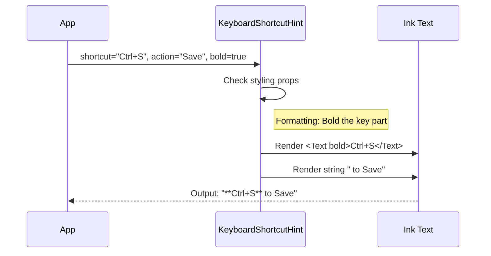

# Chapter 7: Keyboard Interaction Hints

Welcome to the final chapter of our design system tutorial!

In the previous chapter, [Status & Feedback Elements](06_status___feedback_elements.md), we learned how to communicate the *state* of the application (loading, success, failure) to the user.

Now, we face the final challenge of the Command Line Interface (CLI): **Discoverability**.

In a web app, users know what to do because they see buttons like "Save" or "Cancel." In a terminal, there are no buttons. A user might stare at your screen thinking, *"How do I exit? Do I press Esc? Ctrl+C? Q?"*

In this chapter, we will build **Keyboard Interaction Hints**. These are small, standardized text elements—usually placed at the bottom of the screen—that teach the user how to control your application.

## The Motivation

Imagine playing a new video game. If the game doesn't tell you that **"A is Jump"** and **"B is Attack,"** you will just mash buttons randomly and get frustrated.

Your CLI tool is the same.
1.  **Mystery Controls:** Users can't guess your specific keybindings.
2.  **Visual Clutter:** If you write "Press Enter to save" in big bright text, it looks like part of the data. It needs to be subtle.

**The Solution:**
We use a standardized component called `<KeyboardShortcutHint>`. It formats the key (e.g., "Enter") and the action (e.g., "Save") in a way that is easy to read but visually quiet (dimmed).

## Use Case: The File Viewer Footer

Let's imagine we have built a file viewer. We want a footer bar that tells the user their options.

We want to communicate:
1.  **↑/↓** to Navigate.
2.  **Enter** to Open.
3.  **Esc** to Quit.

We will use our hint component to render these instructions clearly.

## Key Concepts

There are three simple parts to a hint:

1.  **The Shortcut:** The physical key the user presses (e.g., `Ctrl+C`, `Enter`, `↑`).
2.  **The Action:** The verb describing what happens (e.g., `Quit`, `Select`, `Scroll`).
3.  **The Style:** Hints are almost always rendered in a "Dim" color so they don't distract from the main content.

## How to Use `KeyboardShortcutHint`

Let's look at how to use this component in your views.

### 1. Basic Usage

The component takes two main props: `shortcut` and `action`.

```tsx
import { KeyboardShortcutHint } from './design-system';

// Renders: "q to quit"
<KeyboardShortcutHint 
  shortcut="q" 
  action="quit" 
/>
```

### 2. Styling for Subtlety

By default, the text is standard color. To make it look like a "hint," we usually wrap it in a text container with `dimColor`. This concept relies on [Theme-Aware Primitives](02_theme_aware_primitives.md).

```tsx
import { Text } from 'ink';

// Renders a subtle gray hint
<Text dimColor>
  <KeyboardShortcutHint shortcut="Esc" action="cancel" />
</Text>
```

### 3. Bolding the Key

Sometimes, you want the key to stand out more than the action. We can use the `bold` prop.

```tsx
// Renders: "Enter to confirm" (where 'Enter' is bold white)
<Text dimColor>
  <KeyboardShortcutHint 
    shortcut="Enter" 
    action="confirm" 
    bold 
  />
</Text>
```

### 4. Grouping Hints

Usually, you have more than one command. We can place them side-by-side using a layout box (often called a "Byline" in our system).

```tsx
import { Box, Text } from 'ink';

<Box gap={2}>
  <Text dimColor>
    <KeyboardShortcutHint shortcut="↑/↓" action="navigate" />
  </Text>
  <Text dimColor>
    <KeyboardShortcutHint shortcut="Enter" action="select" />
  </Text>
</Box>
```

**Output Visualization:**
```text
↑/↓ to navigate   Enter to select
```

## How It Works Under the Hood

The logic here is purely visual. The component takes your strings and assembles them into a localized format.



1.  **Input:** The component receives the raw strings.
2.  **Formatting:** It checks if you want parentheses `( )` or bold text.
3.  **Assembly:** It concatenates the key + " to " + action.

## Internal Implementation Deep Dive

Let's look at the source code for `KeyboardShortcutHint.tsx`. It is a functional stateless component.

### 1. The Props Interface
We define exactly what we need to render the hint.

```tsx
// KeyboardShortcutHint.tsx
type Props = {
  shortcut: string; // e.g. "Enter"
  action: string;   // e.g. "submit"
  parens?: boolean; // Should we wrap in ( )?
  bold?: boolean;   // Should the key be bold?
};
```

### 2. Handling the Key Style
First, we decide how to render the `shortcut` part. If `bold` is true, we wrap it in a Text component.

```tsx
// Inside the component function
const shortcutText = bold ? (
  <Text bold>{shortcut}</Text> 
) : (
  shortcut
);
```
*Beginner Note:* We store the result in a variable `shortcutText`. This variable might hold a simple string `'x'` or a complex React Element `<Text bold>x</Text>`. React handles both perfectly.

### 3. Rendering the Layout
Finally, we combine the parts. We check the `parens` prop to see if we need to add brackets.

```tsx
// Inside the component function
if (parens) {
  return (
    <Text>({shortcutText} to {action})</Text>
  );
}

// Standard render
return (
  <Text>{shortcutText} to {action}</Text>
);
```

**Why is this separate?**
You might wonder, "Why not just type this manually?"
By creating a component, we ensure that the word "to" is always consistent. We ensure spacing is always consistent. If we ever want to change the format to `key: action` (e.g., "Enter: Confirm") in the future, we only have to change this one file, and the entire app updates.

## Conclusion

Congratulations! You have completed the **Design System Tutorial**.

You have built a complete UI kit for your CLI application:
1.  **[Theming](01_theming_context___utilities.md)** to manage colors.
2.  **[Primitives](02_theme_aware_primitives.md)** to style text.
3.  **[Containers](03_structural_containers.md)** to layout screens.
4.  **[Pickers](04_interactive_list_picker.md)** and **[Tabs](05_tabbed_interface.md)** for navigation.
5.  **[Status Elements](06_status___feedback_elements.md)** for feedback.
6.  **Interaction Hints** for teachability.

With these tools, you can build terminal applications that don't just "work"—they feel professional, cohesive, and user-friendly.

Go forth and build beautiful CLIs!

---

Generated by [Code IQ](https://github.com/adityasoni99/Code-IQ)