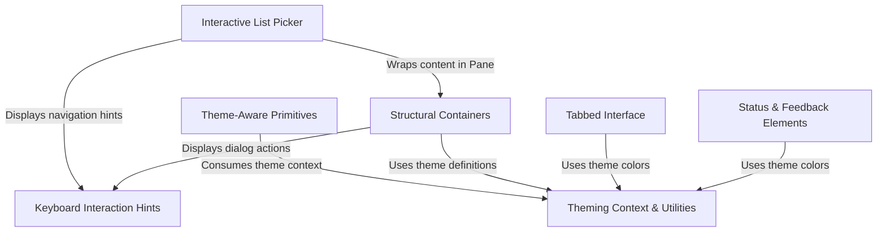

# Tutorial: design-system

This project is a **CLI design system** built to create rich, interactive terminal user interfaces using React. It creates a consistent visual style through a central **theming engine** that manages colors and layouts for components like *tabs*, *dialogs*, and *lists*. It also standardizes user interactions by providing reusable abstractions for **keyboard navigation**, shortcuts, and status feedback.

## Chapters

1. [Theming Context & Utilities](01_theming_context___utilities.md)
2. [Theme-Aware Primitives](02_theme_aware_primitives.md)
3. [Structural Containers](03_structural_containers.md)
4. [Interactive List Picker](04_interactive_list_picker.md)
5. [Tabbed Interface](05_tabbed_interface.md)
6. [Status & Feedback Elements](06_status___feedback_elements.md)
7. [Keyboard Interaction Hints](07_keyboard_interaction_hints.md)

---

Generated by [Code IQ](https://github.com/adityasoni99/Code-IQ)