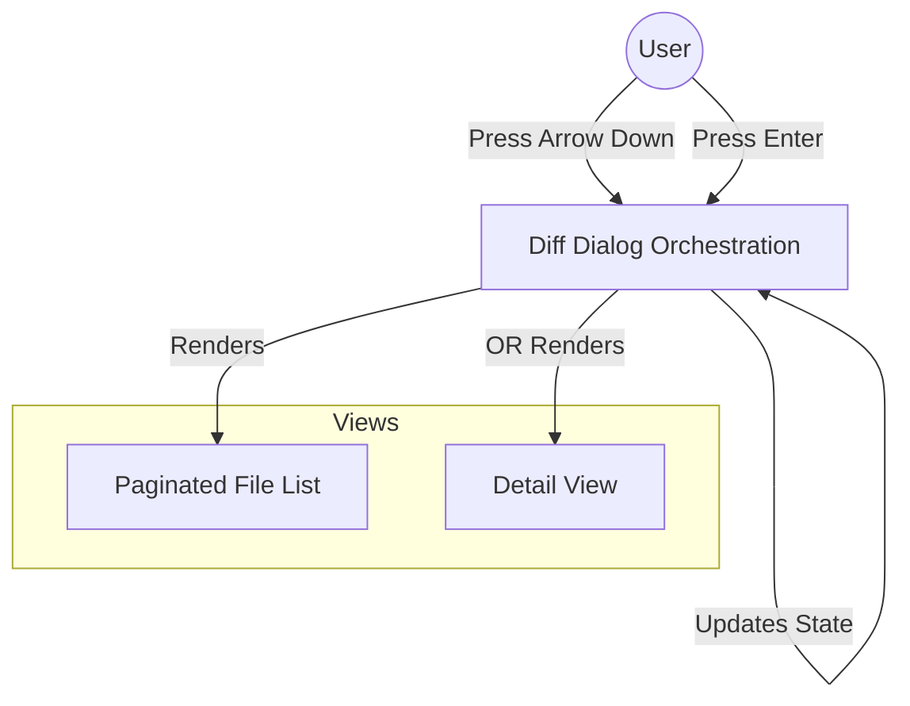
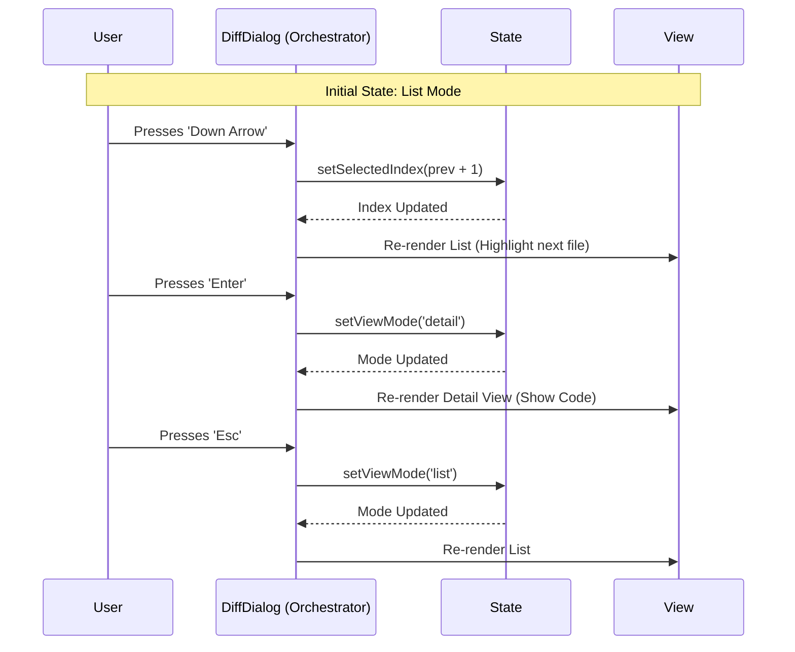

# Chapter 1: Diff Dialog Orchestration

Welcome to the **Diff** project tutorial! We are going to explore how this tool visualizes code changes in a terminal.

We start at the very top: **Diff Dialog Orchestration**.

## The Problem: Managing the "Stage"
Imagine you are directing a play. You have actors (files), scripts (code changes), and different scenes (views). You can't show everything at once. You need a **Stage Manager** to decide:
1.  **Which scene is active?** (Are we looking at a list of all files, or the details of one specific file?)
2.  **Who is in the spotlight?** (Which file is currently highlighted?)
3.  **What happens when the audience yells action?** (What do keyboard shortcuts do?)

Without a stage manager, the application would just be a chaotic pile of text.

## The Solution: DiffDialog
In our project, the `DiffDialog` component acts as this Stage Manager. It is the central hub that holds the "Global State" of the diff viewer. It listens for user commands and swaps out the components on the screen accordingly.

### Key Responsibilities
1.  **State Management:** Tracks if the user is in `'list'` mode or `'detail'` mode.
2.  **Data Selection:** Decides whether to show the current file changes or look back in time at previous "turns" (history).
3.  **Input Handling:** Maps keyboard keys (Arrow keys, Enter, Esc) to actions.

---

## How it Works: High-Level Concepts

Before looking at code, let's visualize the flow. The Orchestrator sits between the User and the Views.



1.  **The Input:** The user presses a key.
2.  **The Decision:** `DiffDialog` updates its internal counters (like `selectedIndex`).
3.  **The Render:** Depending on the mode, it shows either the [Paginated File List](03_paginated_file_list.md) or the [Detail View & Hunk Rendering](04_detail_view___hunk_rendering.md).

---

## Internal Implementation

Let's look at how this is built. We will break the `DiffDialog.tsx` file down into small, understandable pieces.

### 1. The State (The Brain)
The component needs to remember three specific things to orchestrate the show.

```typescript
// DiffDialog.tsx
export function DiffDialog({ messages, onDone }: Props) {
  // 1. Are we looking at a list of files or inside a specific file?
  const [viewMode, setViewMode] = useState<ViewMode>('list');
  
  // 2. Which file in the list is currently highlighted?
  const [selectedIndex, setSelectedIndex] = useState<number>(0);

  // 3. Which version of the history are we looking at?
  const [sourceIndex, setSourceIndex] = useState<number>(0);
  // ...
}
```
*   `viewMode`: This switches the "Scene".
*   `selectedIndex`: This moves the "Spotlight" up and down.
*   `sourceIndex`: This controls the "Time Machine" (current changes vs. past edits).

### 2. Preparing the Data
The Orchestrator gathers data from two places: current Git changes and past conversation history (turns). It combines them into a list of `sources`.

To ensure the data format is consistent regardless of where it comes from, we use a helper concept called the [Data Normalization Adapter](02_data_normalization_adapter.md).

```typescript
  // Combine current changes and history into one list of sources
  const sources: DiffSource[] = useMemo(
    () => [
      { type: 'current' }, // The live changes on disk
      ...turnDiffs.map((turn) => ({ type: 'turn', turn })),
    ],
    [turnDiffs],
  );

  // Pick the data based on which "Tab" (sourceIndex) is active
  const currentSource = sources[sourceIndex];
```

### 3. The Remote Control (Keybindings)
This is where the Orchestrator directs the show. It maps specific keys to state changes.

Notice how the logic changes depending on the `viewMode`.
*   If in **List Mode**, `Enter` opens details.
*   If in **Detail Mode**, `Back` (or Esc) returns to the list.

```typescript
  useKeybindings({
    'diff:viewDetails': () => {
      // If we are in the list, zoom in!
      if (viewMode === 'list' && selectedFile) {
        setViewMode('detail');
      }
    },
    'diff:back': () => {
      // If we are in details, zoom out!
      if (viewMode === 'detail') {
        setViewMode('list');
      }
    },
    // ... other bindings for arrows
  }, { context: 'DiffDialog' });
```

### 4. Rendering the Scene
Finally, the component decides what to draw on the screen. This is a classic "Conditional Rendering" pattern.

```typescript
  return (
    <Dialog title={title} onCancel={handleCancel}>
      {/* 1. Show the tabs (Current vs History) */}
      {sourceSelector}
      
      {/* 2. Decide which view to show */}
      {viewMode === 'list' ? (
        <DiffFileList files={diffData.files} selectedIndex={selectedIndex} />
      ) : (
        <DiffDetailView 
          filePath={selectedFile?.path || ''} 
          hunks={selectedHunks} 
        />
      )}
    </Dialog>
  );
```

*   If `viewMode` is `'list'`, it renders the **File List**. You will learn how that works in [Paginated File List](03_paginated_file_list.md).
*   If `viewMode` is `'detail'`, it renders the **Detail View**. You will learn about that in [Detail View & Hunk Rendering](04_detail_view___hunk_rendering.md).

---

## Interaction Flow: A Sequence Diagram

Here is exactly what happens when a user wants to view a file's changes.



## Summary
The **Diff Dialog Orchestration** is the glue that holds the feature together.
1.  It holds the **State** (What are we viewing?).
2.  It handles **Inputs** (Keyboard navigation).
3.  It swaps **Views** (List vs Details).

It relies on helper components to format the data and display the actual content.

In the next chapter, we will look at how we take raw data from Git or the Chat history and convert it into a format this Orchestrator can understand.

[Next Chapter: Data Normalization Adapter](02_data_normalization_adapter.md)

---

Generated by [Code IQ](https://github.com/adityasoni99/Code-IQ)