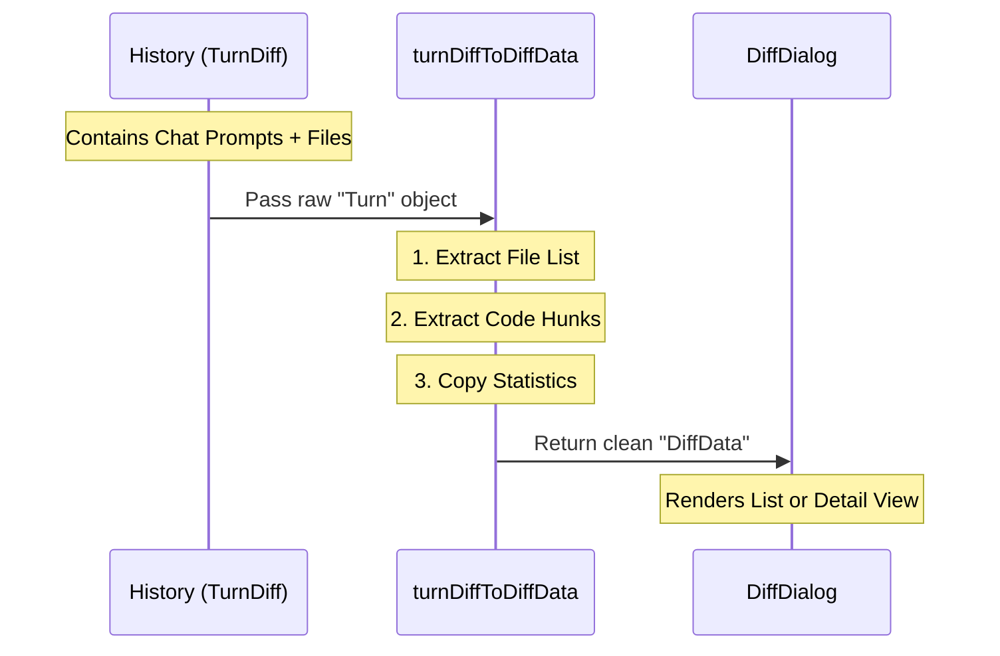

# Chapter 2: Data Normalization Adapter

In the previous chapter, [Diff Dialog Orchestration](01_diff_dialog_orchestration.md), we set up the "Stage Manager" that controls our application. However, a manager is useless without something to manage.

Our app needs to display code changes from two very different places:
1.  **Current Working Directory:** The live changes you haven't committed yet (Git).
2.  **Conversation History:** Old changes from previous turns in the chat.

## The Problem: Square Pegs, Round Holes

Imagine you are traveling. Your laptop has a US plug, but the wall socket is European. You can't plug it in directly.

In our code:
*   **The Wall Socket:** Our UI components ([Paginated File List](03_paginated_file_list.md) and [Detail View & Hunk Rendering](04_detail_view___hunk_rendering.md)) expect data in a specific shape called `DiffData`.
*   **The Plug:** The historical data comes in a shape called `TurnDiff`.

The UI doesn't care where the data comes from; it just wants to know "What files changed?" and "What lines were added?".

## The Solution: The Adapter

We build a **Data Normalization Adapter**. It acts like a universal travel adapter. It takes the complex `TurnDiff` object, strips away the chat-specific context (like prompts and timestamps), and reformats it into the generic `DiffData` that our UI understands.

### The Goal: `DiffData`
This is the "Socket" shape our UI is waiting for. It is simple and purely about file stats.

```typescript
// The generic format our UI loves
type DiffData = {
  files: Array<{ path: string; linesAdded: number; ... }>;
  hunks: Map<string, Hunk[]>; // The actual code snippets
  stats: {
    filesCount: number;
    linesAdded: number;
    linesRemoved: number;
  };
};
```

## How It Works: The Flow

Before looking at the code, let's trace the data.



1.  **Input:** We grab a specific moment in history (`TurnDiff`).
2.  **Process:** The adapter loops through the files in that history.
3.  **Output:** It returns standard `DiffData`.

## Implementation Details

We implement this in a function called `turnDiffToDiffData`. It resides inside `DiffDialog.tsx` because it's a helper specifically for bridging data to the dialog.

### Step 1: Normalizing the File List
The history object stores files in a `Map`. We need to convert that into a simple array and sort them alphabetically so the user sees a clean list.

```typescript
function turnDiffToDiffData(turn: TurnDiff): DiffData {
  // Convert the Map of files into a simple Array
  const files = Array.from(turn.files.values()).map(f => ({
    path: f.filePath,
    linesAdded: f.linesAdded,
    linesRemoved: f.linesRemoved,
    isNewFile: f.isNewFile,
    // Set defaults for things history doesn't track
    isBinary: false, 
    isLargeFile: false,
  }));
  
  // Sort alphabetically so the list is easy to scan
  files.sort((a, b) => a.path.localeCompare(b.path));
  
  // ... continued below
```

### Step 2: Extracting the Hunks
A "Hunk" is a technical term for a continuous block of code changes. The Detail View needs to look these up quickly by filename.

```typescript
  // Create a lookup map for code snippets (hunks)
  const hunks = new Map<string, StructuredPatchHunk[]>();
  
  for (const f of turn.files.values()) {
    // Map the file path directly to its code changes
    hunks.set(f.filePath, f.hunks);
  }
```

### Step 3: Returning the Package
Finally, we bundle the files and hunks with some high-level statistics (how many lines changed in total?) to return the final object.

```typescript
  return {
    stats: {
      filesCount: turn.stats.filesChanged,
      linesAdded: turn.stats.linesAdded,
      linesRemoved: turn.stats.linesRemoved,
    },
    files, // The array we created in Step 1
    hunks, // The map we created in Step 2
    loading: false,
  };
}
```

## Using the Adapter

Now, let's see how the Orchestrator (from Chapter 1) uses this tool.

Inside `DiffDialog`, we have a variable `currentTurn`. If `currentTurn` exists, it means we are looking at history. If it's null, we are looking at live Git changes.

```typescript
// DiffDialog.tsx

const diffData = useMemo(() => {
  // If we are looking at history (currentTurn exists)...
  if (currentTurn) {
    // ... USE THE ADAPTER!
    return turnDiffToDiffData(currentTurn);
  }
  
  // Otherwise, use the live git data (which is already formatted)
  return gitDiffData;
}, [currentTurn, gitDiffData]);
```

By using this pattern, the rest of our application (the file list and detail view) **never needs to know** if it is looking at the past or the present. It just receives `diffData` and renders it.

## Summary

The **Data Normalization Adapter** allows us to decouple our data sources from our UI.
1.  It takes complex History objects.
2.  It simplifies them into a generic `DiffData` format.
3.  It allows the UI to treat Git changes and History changes exactly the same way.

Now that we have our data normalized into a clean list of files, we need to display them to the user.

[Next Chapter: Paginated File List](03_paginated_file_list.md)

---

Generated by [Code IQ](https://github.com/adityasoni99/Code-IQ)