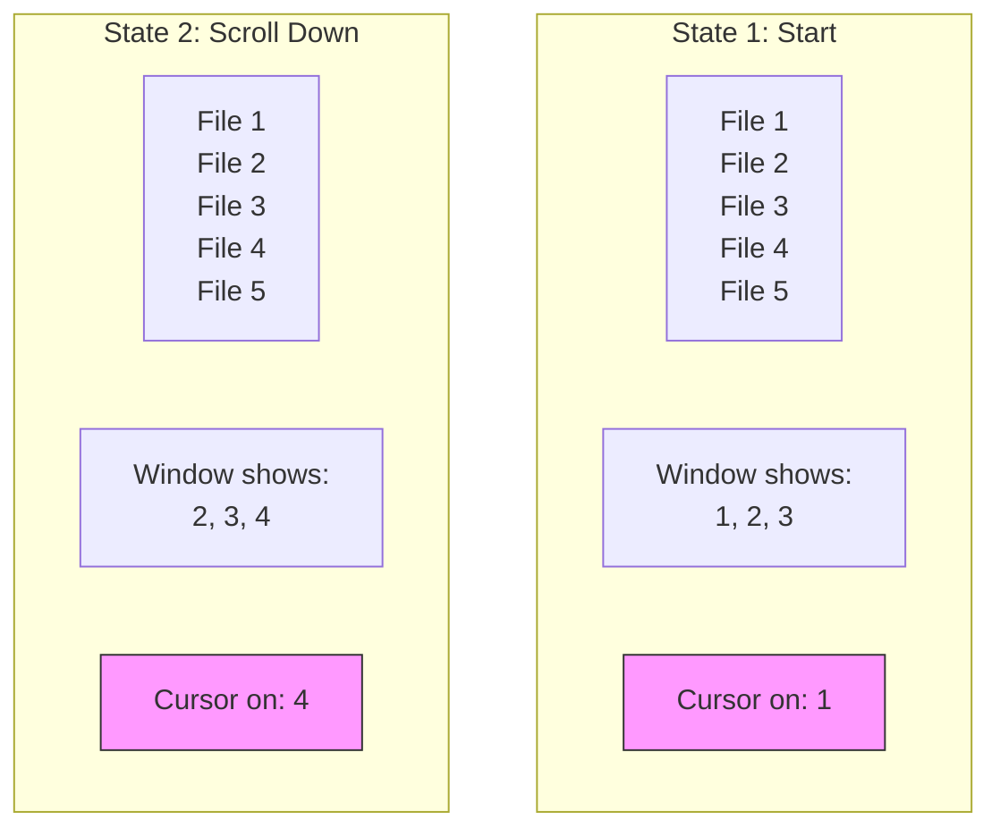
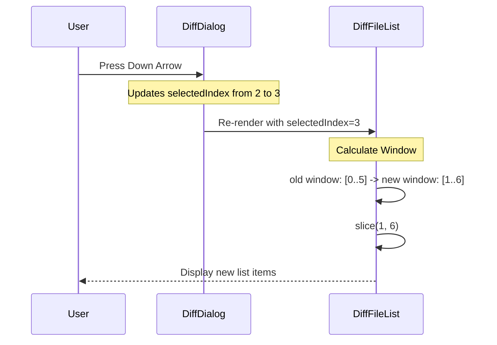

# Chapter 3: Paginated File List

In the previous chapter, [Data Normalization Adapter](02_data_normalization_adapter.md), we learned how to turn messy raw data into a clean, standardized list of files.

Now, we face a physical limitation: **The Terminal Screen**.

## The Problem: The "Long Menu"
Imagine you changed 50 files in your project. Most terminal windows are only about 20-30 lines tall. If we try to list all 50 files at once, the list will run off the screen, and the user won't see what they are selecting.

## The Solution: The Sliding Window
We need a **Paginated File List**.

Think of this like reading a long restaurant menu through a small rectangular cutout in a piece of paper.
*   The **Menu** is your list of 50 files.
*   The **Cutout** is your terminal window (showing only 5 files at a time).
*   As you move your finger (cursor) down to item #6, you physically slide the cutout down so item #6 becomes visible.

This concept is often called a **Sliding Window**.

---

## High-Level Logic

Before coding, let's visualize how the "Window" moves as the "Selection" moves.

Let's say our Window Size is **3 lines** (to keep it simple).



We don't actually move the list; we just calculate which slice of the array to render.

---

## Implementation Details

We implement this in `DiffFileList.tsx`. Let's break it down into small steps.

### 1. The Setup
First, we define how big our "cutout" window is. In this project, we set it to 5 lines so it doesn't take up too much space.

The component receives the full list of files and the index of the file the user currently has selected (managed by the [Diff Dialog Orchestration](01_diff_dialog_orchestration.md)).

```typescript
const MAX_VISIBLE_FILES = 5;

type Props = {
  files: DiffFile[];    // All 50 files
  selectedIndex: number; // The user's cursor position (e.g., 10)
};
```

### 2. Calculating the Window
This is the most critical logic. We need to determine the `startIndex` (where the window begins) and `endIndex` (where it ends).

We generally want the selected item to be in the **middle** of the window, so the user can see context above and below.

```typescript
// Inside DiffFileList component
const { startIndex, endIndex } = useMemo(() => {
  // If we have few files, just show them all!
  if (files.length <= MAX_VISIBLE_FILES) {
    return { startIndex: 0, endIndex: files.length };
  }

  // Calculate start so selectedIndex is in the middle
  let start = selectedIndex - Math.floor(MAX_VISIBLE_FILES / 2);
  
  // Ensure we don't scroll past the beginning (negative index)
  start = Math.max(0, start);
  
  // ... (logic continues below)
```

We also need to make sure we don't scroll past the *end* of the list.

```typescript
  // Calculate end based on start
  let end = start + MAX_VISIBLE_FILES;

  // If we pushed past the end of the list, pull the window back up
  if (end > files.length) {
    end = files.length;
    start = Math.max(0, end - MAX_VISIBLE_FILES);
  }

  return { startIndex: start, endIndex: end };
}, [files.length, selectedIndex]);
```

### 3. Slicing the Data
Now that we have the math figured out, we create a smaller array containing *only* the files we want to draw right now.

```typescript
  // Create a subset of files to render
  const visibleFiles = files.slice(startIndex, endIndex);
  
  // Helpers to know if we should draw arrows
  const hasMoreAbove = startIndex > 0;
  const hasMoreBelow = endIndex < files.length;
```

### 4. Rendering the View
We iterate over `visibleFiles`. For each file, we check: *"Is this the file the user has selected?"*

If yes, we highlight it.

```typescript
  return (
    <Box flexDirection="column">
      {/* Indicator that there are files above */}
      {hasMoreAbove && <Text dimColor>↑ {startIndex} more...</Text>}

      {/* Render the visible slice */}
      {visibleFiles.map((file, index) => (
        <FileItem
          key={file.path}
          file={file}
          // Note: We must add startIndex to match the global index
          isSelected={startIndex + index === selectedIndex}
        />
      ))}
      
      {/* Indicator that there are files below */}
      {hasMoreBelow && <Text dimColor>↓ {files.length - endIndex} more...</Text>}
    </Box>
  );
```

---

## The Render Cycle: A Sequence Diagram

Here is what happens when you press the "Down Arrow".



## Visual Polish: The `FileItem`

The `FileItem` component is responsible for making a single row look good. It handles:
1.  **Selection State:** Inverting colors when selected.
2.  **Stats:** Showing `+10 -2` for lines added/removed.
3.  **Truncation:** Cutting off long filenames so they fit.

```typescript
function FileItem({ file, isSelected }: ItemProps) {
  // If selected, add a pointer arrow ">"
  const pointer = isSelected ? figures.pointer : ' ';
  
  return (
    <Box>
      <Text 
        bold={isSelected} 
        inverse={isSelected} // Flips background/foreground color
      >
        {pointer} {file.path}
      </Text>
      
      {/* Show +Green -Red stats on the right */}
      <FileStats file={file} isSelected={isSelected} />
    </Box>
  )
}
```

## Summary

The **Paginated File List** solves the problem of displaying large datasets in small spaces.
1.  It receives the full data from the [Data Normalization Adapter](02_data_normalization_adapter.md).
2.  It uses the `selectedIndex` from the [Diff Dialog Orchestration](01_diff_dialog_orchestration.md) to calculate a "Window".
3.  It only renders the files inside that window.

Now the user can scroll through their files and pick one. But what happens when they press **Enter**? They want to see the actual code changes.

[Next Chapter: Detail View & Hunk Rendering](04_detail_view___hunk_rendering.md)

---

Generated by [Code IQ](https://github.com/adityasoni99/Code-IQ)