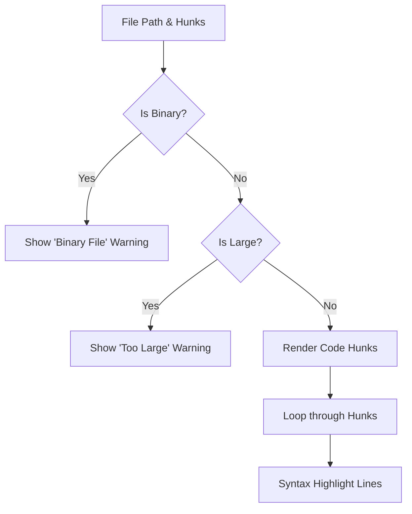
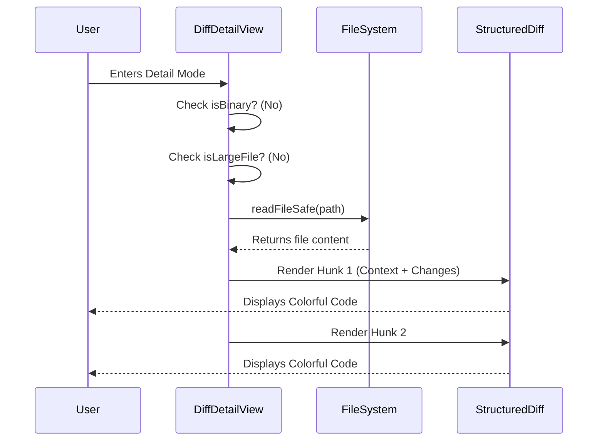

# Chapter 4: Detail View & Hunk Rendering

In the previous chapter, [Paginated File List](03_paginated_file_list.md), we built a scrollable menu allowing the user to select a file.

Now, the user presses **Enter**. They want to "zoom in" and see exactly what code changed.

## The Problem: The "Dangerous" Document
You might think, "Easy! Just read the file and print it to the screen."

But files are dangerous:
1.  **Binary Files:** If you try to print an Image or a compiled binary to a terminal, it will output garbage characters and might break the terminal interface.
2.  **Huge Files:** If a user accidentally diffs a 10MB log file, trying to render all of it will freeze the application.
3.  **Context:** A "Diff" isn't just the whole file; it's specific snippets (Hunks) showing what was added or removed.

## The Solution: A Smart Document Viewer
We need a **Detail View**. Think of this component as a "Safe Document Viewer."

It performs two main jobs:
1.  **The Bouncer:** It checks ID cards at the door. Is this file too big? Is it binary? If so, it denies entry and shows a polite summary instead.
2.  **The Curator:** If the file is safe, it doesn't show the whole thing. It only renders the specific "Hunks" (paragraphs) where changes occurred, adding syntax highlighting.

---

## Key Concept: The "Hunk"
A **Hunk** is a technical term in Git. It represents a continuous block of changes.

Imagine editing a generic essay.
*   You fixed a typo in Paragraph 1.
*   You rewrote the conclusion in Paragraph 5.

Your "Diff" contains **2 Hunks**. We don't need to show Paragraphs 2, 3, or 4. We only render the Hunks to save space and focus attention.

---

## Visualizing the Flow

Here is how the Detail View decides what to put on the screen.



---

## Implementation Details

We implement this in `DiffDetailView.tsx`. Let's break down the logic step-by-step.

### 1. The Safety Checks (The Bouncer)
Before we do any heavy lifting, we check the flags passed down from our data adapter.

```typescript
// DiffDetailView.tsx
export function DiffDetailView({ 
  filePath, 
  isBinary, 
  isLargeFile, 
  /* ... */ 
}: Props) {

  // Safety Check 1: Binary Files
  if (isBinary) {
    return (
      <Box flexDirection="column">
        <Text bold>{filePath}</Text>
        <Text dimColor italic>Binary file - cannot display diff</Text>
      </Box>
    );
  }
  
  // ... (Large file check looks similar)
```
If the file is binary, we return early. We display the filename (so the user knows where they are) and a dimmed warning message.

### 2. Reading the Context
If the file is safe (text), we need to read it. Why? Because a "Diff" usually shows the change *plus* 3 lines of unchanged code around it for context. To show context, we need to read the actual file from the disk.

We use `useMemo` to ensure we only read the file when the `filePath` changes, not on every render frame.

```typescript
  // Read file content for syntax detection and context
  const { firstLine, fileContent } = useMemo(() => {
    if (!filePath) return { firstLine: null, fileContent: undefined };
    
    const fullPath = resolve(getCwd(), filePath);
    const content = readFileSafe(fullPath); // Helper to read disk
    
    return {
      firstLine: content?.split('\n')[0] ?? null,
      fileContent: content ?? undefined,
    };
  }, [filePath]);
```

### 3. Calculating Width
Terminals vary in size. If a line of code is too long, it might wrap uglily. We check the terminal width so we can truncate lines neatly.

```typescript
  // Get the current width of the terminal window
  const { columns } = useTerminalSize();
  
  // Calculate available space (minus borders/padding)
  const availableWidth = columns - 2 - 2; 
```

### 4. Rendering the Hunks (The Curator)
Finally, if the file is safe, we map over the `hunks` array.

We use a helper component called `StructuredDiff`. This helper handles the complex logic of coloring lines green (added) or red (removed) and highlighting syntax (like keywords in TypeScript).

```typescript
  return (
    <Box flexDirection="column">
      <Text bold>{filePath}</Text>
      <Divider padding={4} />
      
      {/* Loop through every change hunk */}
      {hunks.map((hunk, index) => (
        <StructuredDiff
          key={index}
          patch={hunk}             // The raw change data
          fileContent={fileContent} // For context
          width={availableWidth}    // For layout
        />
      ))}
    </Box>
  );
```

---

## Deep Dive: Handling "Untracked" Files
There is a special case: **Untracked Files** (New files not yet added to Git).

Git doesn't know line counts for untracked files yet. If we try to ask Git for "Hunks," it returns nothing. We need a specific UI state for this.

```typescript
  if (isUntracked) {
    return (
      <Box flexDirection="column">
        <Text bold>{filePath}</Text>
        <Divider padding={4} />
        <Text dimColor italic>New file not yet staged.</Text>
        <Text dimColor italic>
            Run `git add {filePath}` to see line counts.
        </Text>
      </Box>
    );
  }
```
This guides the beginner user on *why* they can't see the code changes yet (they haven't staged the file).

---

## Interaction Flow: A Sequence Diagram

Here is what happens when the [Diff Dialog Orchestration](01_diff_dialog_orchestration.md) switches to Detail Mode.



## Summary
The **Detail View & Hunk Rendering** abstraction transforms raw data into a human-readable document.
1.  It acts as a **Bouncer**, protecting the UI from binary or massive files.
2.  It acts as a **Curator**, selecting only the relevant "Hunks" of changes.
3.  It utilizes helper components (`StructuredDiff`) to handle the coloring and formatting.

We now have a fully functional Diff Viewer! We can list files and view their changes.

However, there is one final edge case. What happens if the file status changes *while* we are looking at it? Or if the data becomes invalid? We need one final layer of protection.

[Next Chapter: File Status Guardrails](05_file_status_guardrails.md)

---

Generated by [Code IQ](https://github.com/adityasoni99/Code-IQ)